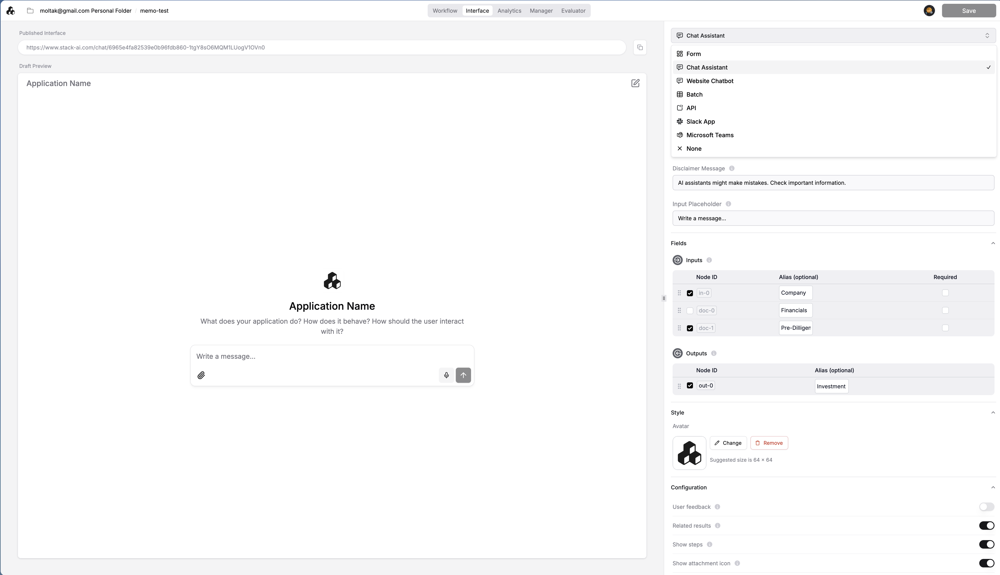
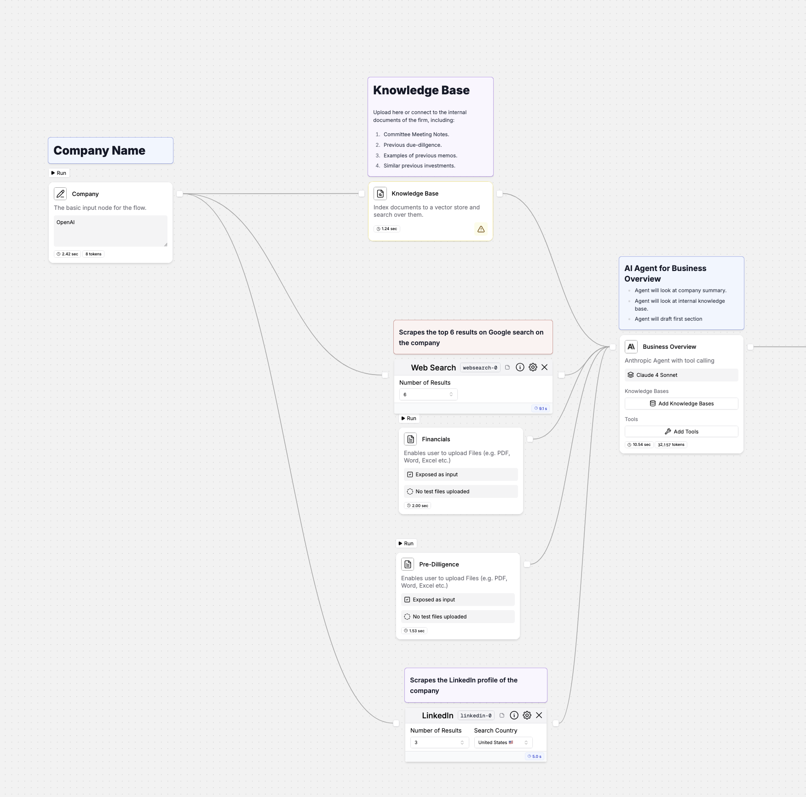
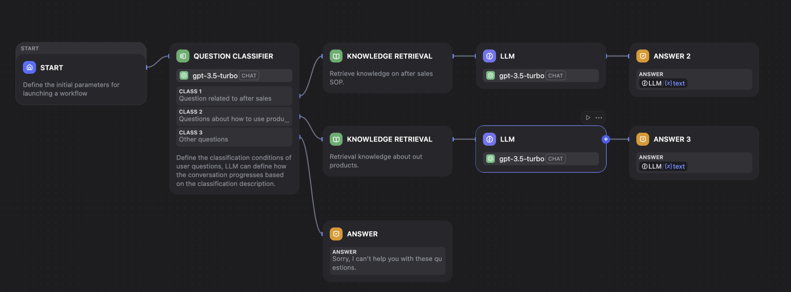
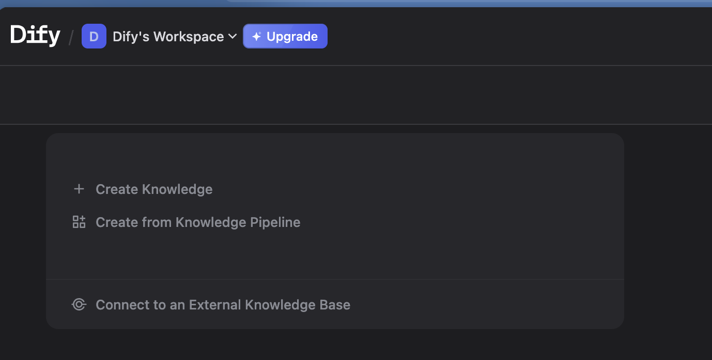
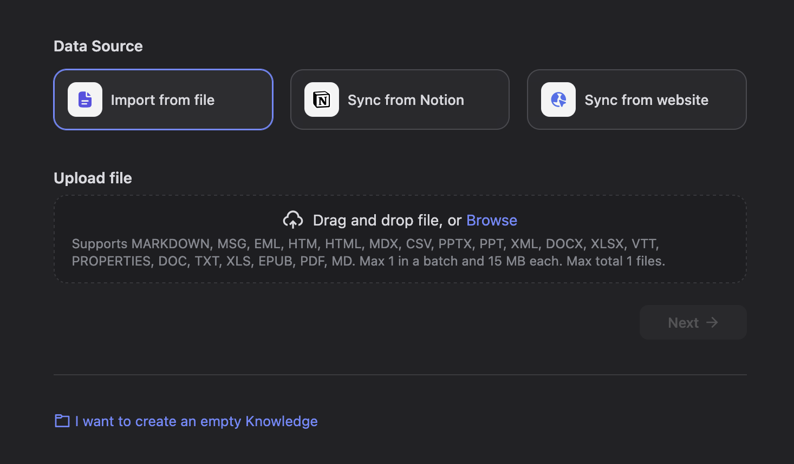
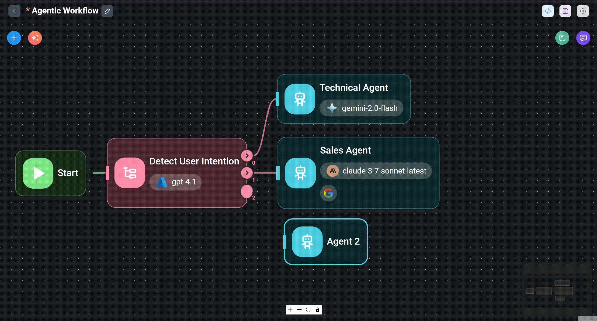
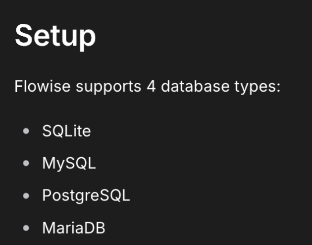
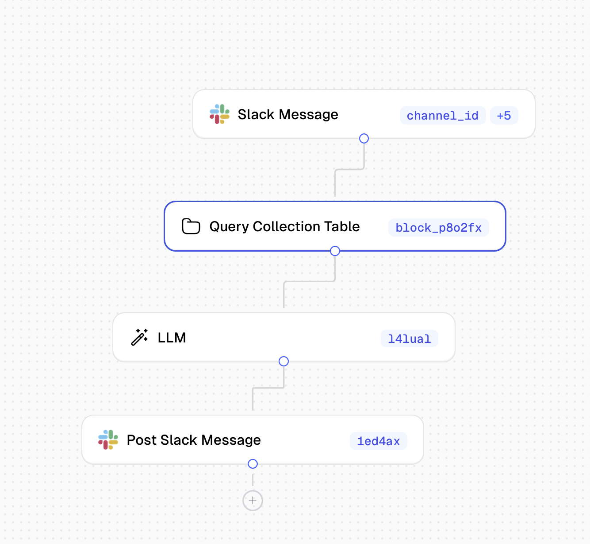
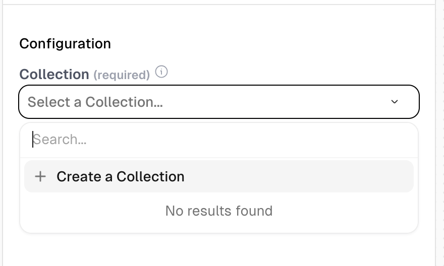
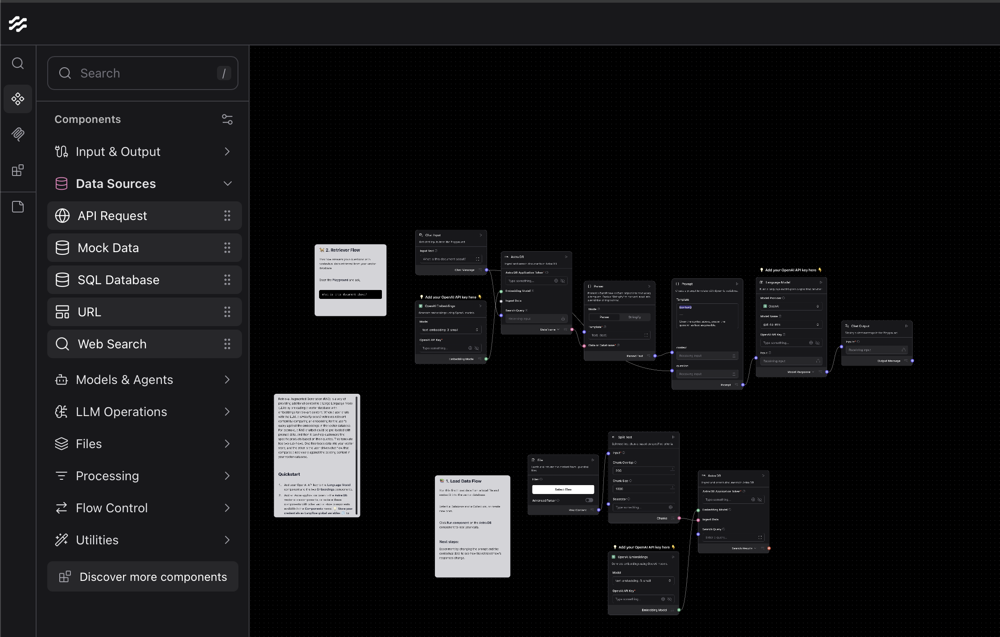

## 목록

**Flowise / LangFlow** — LangChain을 시각적/빠르게 구축
**StackAI / Scoutos** — 에이전트-First 플랫폼으로 빠른 제품화
[Dify: Leading Agentic Workflow Builder](http://dify.ai/)

## 관련 자료

[10 best AI agent platforms & companies I'm using in 2026 | Marketer Milk](https://www.marketermilk.com/blog/best-ai-agent-platforms)

## 지금까지 느낌

stack ai가 참 좋아보인다 ㅋㅋ.

## StackAI

이거 참 좋다. 내가 원하는거랑 거의 비슷

- 두개의 화면이 있다. agent 설계 / 배포
- 배포는 여러 화면을 제공. 심지어 API도 제공

- Agent 설계 화면은 일반적임. 우리가 아는 일반적인 모습과 비슷

- 데이터 처리 화면 하나만 더 있으면 좋은데. 약간 아쉽지만. 전처리는 다른거 써도 되니 일단. 좋아보임

## Dify

이게 내가 찾던거랑 진짜 흡사하다. 그냥 이거 써도 될듯. 이라고 생각했으나 rag가 아직 좀 애매하네.

- agent 작성

- rag - 아 왜 디비가 없지…..

## [Flowise](https://docs.flowiseai.com/)

opensource. npm 잘 되있어서 그냥 설치해서 쓰면 되는듯. 라이센스는 두개로 apache 2.0과 flowise commercial 라이센스가 있음. flowise 라이센스는 특정한 디렉토리 하위에 있는 디렉토리 및 파일들로 sso 같은게 포함됨. 그래도 상당히 좋아보인다.

[디비도 4개 지원](https://docs.flowiseai.com/configuration/databases)

## [scoutos](https://www.scoutos.com/)

에이전트 생성화면은 일반적인데,

디비 connection을 설정 가능

## [Langflow](https://www.langflow.org/)

신기하게도 desktop app으로 설치해서 에이전트를 만들 수 있음. 다른 서비스들도 충분히 직관적인데, 이건 데이터 연동하는 것에 대해서 엄청나게 직관적이네;;

