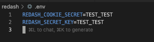
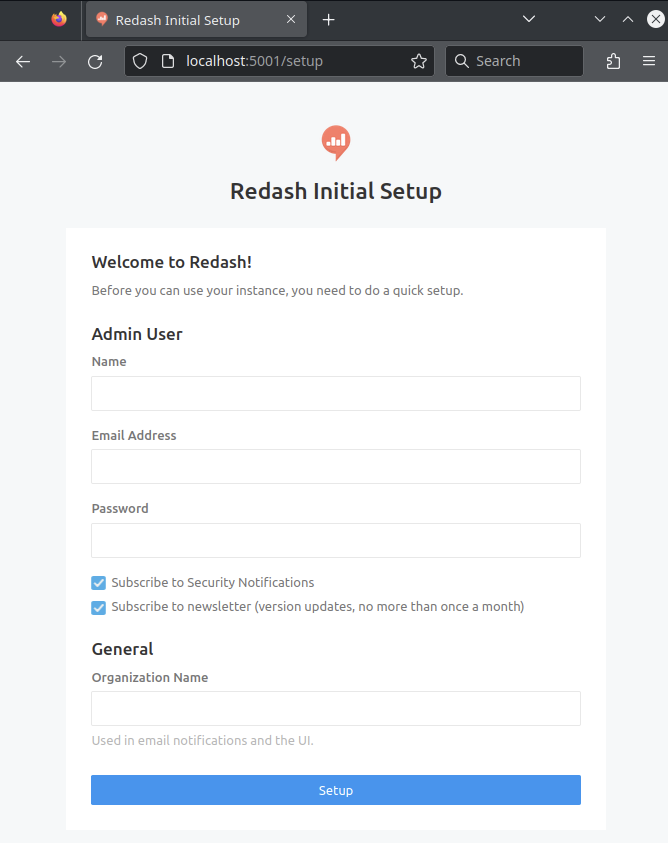

## 개요

예전에 잠깐 써봤던 BI 툴. 되게 쉽게 사용했던 느낌이 있어 리뷰할겸 한번 설치 후 살펴봤다. 근데 생각보다 local development setup이 잘 안되서 글 남김.

## 구성요소

redash는 python project, frontend, redis, postgresql, worker, scheduler 이렇게 되어있다. 구성요소가 많아서 그런지 빌드가 기대보다 잘 안됨

## 맥에서 빌드하기

1. [https://github.com/getredash/redash/wiki/Local-development-setup](https://github.com/getredash/redash/wiki/Local-development-setup) 여기서 시작하는게 좋다. git clone 부터 시작
2. docker 설치
   - 난 요새 orbstack 씀
3. node
   - nvm 설치
   - node 18 lts
4. chromium
   - `brew install chromium`
5. `npm install -g yarn@1.22.22`
6. `yarn i`
7. 여기까지 하면 대충 준비 끝
   - 이 뒤부터는 github 페이지를 보고 따라하자
8. .env 안에 대충 내용 채워넣고



9. `make build` (yarn build 임)
10. `make compose_build`
11. `make create_database`
12. `make up`
13. 여기까지하면 설치 끝
    - docker compose ps 하면 이렇게 보이고

```
---------------------------------------------------------------------------------------------------------------------------------
redash_email_1       bin/maildev                      Up (healthy)   1025/tcp, 1080/tcp, 0.0.0.0:1080->80/tcp,:::1080->80/tcp
redash_postgres_1    docker-entrypoint.sh postg ...   Up             0.0.0.0:15432->5432/tcp,:::15432->5432/tcp
redash_redis_1       docker-entrypoint.sh redis ...   Up             6379/tcp
redash_scheduler_1   /app/bin/docker-entrypoint ...   Up             5000/tcp
redash_server_1      /app/bin/docker-entrypoint ...   Up             0.0.0.0:5001->5000/tcp,:::5001->5000/tcp,
                                                                     0.0.0.0:5678->5678/tcp,:::5678->5678/tcp
redash_worker_1      /app/bin/docker-entrypoint ...   Up             5000/tcp
```

14. [http://localhost:5001](http://localhost:5001/) 로 접속
15. css 안깨지고 아래처럼 뜨면 끝!


