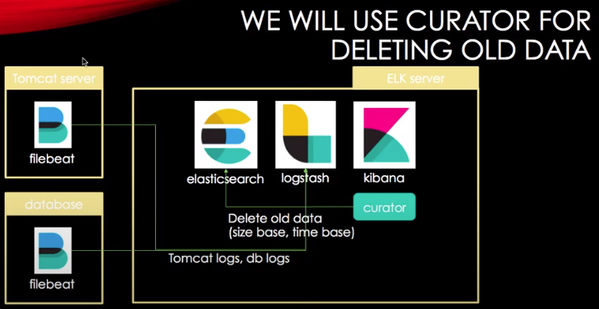

## Reference

- [inflearn ELK 스택 데이터 분석 강좌](https://www.inflearn.com/course/elk-%EC%8A%A4%ED%83%9D-%EB%8D%B0%EC%9D%B4%ED%84%B0-%EB%B6%84%EC%84%9D/lecture/5518?tab=curriculum)

## 들어가며

사실 내가 제일 궁금한건 로그를 한군데 모으는 방법이다. Mobile, WebServer, WebApp의 로그를 logstash에 모으는게 올바른 방법인지는 잘 모르겠으나 여러 종류의 디바이스에 흩어져 있는 로그를 한번에 분석하지 않으면 알아차리기 어려운 에러들이 있다.



위 그림에서 보듯이 database, tomcat에서 logstash로 데이터를 보내는게 존재한다면 더 많은 이기종 시스템들도 지원할 수 있을거라 생각한다.

---

## Kafka

`logstash-input-kafka`을 사용해 kafka의 topic을 읽어올 수 있음

`docker-elk`를 사용하므로 [docker-elk plugins 문서](https://github.com/deviantony/docker-elk#how-to-add-plugins) 참고할 것

```bash
# logstash/Dockerfile 에 추가
RUN logstash-plugin install logstash-integration-kafka

# Docker 빌드
docker-compose build
```
