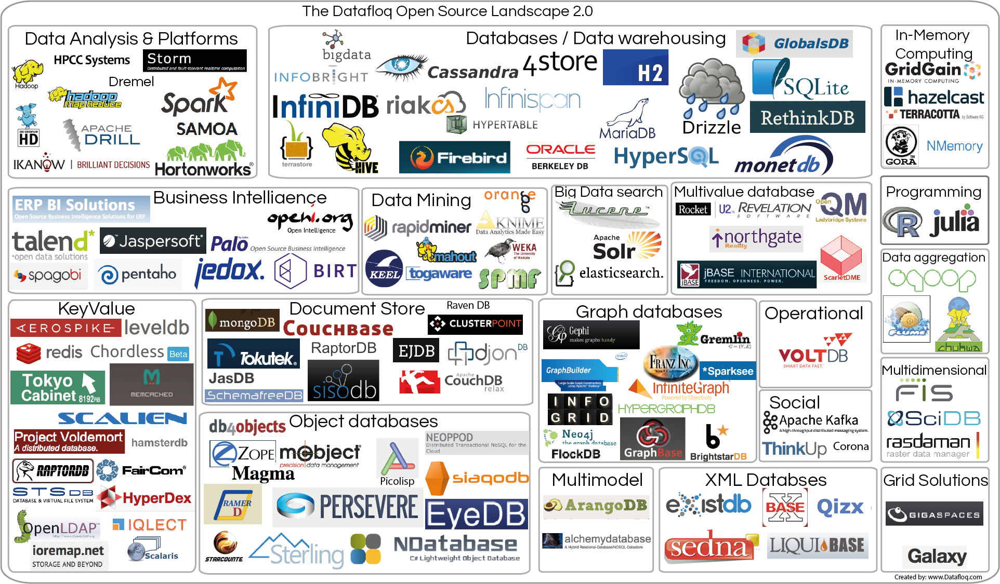
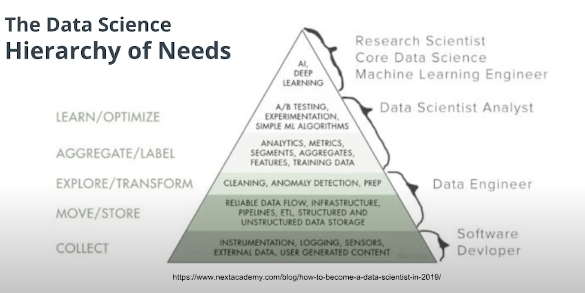
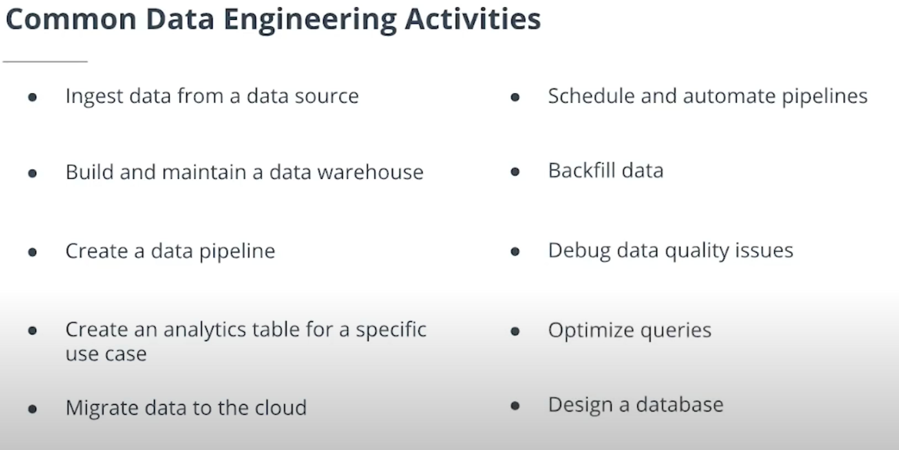
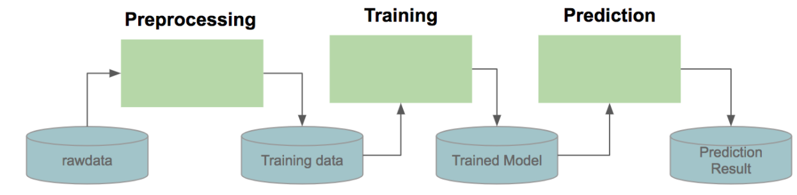
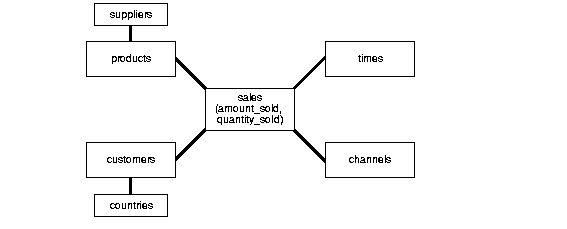

학습을 하는데 필요한 스킬들을 말해줌. 예를들어 sql query를 작성할건데, join, sub query를 한다는 것과 python의 loop, pandas 등을 할 줄 알아야한다고 함.

Careers에 대한 영상이 여러개 나오고 내용도 좀 긴데, 아마 Udacity 프로그램이 비싼 이유가 이런것 때문이 아닐까 싶음. 교육을 마치고 Careers 팀에서 Job을 찾는데 큰 도움을 줄것 같은 느낌을 받았음. 나랑도 관련이 있으려나 싶지만 -_-;

그 다음엔 어떻게 해야 성공적으로 nano degree를 마치는지에 대한 이야기, 데이터 엔지니어가 하는 일들이 나옴. Apache Spark, Apache Airflow, Hadoop, Cassandra, PostgreSQL을 많이 쓰는것 같다.

## References

- [ON the evolution of Data Engineering](https://medium.com/analytics-and-data/on-the-evolution-of-data-engineering-c5e56d273e37)
- [Data Engineering Introduction and Epochs](https://learn.panoply.io/hubfs/Data%20Engineering%20-%20Introduction%20and%20Epochs.pdf)
- [The Big Data Open Source Tools Landscape](https://datafloq.com/big-data-open-source-tools/os-home/)



- [Data Engineering 101: Top Tools And Framework Resources](https://analyticsindiamag.com/data-engineering-101-top-tools-and-framework-resources/)
- [The Rise of Data Engineering: Common Skills and Tools](https://www.burtchworks.com/2018/09/10/the-rise-of-data-engineering-common-skills-and-tools/)

## Lesson 4: Introduction to Data Engineering

### 1. What is Data Engineering

데이터 엔지니어링은 분석, 모델 구축, 앱 개발 등의 목적으로 최종 사용자가 데이터를 사용할 수 있도록하는 데 필요한 모든 엔지니어링 및 운영 작업으로 구성됩니다.






#### Data Warehouse(DW)

분석을 위한 데이터 저장소. 운영 시스템으로 부터 많은 데이터가 공급됨. 여러가지 형태를 갖고 있고 RDBMS, NoSQL등 여러 종류로 사용할 수 있음.

#### Data Lake(DL)

DW가 운영 시스템으로부터 정제된 데이터를 받는다면 DL은 RAW 데이터를 입력받음. DW는 반드시 데이터 정제를 해야해서 구축할 때 여러 고민이 필요한 반면 DL은 데이터 정제에 대해 고민할 필요가 없으므로 데이터를 모으는데 더 장점이 있음. 다만 분석을 하기 위해선 정제가 필요함. 운영 시스템 → DL → DW 순서로 데이터가 전달되는 경우도 많음.

#### Hadoop

대량의 데이터를 MapReduce하기 위한 분산형 시스템. 막대한 양의 데이터가 디스크에 저장되어 있을 때, 이를 읽어오는데 시간이 오래걸리는데 Hadoop과 HDFS을 사용하면 데이터를 여러 디스크에 나눠 담아 빠르게 읽어올 수 있음

#### Spark

Hadoop과 마찬가지로 대량의 데이터를 MapReduce 하기 위한 분산형 시스템. 다만 인메모리로 동작하므로 속도가 Hadoop에 비해 매우 빠르다. 단점은 그만큼 메모리가 많이 필요함.

#### MapReduce


Map: 데이터를 키로 분류
Reduce: 데이터를 키로 묶어 원하는 결과를 만듬

#### Airflow

[사용예](https://berrrrr.github.io/programming/2020/01/12/what-is-apache-airflow/)

### 머신러닝을 실행하는 단계를 생각해보자.



1. 데이터 읽기
2. 데이터 변환
3. 트레이닝
4. 예측

이런 과정을 아래처럼 DAG(Directed Acyclic Graphs)로 표현. DAG란 방향을 가지는 그래프이고 순환을 허용하지 않음.


### 분석을 위한 Data Modeling

운영을 위한 Database Schema와 분석을 위한 Schema는 형태가 달라야한다.

#### 3rd Normal Form

customer가 어떤 제품을 구입했는지 알려면 어떤 쿼리를 써야할까?

```sql
select products.* from customer c
  join orders o on o.customerId = c.id
  join orderItems oi on oi.orderId = o.id
  join products p on oi.productId = p.id
where c.email = 'USER_EMAIL';
```


#### Star Schema

```sql
select products.* from sales
  join products p on sales.productId = p.id
where sales.customerEmail = 'USER_EMAIL';
```


#### Snow Flake Schema

```sql
select products.* from sales
  join products p on sales.productId = p.id
where sales.customerEmail = 'USER_EMAIL';
```


