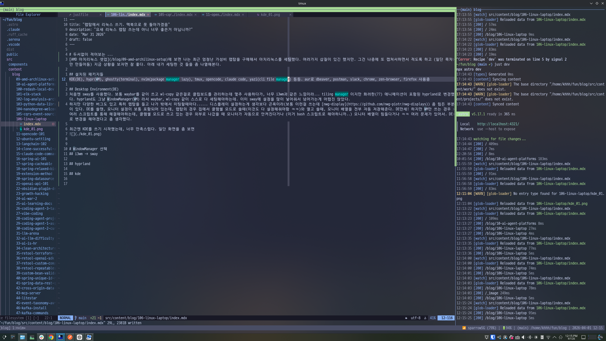
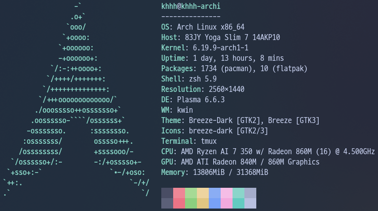
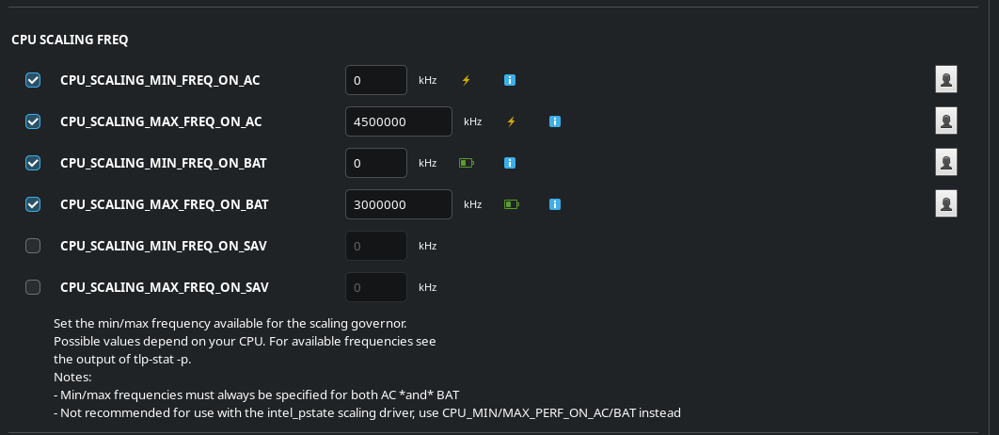
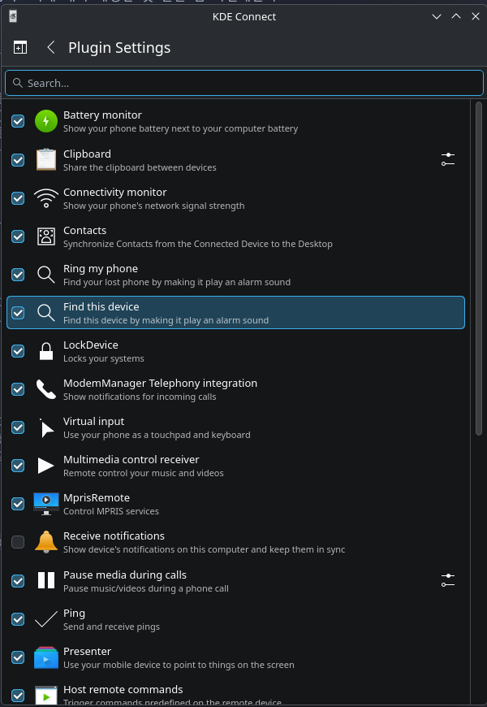
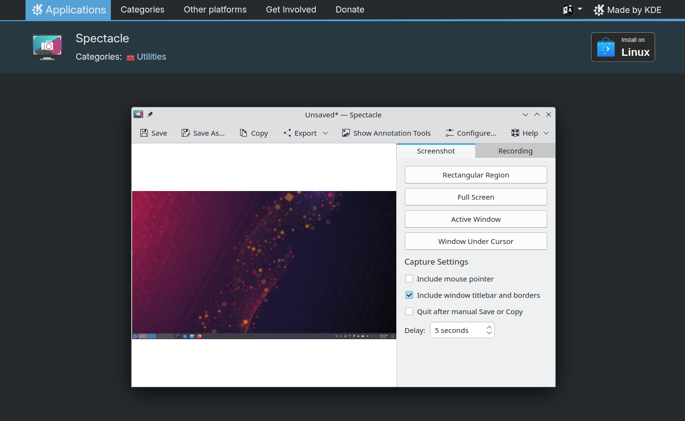
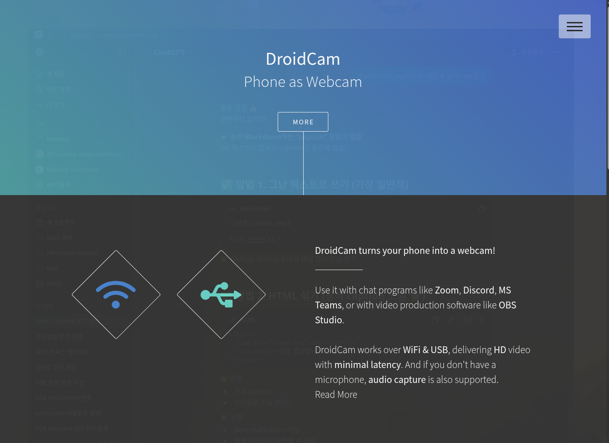

# 두서없이 적어보는 ...
[AMD 아치리눅스 셋업](/blog/09-amd-archlinux-setup)에 보면 나는 최근 엄청난 가성비 랩탑을 구매해서 아치리눅스를 세팅했다. 여러가지 삽질이 있긴 했지만. 그건 나중에 또 캡쳐서하면서 적도록 하고 (일단 목차만 만들어둠) 지금 상황을 보자면 참 좋다. 아래 내가 세팅한 것 들을 좀 나열해본다.

## 설치된 패키지들
KDE(DE), hypr(WM), ghostty(terminal), nvim(package manager lazy), tmux, yazi(cli file manager), stow(dotfile 관리), yay(aur), fcitx5, iwd, tlp 등등.

## Desktop Environment(DE)
처음엔 sway를 사용했다. 보통 waybar를 같이 쓰고 wl-copy 같은걸로 클립보드를 관리하는데 몇주 사용하다가, 너무 i3wm과 같은 느낌이라... tiling manager 이지만 화려한(??) 애니메이션이 포함된 hyprland로 변경했다. hyprland도 그냥 WindowManager(WM) 라서 waybar, wl-copy 같이 스스로 다 세팅해야하는데. 이미 sway에 설정을 많이 넣어줘서 넘어가는게 어렵진 않았다.
하지만 다양한 버그도 있고 특히 랩탑을 들고 나가 밖에서 미팅 할 때마다 어려움을 겪는데, 디스플레이 설정하는게 생각보다 곤욕이라(보통 이런걸 쓴다 -> [nwg-display](https://github.com/nwg-piotr/nwg-displays)) 좀 힘든 부분이 있다. DE를 쓸땐, 모니터 설정이 보통 포함되어 있는데, 랩탑의 경우 집에서 클램쉘 모드로 쓸때 WM만 쓴다면 클램쉘 모드일때 모니터 전원을 끈다던가, 등등 스크립트 작성이 필요하다. 좋게 생각하면 클램쉘 모드를 내가 마음대로 제어할 수 있다는거고 나쁘게 말하면 스크립트를 모르면 아무것도 못하는건데 ㅋㅋ. DE를 쓸때는 모니터 배열을 전부 자동 저장해준다. DE만세! 하지만 WM만 쓰는 경우 여러 스크립트를 통해 해결해야하는데, 클램쉘 모드로 쓰고 있는 경우 외부로 나갔을 때 모니터가 자동으로 안켜진다거나 (이거 bash 스크립트로 해야하니까..) 모니터 배열이 힘들다거나 ㅋㅋ 여러 문제가 있어서. DE로 변경을 해야겠다고 좀 생각했다.

최근엔 KDE를 쓰기 시작했는데, 너무 만족스럽다. 내 작업 화면을 좀 보면 아래와 같은데, ghostty에 tmux, nvim으로 블로그를 하고 astro를 이용해 빌드를 하고 있다. 여기에 intellij를 띄운다거나 chrome을 띄운다거나 Windows, Mac과 비슷한 환경으로 세팅했다.

> ghostty

그런데 KDE는 창 관리를 Windows, Mac 처럼 하기 때문에 tiling manager가 아닌데서 오는 거부감이 좀 있는데, KDE의 완성도가 너무 높고 WM은 직접 설정해서 써야하는데 그것 대한 피로감때문에 너무 만족하며 사용하고 있다. 특히 KDE와 archilinux 를 같이 쓰게 되는 경우, 패키지 선택할때도 많은 자유도가 제공되어 내 피씨에 최적화해서 사용이 가능하다.

> neofetch

## CPU frequency 설정
이건 Mac, Windows에선 하기 되게 어렵거나 못하는건데, 리눅스는 쉽게 할 수 있다. 난 [tlp](https://github.com/linrunner/TLP)를 사용중인데. 클럭을 낮춰서 cpu 온도를 제어해 무소음 환경을 구현할 수 있다. (정말 좋음 ㅋㅋ) 이 피씨는 최대 5Ghz까지 boost가 되는데, 5Ghz일때 좀 시끄럽다. fan 제어는 제조사에서 막아놔서 할 수 없고 cpu 클럭은 조절이 가능한데, AC|Battery에 따라 최대 클럭을 각각 나눠 제어할 수 있다. 이런 경우 Battery일때 오래 쓰고 AC일땐, 좀 더 클럭을 올려 쾌적한 환경이 가능하다. 4.5Ghz는 최대 클럭에서 10% 정도 깎은건데, 이정도 됐을때 fan 소음도 없고 쾌적하게 사용할 수 있었다.

> tlp

## kde connect
최근 iOS -> Android로 바꿨는데, KDE connect의 영향이 크다. 이 프로그램은 쉽게 설명하면 iOS, Mac의 동기화 기능을 비슷하게 구현해놓은 프로젝트다. 클립보드 공유, 전화받기, sms 보내기 뭐 여러가지 기능이 있는데, 좀 특이한건 Android의 sound를 PC로 streaming 할 수 있다. 이 랩탑의 경우 스피커가 dolby atmos 세팅이 되어 있는데, Android 음악을 Archi로 스트리밍해서 음악을 들으면 음질이 매우 훌륭해진다. 많이 쓰지는 않지만 재밌는 기능이다.

> kde connect

## capture
KDE 프로젝트의 [Spectacle](https://apps.kde.org/spectacle/)을 쓰는데. 걍 넘 좋음.

> Spectacle

## 한글
경험상 걍 fcitx5가 제일 좋더라. 한 몇 년전부턴 아예 다른거 안쓰고 이것만 씀.

## 화상채팅
여기도 뭐... 할말이 많지만. 일단 카메라 동작 자체는 잘됨. 근데 나는 클램쉘로 쓰니까. 이때 쓸수 있는 프로젝트가 있다. [Droid Cam](https://droidcam.app/)이라는 프로젝트 인데, iOS 카메라를 Mac으로 Forwarding 해주는 기능과 같다. ㅋㅋ 생각보다 너무 잘 동작해서 신기할 정도로 좋다.

> droidcam

## 그 외
가장 많이 쓰는 clipboard manager는 kde에 내장되어 있고 wifi는 [iwd](https://wiki.archlinux.org/title/Iwd)와 NetworkManager를 이용해 제어하고 있고 bluetooth, display등 너무 동작을 잘 해서 Mac으로 넘어가기가 오히려 겁날 정도로 잘 세팅되었다. 하지만 어려운 부분도 있다. 이건 아예 따로 써야하는데, speaker가 예상외로 참 설정이 어렵다. 여전히 리눅스의 사운드 시스템에 대해서는 잘 이해를 못했는데, 이걸 이해해야 제대로 사운드를 제어할 수 있다. 뭐.... Mac, Windows는 그냥 쓰면 되지만 리눅스는 매우 다르다. 상당히.... 어렵다 ㅋㅋㅋ 나중에 공부하고 다시 채워 넣어야지. 휴.....

# WindowManager 선택기
## i3wm -> sway
i3wm은 x11용이라 그걸 그대로 포팅한 sway를 몇주간 사용했다. 너무 i3wm이랑 똑같아서 좀 밋밋한 느낌이 있어서 고민하다가. hyprland로 변경했다.

## [hyprland](https://hypr.land/)
hyprland(hypr)로 바꿔야겠다고 생각한 이유는 아래 동영상 때문인데, sway에 없는 애니메이션!!(ㅋㅋ)이 너무 잘 구현되어 있어서 이건 좀 놓칠 수 없겠단 생각이 들었다. 이런 류의 프로젝트는 모두 i3wm의 bash 인터페이스를 그대로 따르고 있고 메뉴 창 같은 경우 모두 waybar를 따로 쓰고 뭐 필요한건 직접 찾아 설정해야하니까, i3wm -> sway -> hypr 로 넘어가는건 너무 간단했다. 한참 잘 쓰다가. 클램쉘 등 모니터 설정 삽질을 한참 하다가 kde로 넘어가게 되었다.
<video controls src="https://hypr.land/videos/end_4_rice_intro.mp4" type="video/mp4" style="max-width: 100%;"></video>

## kde
정착

