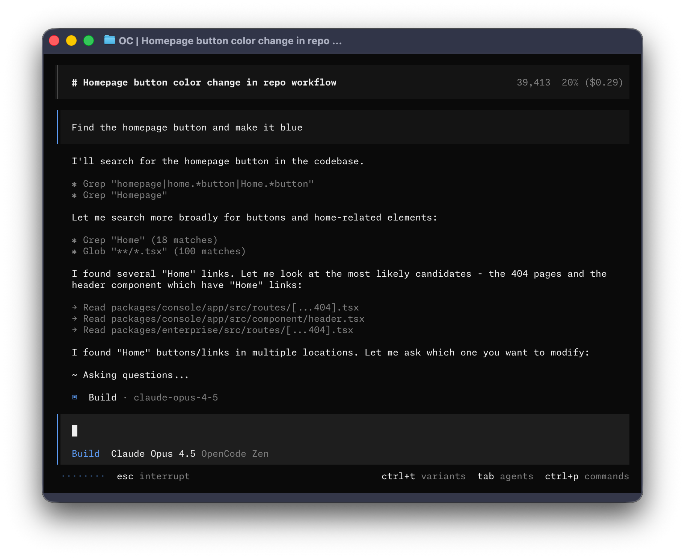
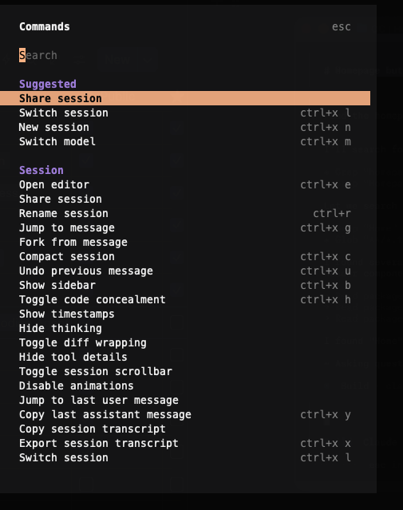
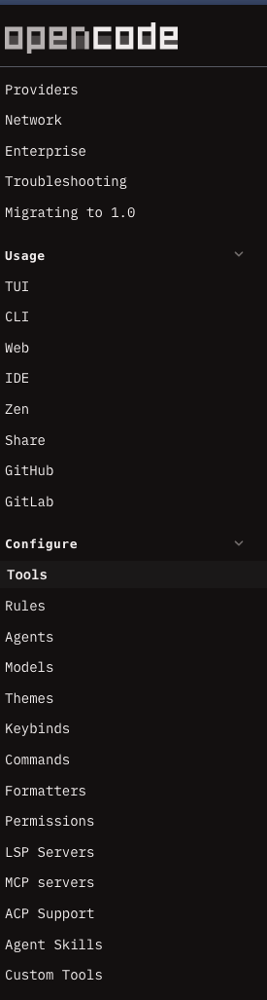
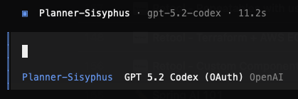
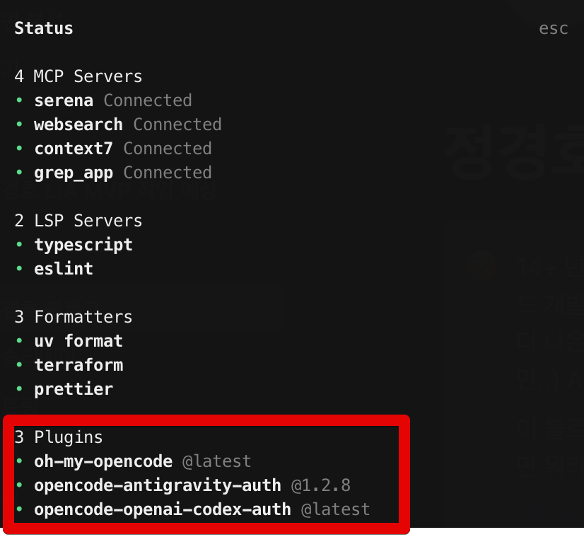

## 개요

요새 정말 AI쪽 기술 발전속도가 너무 빠르다. 현업에 있어도 이리 따라가기 벅찬데, 이 참… 계속 해보는 수밖에 없지. 요새 나는 claude code를 많이 쓰고 있었는데, 대체로 맘에 들었지만 좀 아쉬운건. claude code를 쓰다보면 계속 claude의 구독 등급을 올려야했다는 거다. plus는 너무 짧고 $100 max 를 써도. 좀 아쉽고… $200는 좀 무섭고.

이때 [opencode](https://opencode.ai/)가 도움이된다. opensource agent니까 다양한 llm을 쉽게 지원하고 google, openai, claude 연동도 쉽다. 여기에 그제부터 화제가 된 [oh-my-opencode](https://github.com/code-yeongyu/oh-my-opencode)를 곁들이면 여러 agent들이 생기며(Sisyphus, oracle, librarian 등 ? 아니 네이밍이…) 특정 상황에 특화된 에이전트를 호출 할 수 있다.

## 설치

```bash
# opencode
curl -fsSL https://opencode.ai/install | bash

# oh-my-opencode
npx oh-my-opencode install

# 코딩 도움되는 툴킷 필수 아님
# serena - 코딩 도움 툴킷
opencode mcp add # 이렇게 하면 TUI 창이 열림

# serena를 global로 install
uvx --from git+https://github.com/oraios/serena serena start-mcp-server --context=claude-code --project-from-cwd
```

## Opencode

코딩 agent로 claude code 같은거. TUI가 참 좋다. opencode는 lsp가 연동되어 있어서 java, ts, eslint 가 자동으로 실행되어 agent에게 전달하는 피드백이 훨씬 빠르다.



### Command

아래와 같은 커맨드를 제공하는데 leader key = `ctrl+x` 로 기본 지정되어있고 leader key + l,n 등 다양한 단축키가 제공됨.



### 그 외

아직 많이 안써봤지만 claude code에 있는것과 상당히 흡사해서 `wrap(컨텍스트 압축), session resume` 같은 그런 기능은 기본 제공하니 claude code 를 많이 써본 사람은 따라가기 쉽다.

### 문서화

[문서](https://opencode.ai/docs/tools/)가.. 좀 많은데. 아직 다 못 읽어봄 ㅋㅋㅋ



## Oh-my-opencode

위에서 같이 설치한 oh-my-opencode인데 이걸 설치하면 agent 선택 창이 바뀐다. 그리고 `@oracle, @librarian` 처럼 agent를 직접 호출해서 특화 기능을 사용할수도 있다.



### Sub agents

```
# Agents: Your Teammates
## Sisyphus (anthropic/claude-opus-4-5):
The default agent. A powerful AI orchestrator for OpenCode.
Plans, delegates, and executes complex tasks using specialized subagents
with aggressive parallel execution.

## oracle (openai/gpt-5.2):
Architecture, code review, strategy.
Uses GPT-5.2 for its stellar logical reasoning and deep analysis.

## librarian (opencode/glm-4.7-free):
Multi-repo analysis, doc lookup, implementation examples.

## explore (opencode/grok-code, google/gemini-3-flash, or anthropic/claude-haiku-4-5):
Fast codebase exploration and pattern matching.

## frontend-ui-ux-engineer (google/gemini-3-pro-preview):
A designer turned developer. Builds gorgeous UIs.

## document-writer (google/gemini-3-flash):
Technical writing expert.

## multimodal-looker (google/gemini-3-flash):
Visual content specialist. Analyzes PDFs, images, diagrams.
```

설치 후 ultrawork(ulw)를 하면 열심히 병렬로 마법같이 동작한다니.. 잘 써보면 좋겠다.

```
◇  🪄 The Magic Word ─────────────────────────────────────────────╮
│                                                                   │
│  Include ultrawork (or ulw) in your prompt.                       │
│  All features work like magic—parallel agents, background tasks,  │
│  deep exploration, and relentless execution until completion.     │
│                                                                   │
├───────────────────────────────────────────────────────────────────╯
```

oh-my-opencode 설치 후 status를 보면 활성화된 plugin이 보이는데, antigravity, openai 플러그인은 내가 설치하지 않았다. oh-my-opencode가 스스로 설치한건데, 아래 플러그인을 통해 각 계정을 쉽게 연동할 수 있다.



## 후기

claude-code에서 opencode로 변경하고 있다. 나는 여러 llm을 자유롭게 쓸 수 있는 opencode가 더 맘에 들고 여러 google antigravity 기능을 묶어서 사용량을 늘려 쓸 수 있는데, 이것도 맘에 들었다. 벤더들에 종속되는 것 보단 그렇지 않은게 나으니까.. 그리고 가격도 싸고. 암튼 더 사용해보려한다.

## 관련자료

- [OpenCode | The open source AI coding agent](https://opencode.ai/)
- [oh-my-opencode GitHub](https://github.com/code-yeongyu/oh-my-opencode)
- [Oh-My-OpenCode: 혼자서 $24,000 어치의 토큰을 사용했고 모든 경험을 녹여 | GeekNews](https://news.hada.io/topic?id=24978)
