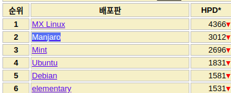
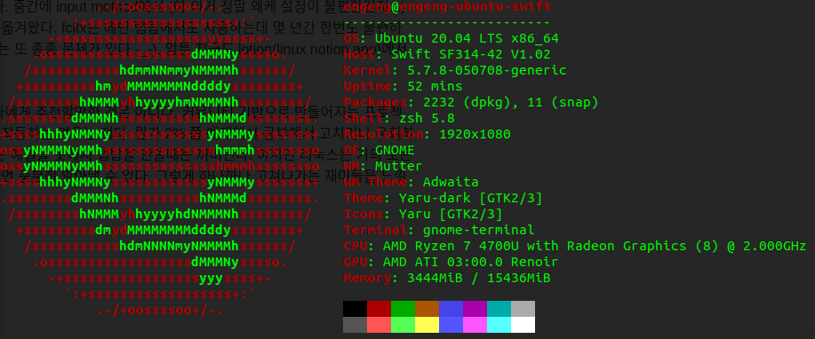

이 글은 누군가가 리눅스를 선택할 때, 조금이라도 도움이 됐으면 싶어서 쓰는 글이며 나의 일기이기도 하다. 나는 개발자로 일하고 있고 리눅스 → 맥 → 윈도우 순으로 좋아한다. 지금 이 글도 우분투 20.04 Kernel 5.7.8에서 쓰고 있다. 리눅스를 PC에서 주력으로 사용하게 된건 3년~4년쯤 된 것 같고 아직도 제대로 못 쓰지만 여러가지 갖고 놀기가 너무 좋아서 잘 쓴다. 회사에서는 여전히 맥을 쓰지만 이건 순전히 팀원들과의 협업때문이고 집에 있는 내 PC엔 리눅스만 깔려있다. 심지어 게임도 리눅스에서 함 (이거 언젠가 글 써봐야지)

한달 전 쯤 나는 라이젠에 꽂혀 지마켓에서 판매되었던 4700u acer 랩탑을 구매하게 되었다. 너무나 써보고 싶었던 CPU라서 엄청 신나서 주문했고 받아서 바로 만자로를 깔았다.

만자로는 distrowatch에서 2위나 하고 있는 엄청 인기가 많은 배포판 중 하나다. 아치 리눅스 기반이고 롤링 업데이트로 되게 유명하다. 빠르게 최신 커널이나 최신 패키지들을 설치해볼 수 있고. 배포판을 뭘 선택해야할지 고민하고 있다면 매우 좋은 선택지다.

PC를 처음 갖게 되면 여러 벤치마킹을 해보겠지만 나는 내가 하고있던 프로젝트의 테스트코드를 돌려보며 나름 벤치마킹을 해봤는데 주력으로 쓰고 있는 7700hq와 비교해봤을 때, 800개의 자바 테스트코드가 실행되는데 10초 정도의 차이밖에 나지 않았다. 물론 4700u가 10초가량 느렸으나 7700hq는 TDP가 45w이고 4700u는 15w밖에 되지 않으므로 절반 미만의 전력 소모로 이 정도의 성능차라니 정말 감격스러웠다. 역시 기술은 발전해야돼....

다만 여러가지 문제들이 있었는데, 리눅스 커널에서 라이젠을 제대로 지원하지 않아서 밝기 조절이나 suspend같은 기능이 잘 되지 않았다. (현재 5.7.8 최신 커널을 쓰는데 지금도 suspend 후 안깨어난다). 이 때 dmesg 나 pm 메세지들을 보면 분명 깨어났는데 x.org가 실행이 잘 안되는것으로 여겨질만한 로그가 많아서 우분투로의 전환을 하게 되었다. 만자로도 너무 좋았으나 나는 pacman 이나 aur이 좀 적응이 안되더라. 지금 생각해보면 apt 보다 분명 다루기가 더 쉬운것을 -_-

암튼 우분투 20.04를 깔면서 zfs를 선택했고 (아오 이거 실수임) 부팅해서 보니 커널이 5.4.x가 깔려 있더라. 여기서도 마찬가지로 suspend 후 깨어나지가 않고 밝기 조절도 안되고 외장 모니터도 인식을 못해서 커널을 업데이트하기로 마음먹었다. 모두 세팅하고 코딩을 하다가 모니터 없이 코딩을 할 수가 없어서 커널을 업데이트 했는데 자꾸 부팅이 안되서 보니 내가 사용하고 있는 zfs에서 커널을 5.4까지밖에 지원을 안하고 (하.........) zfs는 어떻게 업데이트를 하는지도 모르겠고 고민하다가 또 재설치를 하게 되었다. 이렇게 3번째 리눅스 세팅을 시작...

지금은 결과적으로 매우 잘 쓰고 있다. 중간에 input method에서 (아 이거 정말 왜케 설정이 불편한건지...) 좀 헤메다가 ibus → 벼루 → fcitx 로 옮겨왔다. fcitx는 메인 랩탑에서도 사용하는데 몇 년간 한번도 불편하지 않았다 (snap에서 설치한 패키지는 또 종종 문제가 있다 -_-). 암튼 지금도 lotion(linux notion app)에서 글을 쓰는데 잘 써지고 있다.

### 리눅스는 뭔가 조금 어렵긴 하다!

사실 리눅스를 쓰는 것은 일반 사용자에게 추천할만한 것은 아니다. 커뮤니티 기반으로 만들어지는 프로젝트가 많아서 상용제품만큼 완벽하게 작동하는 경우는 많지 않다. 뭔가 2% 쯤 애매하게 동작하기 때문에 공부해서 직접 고치거나 우회하거나 해야한다. 나도 아직 suspend는 해결을 못해서 랩탑을 안쓸때는 꺼버린다. 하지만 리눅스는 거의 모든 정보가 오픈되어 있으므로 알고 싶다면 충분히 알아낼 수 있다. 그렇게 하나하나 고쳐나가는 재미들을 느낄 수 있다면 써봐도 좋을것 같다.

### 윈도우 깔아봄

방금 외장 ssd를 이용해서 윈도우10을 깔아봤는데 너무 완벽히 잘되서 놀라웠다....... 윈도우 갓이다. 모든 하드웨어가 원할하게 동작된다. 윈도우만 딱 깔았는데, 디스플레이, 한글입력, 절전모드, 마이크, 카메라까지 모든것이 너무 완벽하게 동작한다. 이 랩탑은 현재 문서 작성 혹은 웹 브라우징, 가끔 출장 때 코딩을 하는 용도인데, 집에서는 윈도우만 쓰고 있다 ㅋㅋ 아니 너무 완벽하게 잘 되서 놀랍네... 개발은 물론 리눅스가 훨씬 편한데... 암튼... 리눅스 사용하실 분들 오늘도 화이팅이다.
