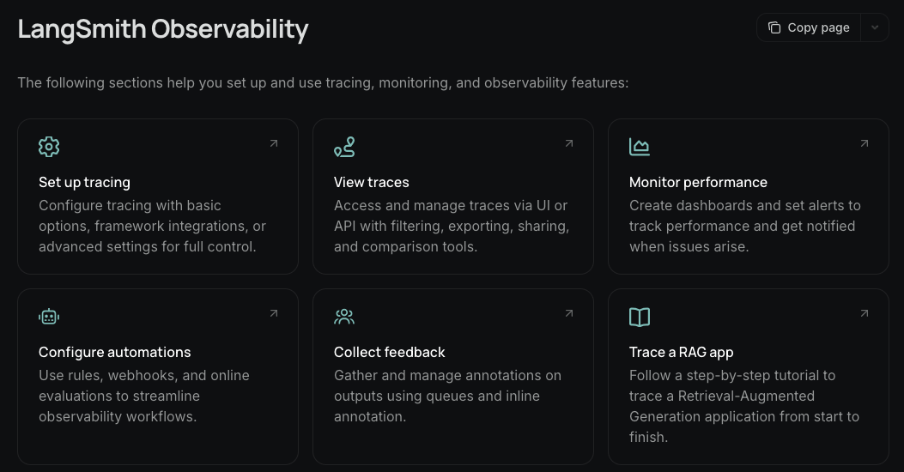
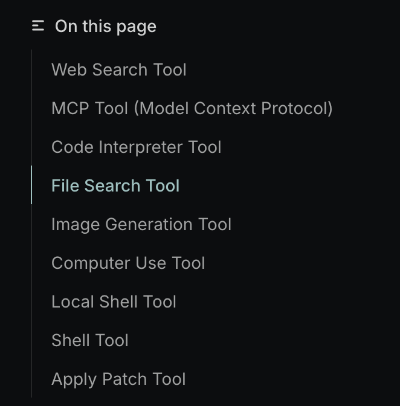
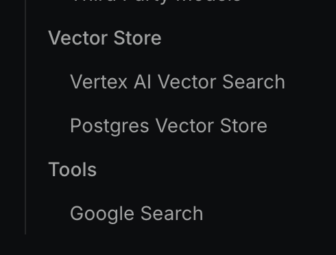

## 개요

[LangChain](https://docs.langchain.com/oss/javascript/langgraph/overview)은 아마 LLM 프로젝트를 시작하면 다들 이것부터 익히려고 할정도로 유명하다. 나도 그랬는데, 처음 기대보단 사용이 어렵고 처음 LLM을 시작하면 읽을게 너무 많아서 LangChain을 시도하기 어려웠다.

처음 LLM을 시작하면 OpenAI 문서를 많이 읽을거 같고 (근데 OpenAI 문서 양 진짜 많음….) 그 외에 Gemini, Anthropic 읽고 책도 좀 읽고 등등. 또 streaming을 잘하고 gui 입히기 위해 nextjs, shadcn, tailwindcss 를 읽다보면 참 한도끝도 없이 깊이 들어간다.

그래서 나는 LangChain 패스 후 OpenAI API, Gemini(gen-ai) API를 직접 구현하기 시작했다. 문제는 두 LLM을 자유롭게 선택하거나 아무튼 구현체를 두개씩 작성해야해서 (가끔 anthropic도 쓰는데 그럼 3개) 상당히 빡세다. 그래서 LangChain을 학습하고 있고 그 내용을 정리한다.

## LangChain Stack

이걸 스택이라고 쓰는지는 모르겠는데, 나는 그렇게 표현한다. 왜냐면 LangChain이 가장 기본이고 그걸 LangGraph가 사용해서 기능(Agentic)을 더 추가하고 그 걸 또 감싸서 LangSmith가 trace를 제공한다. 대충 아래와 같이 표현되지 않을까?

```
LangChain → LangGraph → LangSmith
(기본)       (Agentic)    (Trace)
```

암튼 가장 기본은 LangChain이라서 이걸 가지고 쉽게 LLM 서비스 개발을 시작할 수 있다. 또한 추가적으로 다음과 같은 많은 기능이 제공되는데, 상당히 유용해서 이걸 이제서야 이해할 수 있게되어 참 기쁘달까.

- [Memory](https://docs.langchain.com/oss/javascript/langchain/short-term-memory)
- [Middleware (beforeModel, afterModel)](https://docs.langchain.com/oss/javascript/langchain/middleware/overview)
- [Tools](https://docs.langchain.com/oss/javascript/langchain/tools)
- [multi-agents](https://docs.langchain.com/oss/javascript/langchain/multi-agent)
- [human-in-the-loops](https://docs.langchain.com/oss/javascript/langchain/human-in-the-loop)
- [thread_id](https://docs.langchain.com/oss/javascript/langchain/short-term-memory#usage) (`{ configurable: { thread_id: "1" } }`)
- [Tracing](https://docs.langchain.com/langsmith/observability)



참 많은 기능을 제공하고 당연히 읽을것도 많아서 작업해보며 내용을 채워본다. 이제서야 overview가 좀 되는 느낌이라 이 문서도 이제 써봄

아래부터는 내가 구현하며 필수라고 생각되는 부분을 좀 정리해보려고 한다.

## Memory

## Middleware

## Tools

## Thread_id

## LangSmith

## Provider 통합기능

### OpenAI

충실하게 다양한 기능 제공



### Gemini API

제미나이도 나름 여러 기능 제공



## 관련자료

- [LangChain overview - Docs by LangChain](https://docs.langchain.com/oss/javascript/langchain/overview)
- [LangGraph overview - Docs by LangChain](https://docs.langchain.com/oss/javascript/langgraph/overview)
- [LangSmith docs - Docs by LangChain](https://docs.langchain.com/langsmith/home)
