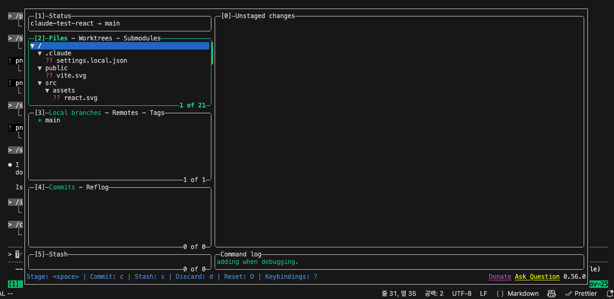

## 개요

요새 claude code를 많이 사용해보는데 명령어가 꽤 많아서 먼저 기능부터 파악해본다. 내가 자주 쓰는것들과 자주 쓰는것들만 일단 정리

> 더 자세히 보고 싶다면 [Claude Code Docs](https://code.claude.com/docs/en/cli-reference)를 읽으세요!

## 바로 쓰면 좋은 명령어

1. IDE 연결
   1. `claude --ide` 👈 이거 정말 많이 쓴다.
2. 이전 대화 목록을 보여주며 claude 실행
   1. `claude -r`
   2. `claude -c` 명령어로 자동으로 마지막 세션 시작 가능

## CLI 명령어

특이하게 한번 쿼리 후 종료되는 명령어들이 존재함. -p 를 넣으면 되는데. bash pipe 처리가 가능하므로 여러 방법으로 활용 가능하다.

1. `claude "query"`
   1. query 로 커맨드 시작
2. `claude -p "query"`
   1. query 실행한 후 종료
3. `cat file | claude -p "query"`
   1. file의 내용을 클로드에 query와 함께 전달 후 처리
4. `claude update`
   1. 업데이트

## REPL 명령어

1. `/help`
   1. tab으로 순환 가능
2. `/agents`
   1. claude는 자동으로 agent를 선택하지만 사용자가 에이전트를 정의하고 실행시킬 수 있음
3. thinking, plan mode
   1. `tab`, `shift+tab` 으로 thinking, plan mode를 선택할 수 있음
4. `#` 메모리 (CLAUDE.md)에 내용 추가
5. `!` bash 명령어
   1. `! npm test`
   2. `/bashes` 백그라운드 작업 보기
6. `Ctrl+R` 입력한 프롬프트 검색
7. `Ctrl+L` 화면 clear
8. `/config`
   1. 설정 변경하거나 status, usage 도 볼 수 있음
9. `/permissions`
   1. 자동실행할지 말지
10. `/sandbox` sandbox를 만들어 안전한 환경에서 작업을 하는건데..
    1. 잘 안되는거 같다. 잘 모르겠음
11. `/install-github-app`
    1. repl에서 위 명령어 입력하고 좀 따라가다보면 알아서 설정 다 해준다. 상당히 편함
    2. 대신 리뷰 결과가 영어로 나오기때문에 프롬프트를 한글로 바꿔주는게 낫다

## 실무 팁

요새 claude와 함께 개발할 때 아래의 workflow를 사용한다. (tmux, claude code, lazygit)

1. `tmux`
2. `claude -c --ide`
3. 여러 작업\~\~\~
4. `! pnpm test`  — bash command 실행
5. `ctrl+b,ctrl+g`  — tmux 기능 실행
   1. tmux에서 lazygit을 popup으로 노출
   2. `space,c,P`
      1. 차례대로 stage,commit,push

> claude code를 쓰면 terminal을 하나 차지하니까 bash 명령어랑 왔다갔다 하며 사용하기 좀 불편하다. tmux를 사용하면 이런 부분을 좀 회피할 수 있고 특히 popup 모드를 사용하면 더 편하게 다른 작업을 할 수 있다.

## 관련자료

[CLI reference - Claude Code Docs](https://code.claude.com/docs/en/cli-reference)
