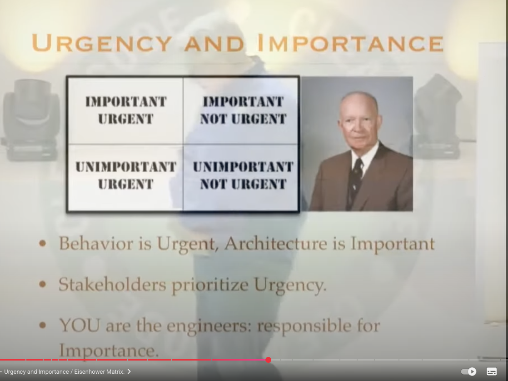

## 엉클밥 강의

[Clean Code - Uncle Bob / Lesson 5](https://www.youtube.com/watch?v=sn0aFEMVTpA&t=4268s)

이 강의를 본(보진 않았지…. 요약을 읽기만 했다 ㅎ) 이유는 요새 하는 프로젝트에서 또 속도를 강요받아 어떤식으로 이야기를 풀어가야할까 고민이 되었기 때문이다. 예전에 클린 아키텍처, 헥사고날 아키텍처에서 엉클밥이 해주신 이야기가 언뜻 떠올라 자세한 내용을 봐야겠다 생각했다.

아래 요약이 많은데 내가 다시 요약해보면 아래와 같다.

1. 고객의 요구사항은 "긴급한 일"
2. 아키텍처는 "중요한 일"
3. 그런데 비즈니스 담당자는 아키텍처는 모르므로 그걸 지키는건 개발자의 책임
   - 개발자는 시스템의 장기적인 건강을 책임지는 이해관계자(Stakeholder)로써 담당자를 설득할 수 있어야한다.
   - 이 일은 용기와 소통 능력이 필요한, 매우 어려운 일임을 인정하지만, 이것이 진정한 프로페셔널리즘이라고 정의합니다.
4. 아키텍처의 목표
   - 시스템을 작동시키는 것이 아니라, 시스템을 구축하고 유지보수하는 데 필요한 인력(비용)을 최소화하는 것
   - "빠르고 지저분하게(Quick and Dirty)"라는 개발 문화는 신화에 불과하며, 진짜로 빠르게 가는 유일한 방법은 처음부터 깨끗하게, 즉 '제대로' 가는 것이라고 강조합니다.

나는 친구들과 이야기하며 시니어를 뽑는 이유는 더러운것을 치우기 위해서라고 자주 이야기한다. (물론 우리도 더러운것을 만들지만…) 매우 더러운것을 좀 덜 더러운 것으로 만들기 위해 우리가 비싼 값을 받는거라고. 항상 가는 곳 마다 정말… 엄청난게 있다. 그걸 치우며 스트레스와 성취감을 느끼며 도를 닦는 마음으로 한발한발 나아간다.

아키텍처의 목표는 `인력을 최소화하는 것`이라는 목표를 다시한번 상기해본다.

## AI 요약

### 소프트웨어의 두 가지 가치와 위기

강연은 소프트웨어 아키텍처의 근본적인 목표를 정의하며 시작합니다. 엉클 밥은 아키텍처의 목표가 단순히 시스템을 작동시키는 것이 아니라, **시스템을 구축하고 유지보수하는 데 필요한 인력(비용)을 최소화**하는 것이라고 단언합니다. 그는 실제 한 인터넷 스타트업의 데이터를 보여주며, 잘못된 아키텍처가 어떻게 개발자 수를 기하급수적으로 늘리면서도 실제 코드 생산성은 바닥으로 떨어뜨리는지 생생하게 증명합니다.

### 아키텍처와 개발자의 책임

엉클 밥은 아이젠하워 매트릭스를 빌려 이 두 가치를 설명합니다. 고객의 요구사항은 '긴급한 일'이고, 좋은 아키텍처를 유지하는 것은 '중요한 일'입니다. 그는 비즈니스 담당자는 아키텍처의 중요성을 이해하거나 우선순위를 정할 수 없으므로, **아키텍처를 지키는 것은 온전히 개발자의 책임**이라고 말합니다.

### 클린 아키텍처의 서막: 의도를 드러내는 설계

좋은 아키텍처는 사용된 프레임워크가 아니라 **애플리케이션의 '의도(Intent)'를 소리쳐야 한다**고 주장합니다. 마치 건물의 설계도가 '이것은 도서관이다'라고 말해주는 것처럼, 소프트웨어의 최상위 구조는 '이것은 은행 시스템이다'라고 명확히 보여줘야 한다는 것입니다.

### 핵심 원칙: 의존성 규칙과 플러그인 아키텍처

클린 아키텍처의 심장부인 **'의존성 규칙(The Dependency Rule)'**이 소개됩니다. 모든 소스 코드 의존성은 시스템의 외부(UI, DB, 프레임워크)에서 내부(핵심 비즈니스 로직)를 향해야 한다는 것이 핵심입니다. UI와 데이터베이스는 비즈니스 로직에 **'플러그인'**처럼 연결됩니다.

### 결론: 결정을 미루는 기술과 프레임워크에 대한 경고

좋은 아키텍처가 어떻게 **중요한 기술적 결정을 가능한 한 뒤로 미룰 수 있게 하는지** 보여줍니다. 프레임워크는 '결혼'할 대상이 아니라, 항상 경계를 두고 신중하게 사용해야 할 도구일 뿐이라고 말하며 강연을 마무리합니다.

## 핵심 인사이트

> "소프트웨어 아키텍처의 품질은 '무엇을 할 수 있는가'가 아니라, '무엇을 하지 않아도 되는가'로 결정된다."

좋은 아키텍처는 UI를 바꾸기 위해 비즈니스 로직을 수정할 필요가 없고, DB를 교체하기 위해 UI 코드를 건드릴 필요가 없습니다. 변경의 파급 효과를 최소화하고, 개발자가 '하지 않아도 될 일'을 만들어주는 것이 아키텍처의 진정한 가치입니다.
