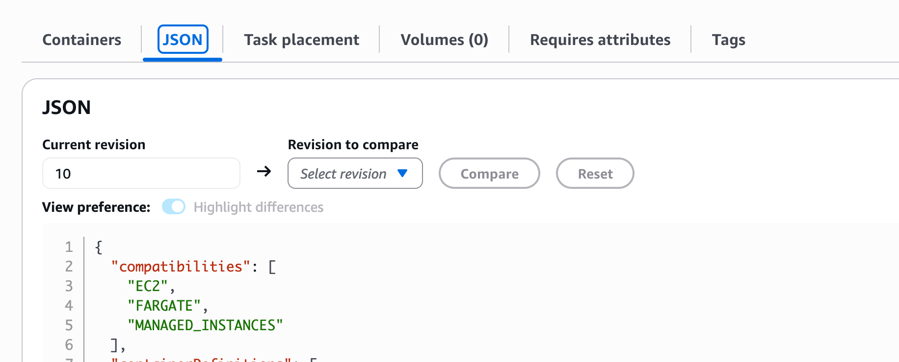

## 개요

리툴을 사용할 때, cloud로 쓰면 쉽지만, 회사의 데이터를 외부로 보내기 싫은 찝찝함이 존재한다. 거기다가 retool서버가 한국 로케이션이 없어서 느리기도 하고.. 또 사내 보안정책때문에 어쩔 수 없이 내부망에 설치해야하는 경우가 있다.

나는 AWS ECS에 Terraform으로 올려서 운영중인데, 처음은 좀 어렵지만 ECS니까 운영하기도 쉽고 terraform에 익숙하면 retool 업데이트도 쉬워서 추천할만 하다.

## 설치방법

> 리툴은 공식적으로 ecs terraform 파일을 지원한다. 나도 [공식문서](https://docs.retool.com/self-hosted/tutorials/ecs-fargate/terraform)를 참고했다.

### 요구사항

1. 리툴을 설치한 후 라이센스 키를 받아야함
2. Temporal
   - retool workflow를 실행하려면 temporal이 필요한데, 이건 운영이 힘들어 나는 설치하지 않았음
3. AWS 계정 - access token id, access secret key를 aws init 명령어로 저장해둬야함
4. terraform도 설치해두고..

### tf file

retool에서 tf파일을 꽤 잘만들어둬서.. 쉽게 된다. 우린 여기에 추가적으로 vpc, subnet, region, alb 설정을 추가하면된다. 아래는 내가 만들어 사용중인 `retool-module.tf`인데 필요한 수정하고 싶은 부분은 [retool-github-variables](https://github.com/tryretool/terraform-retool-modules/blob/main/modules/aws_ecs/variables.tf)를 참고하면 된다.

```bash
module "retool" {
  source = "git@github.com:tryretool/terraform-retool-modules.git//modules/aws_ecs"

  # Basic Configuration
  aws_region          = var.aws_region
  vpc_id              = aws_vpc.retool_vpc.id
  public_subnet_ids   = aws_subnet.retool_public_subnets[*].id
  private_subnet_ids  = aws_subnet.retool_private_subnets[*].id
  ssh_key_name        = var.ssh_key_name
  retool_license_key  = var.retool_license_key

  additional_env_vars = [{
    name  = "BASE_DOMAIN"
    value = "${var.subdomain}.${var.base_domain}"
  }]

  # ECS Configuration
  ecs_retool_image    = var.ecs_retool_image
  launch_type         = "FARGATE" # 나는 fargate로 사용하도록 설정했음.

  # RDB
  rds_instance_class    = var.db_instance_class
  rds_instance_engine_version = var.db_engine_version
  rds_storage_type      = var.db_storage_type

  # instance_count
  min_instance_count = 2
  max_instance_count = 3

  # temporal 설정을 안했으므로 Workflows 비활성화
  workflows_enabled             = false
  use_existing_temporal_cluster = false

  # ALB 설정
  alb_http_redirect = false
  cookie_insecure   = false

  # log
  log_retention_in_days = 3
  ecs_insights_enabled = "disabled"

  alb_ingress_rules = [
    {
      description      = "Global HTTPS inbound"
      from_port        = "443"
      to_port          = "443"
      protocol         = "tcp"
      cidr_blocks      = ["0.0.0.0/0"]
      ipv6_cidr_blocks = ["::/0"]
    }
  ]
}
```

## 주의할점

1. retool은 전용 디비가 필요한데, 이때 패스워드가 auto generate 되므로 저장을 잘 해둬야한다. 만약 패스워드를 잊었다면 ecs task definition을 살펴봐라



## 관련 링크

- [Deploy Self-hosted Retool on AWS Fargate and ECS with Terraform](https://docs.retool.com/self-hosted/tutorials/ecs-fargate/terraform)
- [AWS ECS + EC2 Module github terraform module](https://github.com/tryretool/terraform-retool-modules/tree/main/modules/aws_ecs)
- [변수명 참고](https://github.com/tryretool/terraform-retool-modules/blob/main/modules/aws_ecs/variables.tf)
