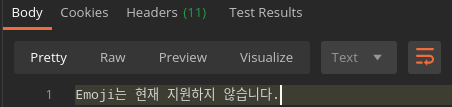

## Bean Validation

Web framework들은 validation 기능들을 제공하는데 가장 많이 사용되는 곳은 사용자의 요청을 미리 살펴볼때 사용한다. 예를들어 price라는 필드가 있을 때, 우리 서비스 내에서는 100만원까지만 입력할 수 있다고 치자. 이걸 어떻게 처리할까?

```kotlin
// 이렇게 처리하면 어떨까?
val price = request.body.price

if (price > 1_000_000) throw OverPriceException("100만원까지만 입력할 수 있습니다")
```

위의 코드도 틀린건 아닌데, price가 여러군데서 사용되다보면 아무래도 더 나은 방법들을 고민하게 될 것이다. 이때 validation 기능을 사용하면 되는데 보통 이렇게 사용한다.

```kotlin
data class PriceRequest(
  @get:Min(value = 0, message = "Price는 0보다 커야합니다.")
  @get:Max(value = 1_000_000, message = "Price는 100만원보다 작아야합니다.")
  val price: Int? = null
)
```

이렇게 해두면 Bean Validator가 자동으로 값을 체크하고 조건에 틀렸을 경우 정의해둔 메세지와 함께 에러를 throw 한다. 그리고 당연히 Custom Validator를 만들수도 있다.

## Custom Bean Validator

예를들어 어떤 이유로 emoji를 사용못하게 하고 싶다고 하자. 우리는 emoji가 request 요청과 함께 들어오면 에러 메세지를 내고 400에러와 함께 반환시키려고 한다.

### 1. Annotation 정의

```kotlin
import javax.validation.Constraint
import kotlin.reflect.KClass

@Target(
        AnnotationTarget.FIELD,
        AnnotationTarget.PROPERTY_GETTER
)
@Retention(AnnotationRetention.RUNTIME)
@Constraint(validatedBy = [NoEmojiValidator::class])
@MustBeDocumented
annotation class NoEmoji(
        val message: String = "Emoji는 현재 지원하지 않습니다.",
        val groups: Array<KClass<out Any>> = [],
        val payload: Array<KClass<out Any>> = []
)
```

### 2. Validator 만들기

```kotlin
import com.vdurmont.emoji.EmojiParser
import org.springframework.util.StringUtils
import javax.validation.ConstraintValidator
import javax.validation.ConstraintValidatorContext

class NoEmojiValidator : ConstraintValidator<NoEmoji, String> {
    override fun isValid(value: String?, context: ConstraintValidatorContext?): Boolean {
        if (StringUtils.isEmpty(value)) {
            return true
        }

        return EmojiParser.parseToAliases(value) == value
    }
}
```

### 3. 적용하기

**Controller**에서 `@Valid` Annotation을 이용해 Validation을 사용할 것이라는 것을 미리 알려야한다.

```kotlin
@GetMapping("")
@ResponseBody
fun get(@RequestBody @Valid request: UserRequest): ResponseEntity<*> {
   ...
}
```

**Request**에서 `@get:NoEmoji`를 field에 연결시킨다. `@get`은 [Annotation Use-site Targets](https://kotlinlang.org/docs/reference/annotations.html#annotation-use-site-targets)에서 볼 수 있다.

```kotlin
data class PriceRequest(
  @get:Min(value = 0, message = "Price는 0보다 커야합니다.")
  @get:Max(value = 1_000_000, message = "Price는 100만원보다 작아야합니다.")
  val price: Int? = null,

  @get:NoEmoji
  val name: String? = null,
)
```

### 4. 에러 메세지 반환하기

```kotlin
@ControllerAdvice
class GlobalControllerExceptionHandler : ResponseEntityExceptionHandler() {
    override fun handleMethodArgumentNotValid(
          ex: MethodArgumentNotValidException,
          headers: HttpHeaders,
          status: HttpStatus,
          request: WebRequest): ResponseEntity<Any> {
      val message = ex.bindingResult.allErrors[0].defaultMessage

      return handleExceptionInternal(ex, message, headers, HttpStatus.BAD_REQUEST, request)
    }
}
```

### 5. 결론

Emoji를 넣으려고 시도하면 이런 메세지를 볼 수 있다.



## References

- [Custom Bean Validation (JSR-303) Annotations](https://discuss.kotlinlang.org/t/custom-bean-validation-jsr-303-annotations/6743)
- [Annotation Use-site Targets](https://kotlinlang.org/docs/reference/annotations.html#annotation-use-site-targets)
- [Spring Boot, Kotlin, JSR 380으로 요청 파라메터 유효성 검사하기](https://jsonobject.tistory.com/459)
