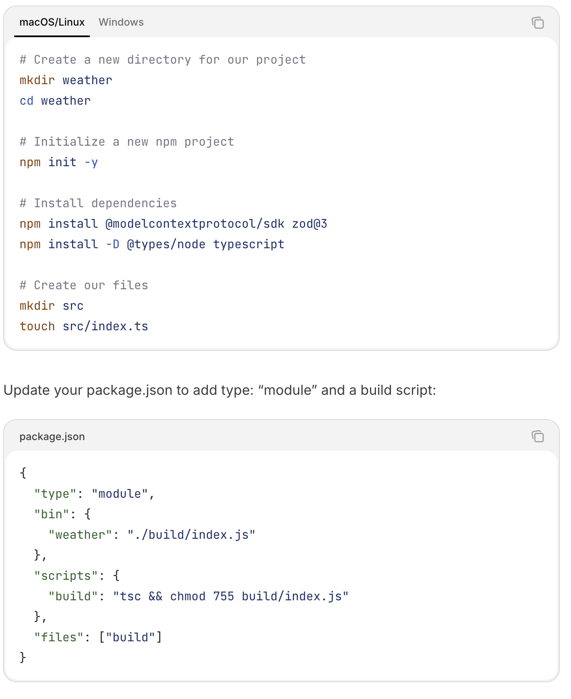
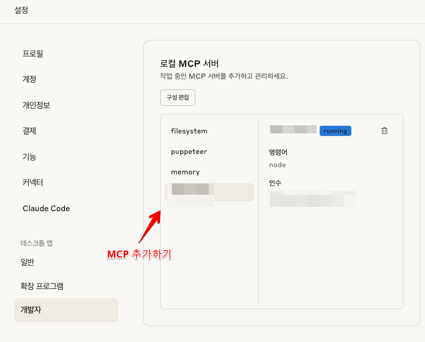
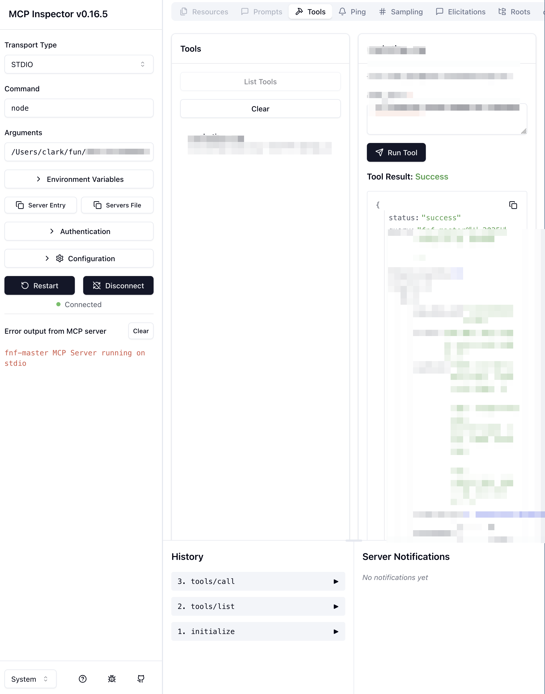

# 개요

회사에서 MCP가 갑자기 필요해서 급하게 만들어봄. Anthropic 문서가 너무 잘되있고 요구사항이 작아서 금방 만들 수 있었다.
다음에 더 빠르게 만들기 위해 정보를 모아둔다.

# 따라가기

[Build an MCP Server](https://modelcontextprotocol.io/quickstart/server#node) 여기서부터 시작해서 천천히 따라가면됨. 난 ts 로 구현함

npm init, package.json 수정등 기본적인거 한다.



## 코드는 이정도?

```typescript
import { McpServer } from "@modelcontextprotocol/sdk/server/mcp.js";
import { StdioServerTransport } from "@modelcontextprotocol/sdk/server/stdio.js";
import { z } from "zod";

const server = new McpServer({
  name: "MCP_TEST",
  version: "0.1.0",
  capabilities: {
    tools: {},
  },
});

async function makeRagRequest(body: { user_input: string }) {
  const url = "BASE_URL";

  try {
    const response = await fetch(url, {
      method: "POST",
      headers: {
        "Content-Type": "application/json",
      },
      body: body ? JSON.stringify(body) : undefined,
    });

    const data = await response.json();

    return {
      content: [
        {
          type: "text" as const,
          text: JSON.stringify(data),
        },
      ],
    };
  } catch (error) {
    return {
      content: [
        {
          type: "text" as const,
          text: `Error: ${
            error instanceof Error ? error.message : "Unknown error"
          }`,
        },
      ],
    };
  }
}

server.tool(
  "TOOL_NAME",
  "TOOL_DESCRIPTION",
  {
    user_input: z.string().describe("검색할 키워드"),
  },
  async ({ user_input }) => {
    return makeRagRequest({ user_input });
  }
);

async function main() {
  const transport = new StdioServerTransport();
  await server.connect(transport);
  console.error("MCP Server running on stdio");
}

main().catch((error) => {
  console.error("Fatal error in main():", error);
  process.exit(1);
});
```

이정도 코드 작성하고 빌드하면 준비는 끝!

# Claude Desktop에 넣기

이 위치에 가서 mcp server 추가하면 됨. 설정법은 cursor와 같음



# Debugging

처음에는 잘 안되서 [Inspector](https://modelcontextprotocol.io/legacy/tools/inspector) 여길 보고 디버깅을 시작. 아래와 같은 커맨드를 입력해서 디버깅을 시작할 수 있다.

```bash
npx @modelcontextprotocol/inspector node my_mcp.js
```



이런식으로 MCP 테스트 가능!
