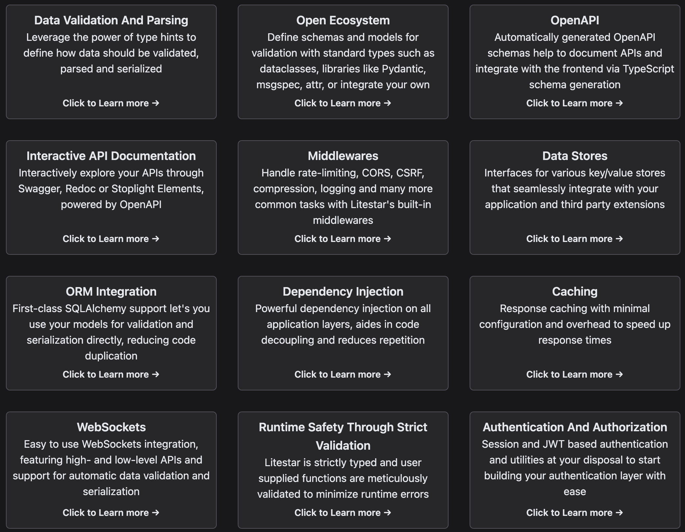

# 개요

요새 python 프로젝트를 진행하며 Pydantic, FastAPI를 많이 사용했다. Pydantic은 너무 무거운 느낌을 Fastapi는 적당했다?는 느낌을 받았다. 그렇지만 router를 추가하거나 파일을 나눌 땐 좀 별로고 pydantic이 생각보다 linter와 잘 안붙어서 영 껄끄러웠음

그러던 중 긱뉴스에서 Litestar를 발견했고 잠깐?(5분?) 살펴본 내용을 적어본다

# Litestar

[Litestar library documentation](https://docs.litestar.dev/2/index.html)

```python
# https://docs.litestar.dev/2/index.html
from litestar import Litestar, get


@get("/")
async def index() -> str:
    return "Hello, world!"


@get("/books/{book_id:int}")
async def get_book(book_id: int) -> dict[str, int]:
    return {"book_id": book_id}


app = Litestar([index, get_book])
```

```python
# https://fastapi.tiangolo.com/#installation
from typing import Union

from fastapi import FastAPI

app = FastAPI()


@app.get("/")
def read_root():
    return {"Hello": "World"}


@app.get("/items/{item_id}")
def read_item(item_id: int, q: Union[str, None] = None):
    return {"item_id": item_id, "q": q}
```

위에서 보이는 두 프레임워크의 차이점은 그다지 커 보이지 않는다. 그런데 Litestar의 초기화가 훨씬 명시적이다. 이런 경우 파일을 쉽게 나눌 수 있을 것으로 보인다.

## 문서

[Usage — Litestar Framework](https://docs.litestar.dev/2/usage/index.html#)


FastAPI도 그렇지만 Litestar도 문서화가 참 잘되있다. 너무 보기 편하잖아?

## 왜 갑자기 DTO?

이건 타이핑이 없는 파이썬의 특성인가? [DTO](https://docs.litestar.dev/2/usage/dto/index.html)를 가이드 문서에 적어둔건 처음보는데? 내가 이 플로우를 따라할거 같진 않다.

## OpenAPI

이거 없음 안되지. FastAPI 도 너무 잘되있어서. OpenAPI 서포트 없으면 안쓸듯.

## 미리 빌트인된 기능이 많다

문법도 일관성있고(제일 취향) 전체적으로 좋은 느낌을 준다. 나중에 써봐도 좋을듯


