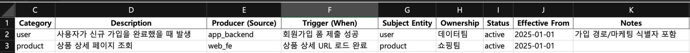
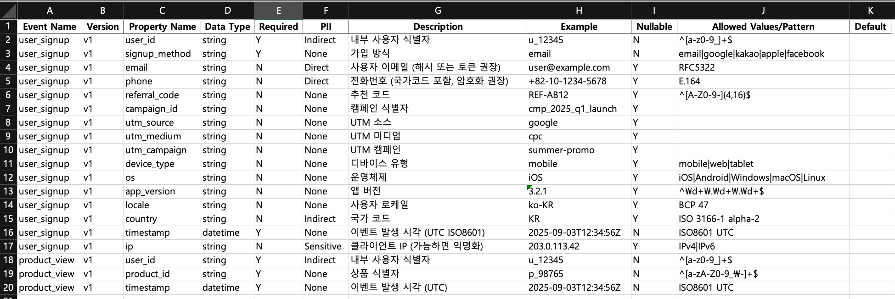
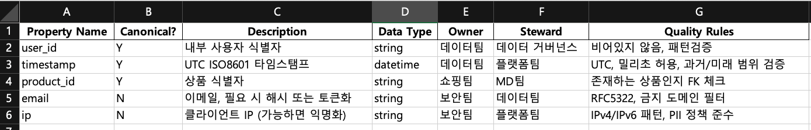
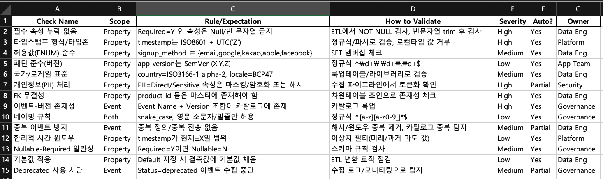

# 개요

데이터 엔지니어링에서의 이벤트 텍사노미를 살펴보고 Avro를 이용해 규칙을 모든 팀이 공유하는 방법을 탐구한다

> 💡 텍소노미는 **과학적인 분류**라는 뜻
> (그리스어로 "분류하다"라는 "tasse in"과 "법, 과학"이라는 "nomos"의 합성어)

---

# 이벤트 텍소노미 (Event Taxonomy)

## 예제 및 옛날 기억

- 이벤트 수집에서의 텍소노미는 시스템에서 발생하는 이벤트를 정의하고 분류하는 체계를 말한다
- 옛날 생각을 해보면 이 부분에 대해 고통이 많았다.
  - 추적하고 싶은 이벤트를 설계하고 그걸 다시 코딩하는 일은 엄청난 꼼꼼함이 필요했다.

  

  

  

  

  - 위에 이벤트 텍소노미를 정의해둔건데. 이걸 정의하는 것도 쉽지 않지만 꼼꼼하게 코딩하는건 또 다른 어려움이다.

## 처음 시작할 때

- 얼마만큼의 텍소노미를 정의하는게 좋을까?
  - 가장 좋은건 핵심 이벤트이다.
  - 예를들어 비즈니스에서 가장 중요한 이벤트. signup, add_to_cart, checkout_completed 같은 지표들일 수 있겠다.
  - 대충 OMTM은 반드시 추가해야겠다.
  - 대략 20-30개 정도 될거 같다.

## 활용

- 데이터 거버넌스
  - 조직 전체가 동일한 정의를 사용한다. 협업이 쉬워지고 보안 준수에도 도움이 된다.
  - 분석/머신러닝시에도 데이터가 표준화 되어있으므로 전처리 과정에 도움이 된다.

## 이벤트 정의 후 수집 vs 포괄적 수집 후 ETL

- 사실 두가지다 사용하는데, 장단점이 있다.
  - 아래 두가지 방법 모두 정의해뒀다. 결국 거버넌스를 먼저 확립하고 결정할 일이겠지만, 엔지니어링 부담이 적다면 먼저 수집하는것도 고려해볼만 하다. 하지만 데이터가 많더라도 신뢰성에 대한 문제가 생기므로 이벤트 정의 후 수집이 더 고려할만 하다.
  - **이벤트 정의 후 수집**
    - Google Analytics나 Amplitude 같은 툴을 도입할 때, 이벤트를 명확히 결정한다. 이때의 장점은 수집 데이터의 목적과 스키마가 명확하다는 것이다. 이벤트 명, 속성 등이 미리 합의되므로 분석시 일관된 지표를 얻을 수 있고, 불필요한 데이터가 적어 데이터 품질 관리가 수월하다. 회사 전반의 이벤트 스키마를 엄격히 정의/검수하면 부서별로 발생시키는 이벤트에도 일관성이 높아지고 오류가 감소한다. 후 처리 과정도 당연히 쉬워진다.
  - **포괄적 수집 후 ETL**
    - 일단 가능한 한 모든 사용자 상호작용 데이터를 수집해 두고, 사후에 ETL 또는 분석 단계에서 유의미한 이벤트로 정의/가공하는 방식이다. Heap같은 서비스가 제공하는 오토 캡처(Auto-capture) 전략의 장점은 놓치는 데이터가 거의 없다는 것이다. 수동 계측에서는 대부분 이벤트를 아예 수집 못하지만, 자동수집을 하면 일단 사용자의 모든 행동 로그가 축적되므로 나중에 예기치 않은 분석 질문이 생겨도 과거 데이터를 활용해 답을 찾을 수 있다. 게다가 제품이 변화해도 자동으로 새 이벤트가 기록되므로, 개발자가 일일이 태깅하지 않아도 데이터 연속성이 유지된다.
    - 또한 예상 못 한 사용자 행동이 의외의 인사이트를 주는 경우가 많은데, 포괄적 수집은 이런 롱테일 이벤트도 데이터에 남겨둠으로써 새로운 발견을 가능케 한다.
    - 다만 단점도 분명하다. 방대한 원시 로그 데이터를 다 저장하고 처리해야 하므로 비용과 엔지니어링 부담이 있다. 또 노이즈 데이터(분석 가치가 낮은 이벤트)까지 쌓여서 후처리에 부담이 될 수 있다.
- 핵심 지표에 대해서는 이벤트를 꼼꼼히 정의하여 추적(예: 구매, 회원가입 등)하고, 그 외의 사용자 행동 데이터는 가급적 폭넓게 수집하여 데이터 레이크에 저장한 후 필요에 따라 가공/분석하는 혼합 전략을 채택하는 경우가 많다. 이렇게 하면 주요 지표는 신뢰성 있게 모니터링하면서도, 예상 밖의 인사이트를 얻을 수 있는 원천데이터도 확보할 수 있기 때문이다.
  - 이런 하이브리드가 좋은거 같은데. 결국 가용할 수 있는 자원이 얼마나 되냐에 따라 선택 가능하다
  - 포괄적 수집: 데이터 엔지니어링 리소스가 충분하고 탐색적 분석을 중시하는 조직
  - 사전 정의: 리소스가 제한적이거나 명확한 KPI 위주 의사결정을 하는 조직
    - **어떤 접근이든 수집된 데이터의 품질과 일관성을 관리하는 거버넌스 체계**는 반드시 필요하다

---

# 프로젝트에서의 활용

## Apache Avro

위에서 봤던 이런 시트를 Avro를 활용에 아래처럼 schema를 만들 수 있다.


```json
{
  "type": "record",
  "namespace": "com.shop.checkout",
  "name": "CheckoutCompleted",
  "doc": "구매 완료 이벤트 v1",
  "fields": [
    {"name": "event_name", "type": {"type":"string"}, "default": "checkout.completed"},
    {"name": "event_version", "type": "string", "default": "v1"},
    {"name": "event_time", "type": "string"},
    {"name": "source", "type": "string"},
    {"name": "user_id", "type": ["null","string"], "default": null},
    {"name": "anonymous_id", "type": ["null","string"], "default": null},
    {"name": "session_id", "type": "string"},
    {"name": "order_id", "type": "string"},
    {"name": "currency", "type": "string"},
    {"name": "amount_cents", "type": "long"},
    {"name": "items", "type": {
      "type": "array",
      "items": {
        "name": "LineItem",
        "type": "record",
        "fields": [
          {"name": "product_id", "type": "string"},
          {"name": "quantity", "type": "int"},
          {"name": "unit_price_cents", "type": "long"}
        ]
      }
    }},
    {"name": "campaign", "type": ["null", {
      "type":"record","name":"Campaign","fields":[
        {"name":"utm_source","type":["null","string"],"default":null},
        {"name":"utm_medium","type":["null","string"],"default":null},
        {"name":"utm_campaign","type":["null","string"],"default":null}
      ]
    }], "default": null},
    {"name": "consent", "type": ["null","boolean"], "default": null},
    {"name": "pii_hash_email", "type": ["null","string"], "default": null}
  ]
}
```

---

# Apache Avro Workflow

## 1. Schema source of truth

- Avro 스키마는 이벤트 텍소노미의 구현체이며 데이터 거버넌스에 참여하는 모든팀간에 공유가 되야한다
- Git 레포에 PR로 Avro 스키마를 관리한다

## 2. CI

- 스키마 호환성 검사
- PR마다 github action으로 Confluent SR 또는 AWS Glue SR에 대해 dry-run 등록 가능.
  - 호환성 모드: BACKWARD_TRANSITIVE

## 3. 자동 코드생성

- **Java**: Avro Maven/Gradle 플러그인으로 SpecificRecord 생성
- **TypeScript**: avro-to-typescript 등으로 TS 타입/런타임 validator 빌드 산출

## 4. 샘플 페이로드 테스트

- 생성된 이벤트 스키마(Avro)에 예시 JSON들을 넣어 보고, 정상/에러가 기대대로 판정되는지 자동으로 확인
- 스키마를 협의해서 생성했다고 하더라도 실제 JSON 데이터를 봐야 정확히 이해할 수 있다.
  - 스키마가 제품에 반영되기 전에 미리 JSON 샘플로 테스트 해보고 팀원들이 스키마의 사용법을 정확하게 이해할 수 있도록 돕는다.

## 5. 문서화/카탈로그 동기화

- Avro 스키마는 사람이 빠르게 이해하기 어려움.
- "이 이벤트에 어떤 필드가 있고, 타입이 뭔지, 어떤 용도인지"를 팀 내/다른 팀과 공유하려면 문서화가 필요함
- [docusaurus](https://docusaurus.io/)를 이용해 이런 문제를 회피 가능
- Schema를 JSON → MD로 변환 docusaurus를 이용해 검색 가능한 문서로 변환 가능

---

# Avro IDL (AVDL)

Avro 스키마를 json 형태가 아닌 자바에 가까운 형태로 작성해서 코드 가독성과 휴먼 에러를 줄일 수 있음. avdl로 작성 한 후 avro java 프로젝트를 사용해 `.avsc`, `.java`, json schema로 변환 가능. 이걸 이용해서 maven registry, npm registry, 문서화에 활용 가능

## 다운로드 및 사용 법

1. 아래 주소와 커맨드를 사용해서 jar 파일을 다운받자.

```bash
curl -O https://repo1.maven.org/maven2/org/apache/avro/avro-tools/1.12.0/avro-tools-1.12.0.jar
```

2. jar 파일을 실행해보면 커맨드 리스트를 볼 수 있는데. 되게 많다.

```bash
$> java -jar avro-tools-1.12.0.jar

Version 1.12.0
 of Apache Avro
Copyright 2010-2015 The Apache Software Foundation

This product includes software developed at
The Apache Software Foundation (https://www.apache.org/).
----------------
Available tools:
    canonical  Converts an Avro Schema to its canonical form
          cat  Extracts samples from files
      compile  Generates Java code for the given schema.
       concat  Concatenates avro files without re-compressing.
        count  Counts the records in avro files or folders
  fingerprint  Returns the fingerprint for the schemas.
   fragtojson  Renders a binary-encoded Avro datum as JSON.
     fromjson  Reads JSON records and writes an Avro data file.
     fromtext  Imports a text file into an avro data file.
      getmeta  Prints out the metadata of an Avro data file.
    getschema  Prints out schema of an Avro data file.
          idl  Generates a JSON schema or protocol from an Avro IDL file
 idl2schemata  Extract JSON schemata of the types from an Avro IDL file
       induce  Induce schema/protocol from Java class/interface via reflection.
   jsontofrag  Renders a JSON-encoded Avro datum as binary.
       random  Creates a file with randomly generated instances of a schema.
      recodec  Alters the codec of a data file.
       repair  Recovers data from a corrupt Avro Data file
  rpcprotocol  Output the protocol of a RPC service
   rpcreceive  Opens an RPC Server and listens for one message.
      rpcsend  Sends a single RPC message.
       tether  Run a tethered mapreduce job.
       tojson  Dumps an Avro data file as JSON, record per line or pretty.
       totext  Converts an Avro data file to a text file.
     totrevni  Converts an Avro data file to a Trevni file.
  trevni_meta  Dumps a Trevni file's metadata as JSON.
trevni_random  Create a Trevni file filled with random instances of a schema.
trevni_tojson  Dumps a Trevni file as JSON.
```

3. 나는 위 커맨드 중 compile(java code 생성), idl(avdl to json schema), random 을 사용할 수 있을거 같다
   - idl과 random을 통해 문서화를 보강할 수 있을거 같음.
