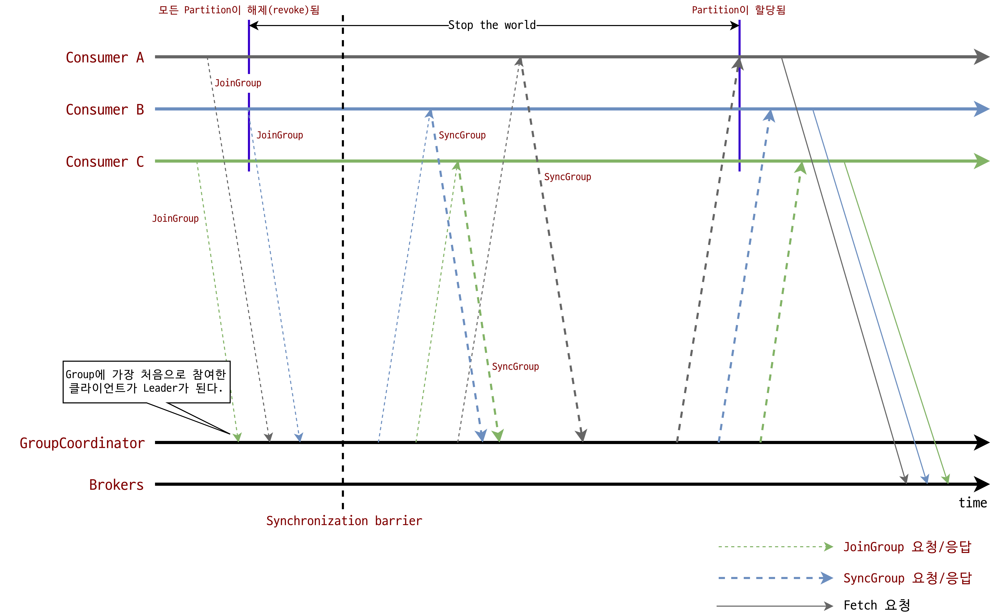

# 참고

- [Apache kafka 공식문서 (max.poll.interval.ms)](https://kafka.apache.org/documentation/#consumerconfigs_max.poll.interval.ms)
- [Apache kafka 의 기본 아키텍쳐 (jootopia)](https://joooootopia.tistory.com/29?category=907957)
- [카프카, 데이터 플랫폼의 최강자(고승범, 공용준 저)](https://ridibooks.com/books/3649000002)
- [KafkaConsumer Client Internals (Naver D2)](https://d2.naver.com/helloworld/0974525)
- [Consumer Group Internals: Rebalancing - Jason Gustafson & Onur Karaman](https://youtu.be/QaeXDh12EhE?t=388)

# 개요

Kafka Topic Partitioning에 대해 학습하다 보니 Consumer Group Rebalancing을 빼놓을 수 없었다. 토픽에 파티션이 추가되거나 여러 조건들이 충족이 되면 Consumer Group이 Rebalancing 되고 그 과정 중 다양한 일들이 발생한다. 이 글은 그 과정들에 대해 정리해보는 글이다.

# 상세

## Kafka Rebalance Protocol

카프카 리밸런스 프로토콜은 컨슈머 인스턴스가 그룹과 잘 동작하고 컨슈밍 할 수 있도록, Kafka Rebalance Protocol을 제공한다. 그룹에 속해있는 컨슈머들은 poll 명령을 통해 리밸런싱이 된다.

리밸런싱이 되는 시점은 다양한데, 파티션이 변경됐거나 그룹에 새로운 컨슈머가 들어왔거나, 컨슈머가 빠지는 경우 발생하게 된다. 각 컨슈머들은 poll()를 통해 `FindCoordinator -> JoinGroup -> SyncGroup` 함수를 연속으로 호출해가며 GroupCoordinator를 찾고 그룹에 조인한 후 그룹의 설정값을 싱크하게 된다. 이때 리더도 선출되며 리더는 각 컨슈머 그룹들의 offset을 관리하게 된다.

위 그림에서 보면 리밸런싱이 필요한 시점에 JoinGroup을 호출하게 되는데, 이때 카프카의 설정값 중 `max.poll.size` 가 리밸런싱 속도에 영향을 준다. 컨슈머가 그룹에 들어가게 되는 순간은 poll에서 가져온 레코드를 다 처리한 후인데, `max.poll.size` 가 1일때와 1000일때를 생각해보면 `max.poll.size`값이 작을수록 리밸런싱 시간이 줄어든게 된다. 하지만 또 `max.poll.size` 값을 마냥 작게 할수만도 없는게 너무 작은값이 오면 fetch를 여러번 해야하니 속도가 더 느려지게된다.

위와 같이 그룹안에 있는 컨슈머들을 리밸런싱 할 수 있고 poll 이 모두 끝난 후에 리밸런싱이 되는것이기 때문에 데이터가 누락되진 않지만 설정에 따라 상황에 따라 Stop the world 가 길어질 수 있다.

## Stop The World

위 그림에 보면 Stop the world라는 내용이 있다. 이건 토픽이 컨슘이 되지 않는 상황이다. 위에 언급한것 처럼 리밸런싱이 완료 되어야하는데 어떤 한 컨슈머가 너무 늦게 그룹에 조인하게 되는경우 그만큼 컨슘이 멈추게 된다. 이 상황을 Stop the world라고 한다.

# 번외

카프카의 내부 동작들에 대해 계속 알아보고 있는데 다음은 커밋에 대해 알아보겠다.
