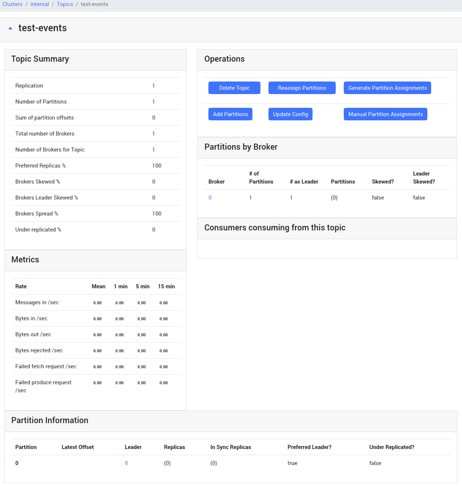
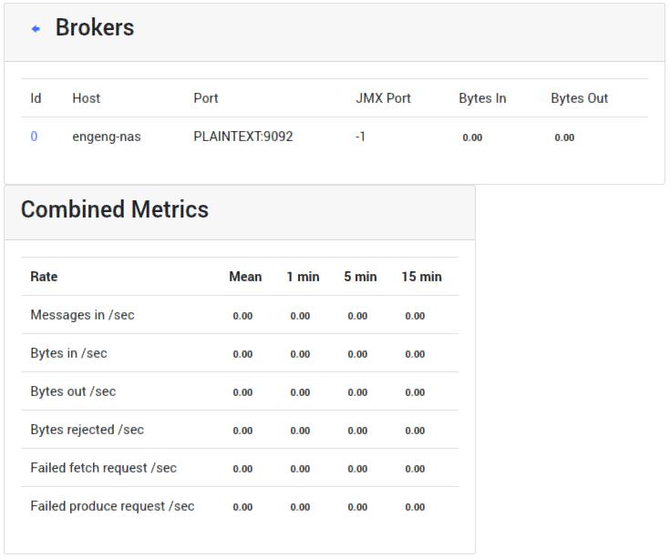
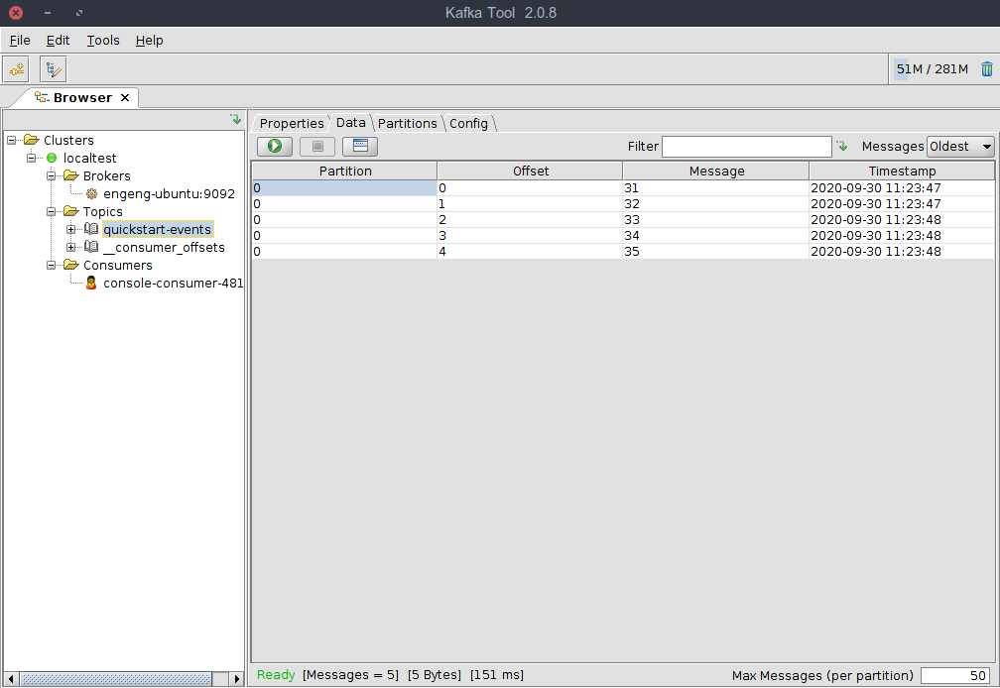
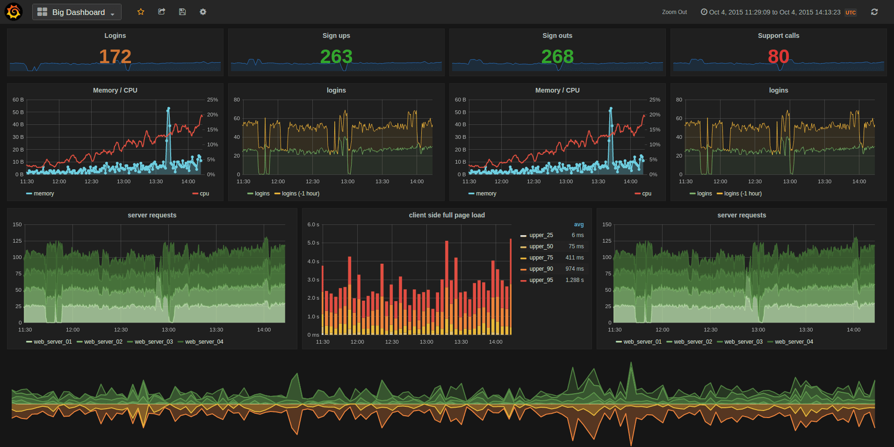

지금 회사에서 이벤트 MQ로 kafka를 사용하고 있는데, 모니터링에 대해 고민하다가 조금 해보고 그 내용을 남긴다. 전체 내용은 [DZone(Kafka Administration and Monitoring UI Tools)](https://dzone.com/articles/kafka-administration-and-monitoring-ui-tools) 를 참고했다.

### 첫 시도 CMAK

야후에서 만든 [CMAK(Cluster Manager for Apache Kafka, previously known as Kafka Manager)](https://github.com/yahoo/CMAK) 라는 것으로 CMYK를 생각나게 하는 툴이다 ㅋ 설정방법이 매우 간단해서 빠르게 볼 수 있을것 같아 설정해봤다.

아래 이미지 같이 토픽에 대한 metric까지 볼 수 있고 간단한 설정도 지원한다.

브로커에 대한 metrics 도 지원하는데 다음과 같이 간편하게 볼 수 있어서 좋았다.

전반적으로 가볍게 사용할 수 있다는 것이 맘에 들었다.

### 두 번째 시도 Kafka Tool

[Kafka Tool](https://www.kafkatool.com/index.html)은 설치형 GUI 프로그램이고 리눅스에서도 사용할 수 있다기에 한번 깔아봤다. 아래 처럼 Topic에 대한 Data도 다 볼 수 있고 Consumer들도 한번에 확인 가능하다. 하지만 system, jvm metrics 같은건 지원되지 않는것 같다. Windows, Mac, Linux 모두 지원하고 설치도 쉬우므로 간간히 써볼 것 같다.

### 세 번째 시도 Prometheus, Grafana

가장 많이 사용되는 Prometheus도 살짝 살펴봤다. kafka의 jmx를 export 해줘야 metric들을 볼 수 있는데 보통 Prometheus는 alerting과 storage로 많이 사용하고 Dashboard는 Grafana를 사용하는 것을 알게 됐다.

Grafana를 이용해 아래 그림과 같이 엄청 미려한... 화면을 만들어 낼 수 있는것 같은데 kafka metrics를 많이 알지 못하는 나로썬 아직 먼 산의 이야기다. 나중에 설정해보고 kafka의 metrics 이야기를 해보겠다.

---

여기까지 보면 가볍게 사용하기 위해선 CMAK, Kafka Tool을 이용해도 될 것 같고 이를 이용해 message가 얼마나 발송되고 있는지 빠르게 알 수 있다. 자세한 system, jvm metrics을 알기 위해선 Prometheus와 Grafana 를 이용해야하는것 같다.
