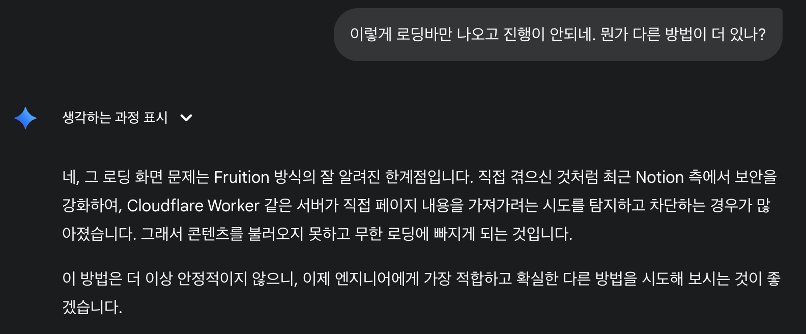

# 개요

내 블로그에 도메인을 연결하고 싶었다. `https://blog.parsley-bay.com` 을 사용하고 싶었는데 (노션에서도 할 수 있는데 돈을 받음. 아무것도 아닌 cname 연결에 돈을 받는다고? 용서 못하지😤) cloudflare를 이용해서 하려고 했는데 막혔는지 아래와 같은 로딩 화면만 나오고 안됨. 흠…. 일단 다음에 또 시도할 수 있으니. 삽질을 줄이기위해 기록한다.

# 방법

1. cloudflare에 내 도메인 등록
   1. hosting kr 에 있던거 cloudflare 로 옮겨왔다
   2. MX record와 A record parsley-bay 가 있어서. 다운 타임이 생기면 어떡하지 걱정했는데. cloudflare 그는 정말 빨랐다!
2. worker 생성
   1. cloudflare 초보자는 이게 제일 어려웠다. 왜냐면 메뉴 이름이 바꼈거든
   2. Compute (Workers) → Workers & Pages → App 추가를 하면 된다.
3. 제미나이가 생성해준 Fruition 스크립트를 붙여넣고
4. Workers → Settings → Domains & Routes 를 설정하고
5. Domain에서 A record
   1. `blog.parsley-bay.com`, `192.0.2.1` 을 등록하면 끝

이렇게 하면 예쁘게 이런 화면이 뜨고 내 컨텐츠는 안뜸 ㅎ

# 결론

알고 있었으면 진작 말하라고…

결국 next로 해야하나 후… 배포까지 30분 미만으로 하려고 했던건데.. GA도 붙이고 추가 기능도 좀 넣으려고 했는데. 당분간 냅둬야겠다

갑자기 공짜 ddns 방화벽 생겼다. (근데 아무도 내 사이트엔 관심 없어서 없어도 되는데… ㅋㅋ)
