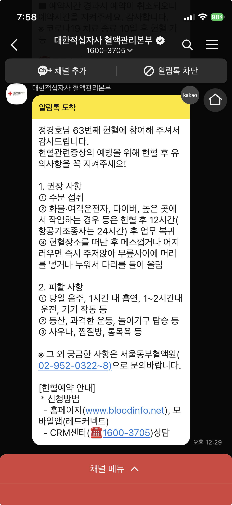
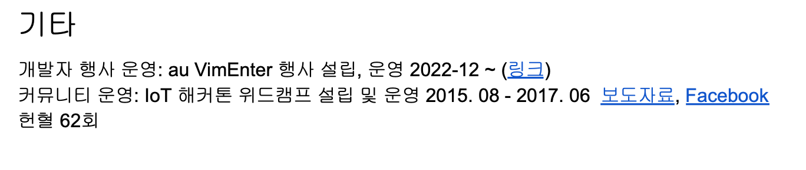

# 헌혈

헌혈을 굉장히(?) 주기적으로 하는데 (두달마다), 헌혈 주기가 오면 이벤트 문자가온다. 이벤트 문자라서 헌혈 주기와는 상관 없어보이지만 헌혈 주기가 되면 문자가 딱 온다. 나는 그걸 보고 예약 후 방문해서 헌혈하고.

헌혈이 나에겐 상당한(?) 자랑거리라 이력서에도 써져있는데, 아무도 언급을 안해주더라 ㅋㅋ 왕년엔 하루에 면접을 4곳을 볼 정도로 면접을 많이 본 난데. 참 아무도 물어봐주지도 않다니? 서운했다. 근데 얼마전 친구에게 소개받은 후순님이 칭찬해주셔서 그간의 울분을 다소 해소됐다.

내가 프로그래밍을 한지 벌써 20년? (중학교때도 잠깐 했으니 25년?)은 됐다. 그동안 참……… 꾸준히 한거 같다. 물론 여전히 매우 부족하고 항상 겸손한 마음으로 업무에 임하려고 한다. 나에 대해 생각해보면 자신 있는 부분은 이런것 처럼 시간을 꾸준히 소모해왔다는 점인거 같다. 중간에 프로그래밍이 너무 지겨워 몇달간 쳐다도 보지 않았을때가 있다. (창업했다가 망해서 혼자 여행을 떠났을때쯤?) 그때 처음으로 정말 프로그래밍이 하기 싫다는 감정을 마주했다. 너무 지겹고 더는 알고 싶지 않던. 몇달 지나지 않아 또 창업을 하며 그런것도 자연스레 사라졌지만. 그런 쉬는 순간에는 운동을 하고 나를 더 깊이 관조하는 시간을 가졌었다.

아무튼 나도 몇가지의 꾸준함은 가지고 있는데 그 중 하나가 헌혈이고 하나가 프로그래밍이다. 그리고 이 글은 자랑하고 싶어서 쓴다 ㅋㅋ 아쉽게도 피는 아직 인간이 제조하지 못한다. 반드시 사람이 몸으로만 생산가능하다. 누군가가 피를 나눠주지 않으면 약도 못 만들고 응급한 상황에서는 매우 위험하다. 내 피가 내 가족과 지인 그리고 나에게(그런 상황이 아예 안오는게 가장 좋은데….) 쓰일 수 있는 그런 상황에 도움이 되길 바랄뿐이다. 그리고 자랑도 하고.

> 저 매해 4-5번씩 15년 이상 해왔어요!

