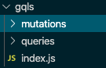

사용한 툴과 링크:
[apollo-tooling](https://github.com/apollographql/apollo-tooling#code-generation), [gql-generator](https://github.com/timqian/gql-generator)

[참고 블로그](https://medium.com/open-graphql/automatically-generate-typescript-definitions-for-graphql-queries-with-apollo-codegen-e73eae72b561) ([git repo](https://github.com/faahmad/react-apollo-typescript/blob/master/src/types/graphql-global-types.ts))

---

react 에서 graphql 을 사용하기 위해 여러가지 작업을 해줘야한다. 그런데 스키마가 이미 정해져있는 graphql 은 툴들의 도움을 받기가 매우 쉽다. 이미 많은 툴들이 나와있고 이를 이용해 서버가 변경되더라도 클라이언트에서 매우 조금만 변경해 제품을 만드는것이 가능하다. 지금까지 여러가지 툴을 이용해 모든 과정을 자동화하려고 했으나 실패했고 그에 대한 기록을 남긴다.

내 목적은 아래 두개로 분류할 수 있다.

# 1. apollo react gql 을 이용

1. 서버에서 graphql schema 변경
2. 클라이언트에서 몇번의 커맨드로 `schema.graqhql` 생성 및 `apollo react gql` 생성

# 2. react componet 로 graphql 함수를 호출

1. 서버에서 graphql schema 변경
2. 클라이언트에서 몇번의 커맨드로 `types` 생성
3. 이를 `react-apollo` 로 감싸서 `<PokemonsQuery >` 이런 모습으로 쿼리 실행

> 위에서도 말했듯이 두가지 방법 모두 실패했는데 그 상황과 결과를 한번씩 살펴보자.

# react gql

## 환경 설정

apollo.config.js 파일이 필요하다

```graphql
module.exports = {
  client: {
    service: {
      name: 'Mathpedia',
      url: 'https://wonri-back.ngrok.io/graphql',
      // optional headers
      headers: {
        authorization:
          'Bearer ',
      },
      // optional disable SSL validation check
      skipSSLValidation: true,
    },
  },
};
```

## 작업 과정

1번(apollo react gql 을 이용)을 달성하기 위해선 apollo-tooling 을 이용 `apollo client:download-schema schema.gql` 명령어를 통해 schema를 다운 받고 `gqlg --schemaFilePath schema.gql --destDirPath gqls --depthLimit 5` 를 통해 gql 을 생성할 수 있다. 이로인해 만들어진 파일은 다음과 같다

생성된 디렉토리 구조와 problem.gql 일부:



```graphql
# problem.gql

query problem($id: String!){
    problem(id: $id){
        id
        title
        problemUniqueId
        bookTitle
        partTitle
        sectionTitle
        sectionType
```

## 결과물

위에서 만들어진 결과물은 텍스트로 이루어진 graphql query 로써 이를 사용하기 위해선 추가적인 작업이 필요하다. file을 읽던가 (하지만 browser엔 file read 가 없음) 아니면 텍스트를 typescript 에서 사용할 수 있도록 변수로 변경하는 것이다. 첫번째 방법 (file을 읽는)은 사용할 의향이 있으나 두번째 방법(텍스트를 typescript에서 사용할 수 있도록 변경)은 내가 원하던 방법이 아니었으므로 패스

## react componet 로 graphql 함수를 호출

2번(react componet 로 graphql 함수를 호출)을 달성하기 위해선 apollo-tooling 을 이용해 `apollo client:codegen --target typescript --includes="gql/*.ts" --addTypename types` 명령을 통해 한번에 원하는 디렉토리에 query type을 출력할 수 있다. 다만 위 명령어를 호출하기 위해선 `gql` 로 먼저 쿼리를 짜 둬야한다. 난...... 그걸 안하고 싶은데 좀 이상했다. 하지만 그래도 react component 로 바로 호출하는 것도 좋으므로 시도해봄.

## 결과물

sample.ts:

```typescript
import { UserRole, AuthType } from "./../../types/globalTypes";

// ====================================================
// GraphQL mutation operation: login
// ====================================================

export interface login_login {
  __typename: "User";
  accessToken: string | null;
  refreshToken: string | null;
  email: string | null;
  name: string | null;
  nickname: string | null;
  id: string;
  userRole: UserRole | null;
  latestPasswordChangedDate: any | null;
  authType: AuthType | null;
}

export interface login {
  login: login_login | null;
}

export interface loginVariables {
  email: string;
  password: string;
}
```

위와 같은 파일이 출력되고 이를 react에서 사용하기 위해 바로 component 로 변경해서 쿼리를 호출 할 수 있다. 하지만 이것도 잘 안됐다. 아래 소스코드는 [참고블로그](https://medium.com/open-graphql/automatically-generate-typescript-definitions-for-graphql-queries-with-apollo-codegen-e73eae72b561)에서 가져온 코드인데 나는 뭔가 원하는데로 잘 안됐음 -_- 다시 시도해봐야지...

```javascript
class PokemonsQuery extends Query<Pokemons, PokemonsVariables> {}

export default class App extends React.Component {
  render() {
    return (
      <PokemonsQuery
        query={pokemonsQuery}
        variables={{ first: '10' }} // Throws an error!
      >
    )
  }
}
```

# 3. 새로운 시도 gql-generator-node

위 프로젝트는 [gql-generator(gql command)](https://github.com/timqian/gql-generator)의 fork 프로젝트로써 조금 더 `graphql.schema` 파일을 이용 아래와 같은 코드로 query, mutation을 할 수 있게 도와주는 툴이다. 아래와 같은 방식으로 쿼리를 호출 할 수 있다.

```javascript
const {queries} = generateAll(schema.getMutationType().signup);

const variables = { username: "I", email: "best_developer@testing.org", password: '1234' };

test.each(Object.entries(queries))('%s', async ([name,query]) =>
  graphql(query,{variables})
);
```

결과적으론 이마저도 실패했고 위 library를 이용해 react 용 gql을 만드는게 나을 것 같다...

# 4. 딱 맞는게 없어서 만듬.....

[결과물(react-gql-generator)](https://github.com/moltak/react-gql-generator)

위 결과물은 `gql-generator-node` 의 fork 프로젝트로써 graphql.gql 을 분석해 apollo gql object 를 반환해준다. 이것을 바로 프로젝트에 넣어서 사용할수도 있고 복사해서 쓸수도 있다.
