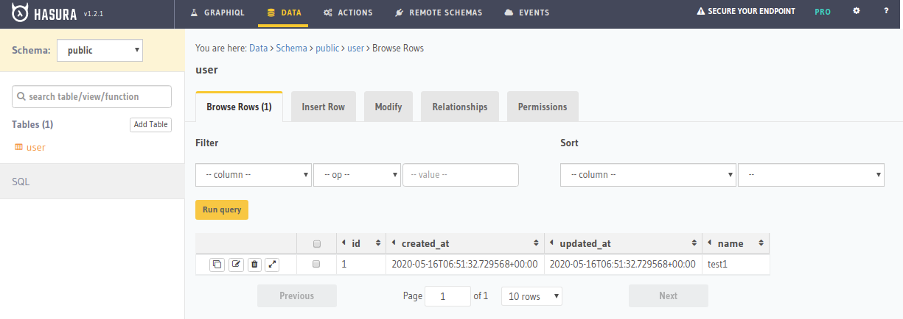
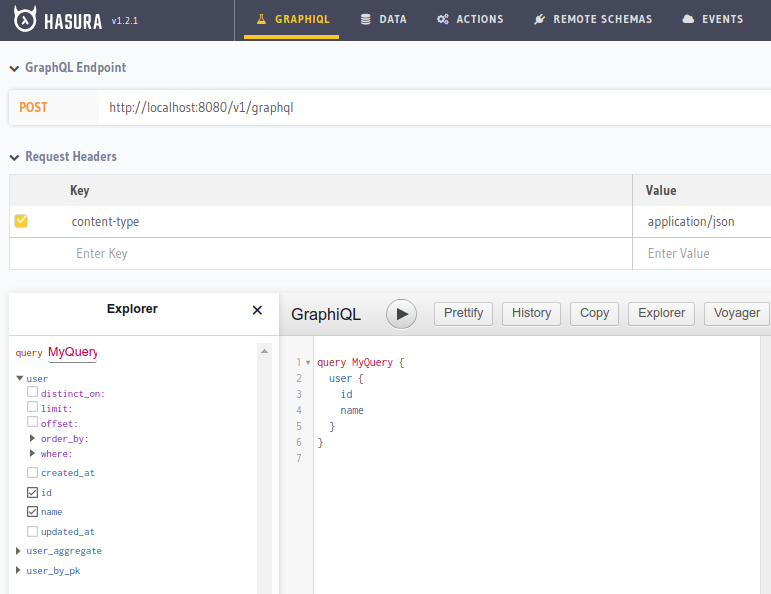
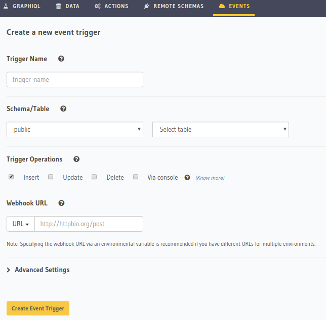
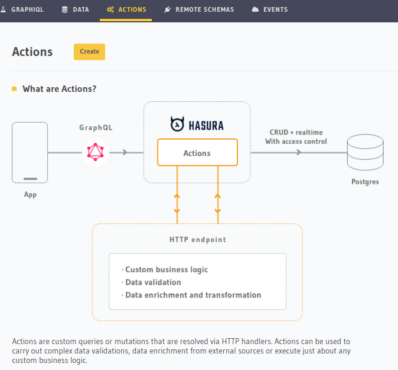
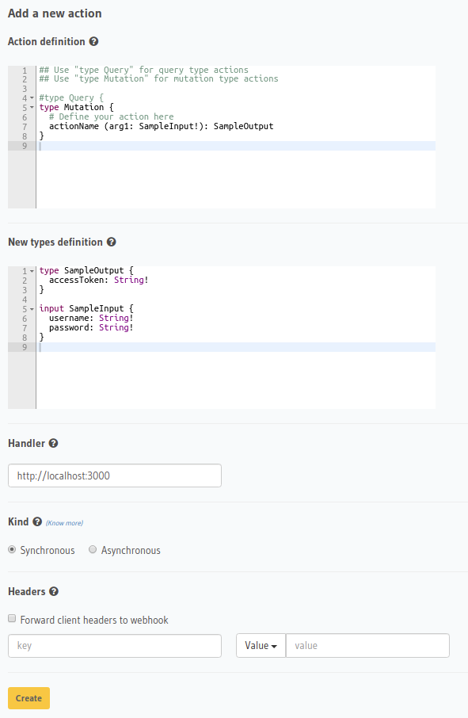

# 도입

지금 알아볼껀 graphql 을 auto generator 해주는 툴이다.

미리 결론부터 말해보자면 매우 편했다! 설치도 쉬웠고 사용도 매우 쉬웠다! 아래 몇 이미지를 봐보자.

위 두 이미지에서 보듯이, 테이블 추가 후 쿼리만 짜면 바로 내가 보고 싶은 값을 가져올 수 있었다; 소름돕게 직관적이었고 심지어 [설치방법](https://hasura.io/docs/1.0/graphql/manual/getting-started/docker-simple.html)도 매우 간단했는데, 도커 이미지가 있어서 그걸 실행만 하면 됐다. 아주 작은 프로젝트에서는 충분히 잘 사용해볼 수 있을 것 같다. 이제 조금 섹션을 나눠서 봐보자.

# Auth

Hasura는 custom function 을 넣는게 매우 제한되므로 좀 복잡한 기능들을 다음과 같이 api 콜을 이용해 해결하도록 했는데 그 중 하나가 인증이다. 아래 화면에서 보듯이 어떤 테이블에서 어떤 기능(Operation)이 호출될 때, webhook 을 이용해 인증을 처리할 수 있다. 이 [링크](https://hasura.io/docs/1.0/graphql/manual/auth/authentication/index.html#webhook)에서 webhook을 이용해 인증을 처리하는 방법이 있고 또 JWT를 이용해서도 인증 처리를 할 수 있다고 [다음 링크](https://hasura.io/docs/1.0/graphql/manual/auth/authentication/index.html#jwt-json-web-token)에도 나와있다.

# Actions

복잡한 비즈니스 로직 처리를 위해 Actions 라는 메뉴를 지원한다.

설정화면으로 들어가서 봐도 딱히 어렵진 않은데, 다만 비즈니스 로직을 처리하는 곳도 graphql 을 구현해야 한다.

