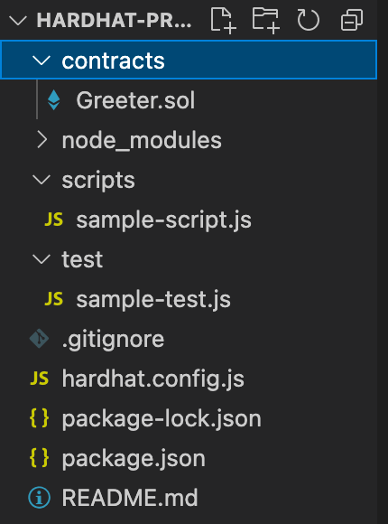
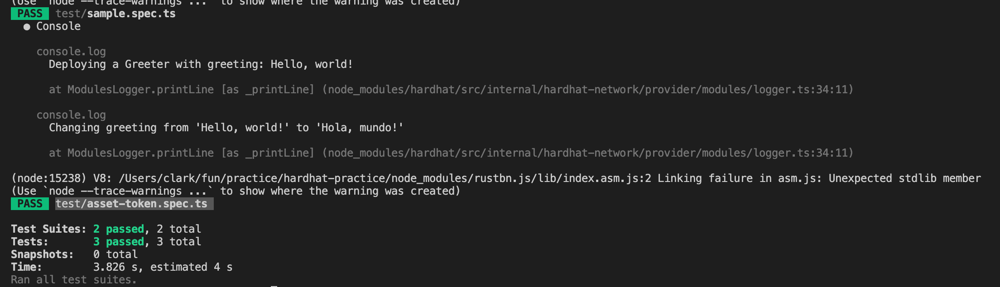
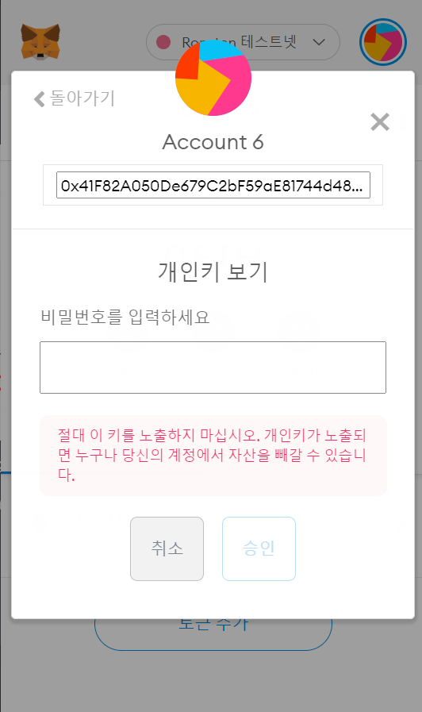
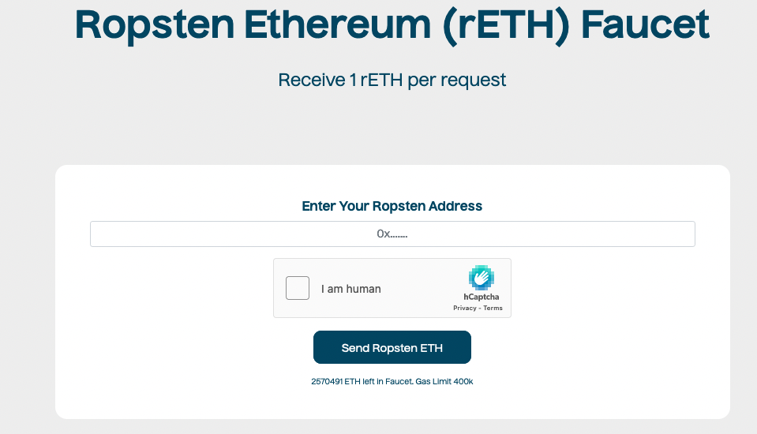

# hardhat과 typechain을 사용한 컨트랙트 개발

Truffle의 단점 때문에 hardhat을 많이 사용하는 듯 함.

## Truffle의 단점

1. 검증과정이 불편함. 컨트랙트 배포 후 검증 과정을 거치지 않으면 컨트랙트의 Read, Write 기능이 활성화되지 않는데, Truffle은 검증을 도와주지 않기 때문에 직접 해야함.
2. Typescript 지원 빈약. web3.js, ether.js 같은 자바스크립트 패키지를 쓰는데, bigNumber, unint, keccak256등 타입이 자바스크립트에서 약간 다름.

## Hardhat 장점

1. Verify 자동화
2. Typechain을 이용해 타입스크립트 사용 가능.
   - .sol 파일을 타입스크립트로 된 artifact로 만들어줌.
3. console.log 사용가능
4. Documentation
5. 다양한 플러그인 제공. upgrade proxy, test coverage, gas report, react hot reloader

# 써보기

## Project Init

```bash
npm i --save-dev hardhat @nomiclabs/hardhat-waffle ethereum-waffle @nomiclabs/hardhat-ethers ethers @types/jest jest

npm i @openzeppelin/contracts

npx hardhat # basic sample project를 선택
```

> `@openzeppelin/contracts` 은 secure smart contract 개발을 위한 library.

여기까지 하면 다음과 폴더구조가 다음과 같이 됨



## Typechain

solidity도 type을 갖고 있기때문에 typescript와의 궁합이 아주 좋다. typescript를 사용하기 위해서 typechain을 설치하고 ts 설정을 해줘야하는데 다음과 같다.

```bash
npm i --save-dev @typechain/hardhat typechain ts-generator @typechain/ethers-v5 typescript ts-node
```

hardhat.config.js 를 hardhat.config.ts로 파일이름을 바꾼 후 내용을 아래와 같이 바꾼다.

```typescript
import "@nomiclabs/hardhat-waffle";
import "@typechain/hardhat";
import "@nomiclabs/hardhat-ethers";
import "@nomiclabs/hardhat-waffle";

import { HardhatUserConfig } from "hardhat/types";

const config: HardhatUserConfig = {
  solidity: {
    version: "0.8.11",
  },
};

export default config;
```

위와같이 변경 후 `npx hardhat compile` 명령어를 실행해준다.

# TestCode 작성

다음과 같이 테스트 코드를 작성할 수 있다. integration, e2e 테스트와 비슷한 느낌으로 작동한다. contract를 배포하고 Contract API를 직접 호출하며 동작을 검증하는 방식이다.

```typescript
import { waffle } from 'hardhat'

import AssetTokenArtifact from '../artifacts/contracts/asset-token.sol/AssetToken.json'
import { AssetToken } from '../typechain-types/AssetToken'

const { deployContract } = waffle

describe('AssetToken', () => {
  let assetToken: AssetToken

  const provider = waffle.provider
  const [admin] = provider.getWallets()

  beforeEach(async () => {
    assetToken = (await deployContract(admin, AssetTokenArtifact, [
      10000,
      'FirstAssetToken',
      'FAT',
    ])) as AssetToken
  })

  describe('new AssetToken', () => {
    it('has given data', async () => {
      expect((await assetToken.totalSupply()).toNumber()).toEqual(10000)
      expect(await assetToken.name()).toEqual('FirstAssetToken')
      expect(await assetToken.symbol()).toEqual('FAT')
      expect(await assetToken.decimals()).toEqual(18)
    })

    it('increases the deployer balance', async () => {
      expect((await assetToken.balanceOf(admin.address)).toNumber()).toEqual(
        10000
      )
    })
  })
})
```

## TS Test code 실행 설정

위의 테스트코드가 있다고 해도 바로 실행되진 않는다. tsconfig.json과 jest 설정을 해줘야하기때문

1. jsonfile을 바로 임포트해서 사용하기 위해서 `resolveJsonModule: true` 로 변경한다.
2. jest ts 설정도 해줘야하며 아래 package.json 을 참고하면 된다.

완성된 [tsconfig.json](https://github.com/moltak/practice-hardhat/blob/main/tsconfig.json), [package.json](https://github.com/moltak/practice-hardhat/blob/main/package.json)

아래와 같이 test가 실행되는 것을 볼 수 있다.



# 배포하기

이더리움 네트워크와 통신하기 위해선 노드를 운영해야하는데, 어렵다고 한다(잘 모름). infura를 이용하면 노드운영 필요없이 이더리움 네트워크에 직접 접근할 수 있다.

제작한 컨트랙트를 배포하기 위해 다음 과정이 필요하다.

1. infura에서 project id 얻기
2. metamask 개인키 복사
3. 배포 스크립트 작성
4. Ropsten Ethereum Faucet 에서 테스트 이더 얻기
5. 배포

## 1. infura에 가입하고 ProjectID를 복사하자.


## 2. metamask 개인키 복사

메타마스크 계정 세부정보 → 비공개 키 내보내기



## 3. 배포 코드 작성

env 설치 후 .env 에 infura project id와 개인키를 넣고 다음과 같은 코드 작성

```typescript
// scripts/deploy.ts

import hardhat from 'hardhat'

async function main() {
  console.log('deploy start')

  const AssetToken = await hardhat.ethers.getContractFactory('AssetToken')
  const assetToken = await AssetToken.deploy(
    10000, // totalSupply
    'FirstAssetToken', // Token name
    'FAT' // Token symbol
  )
  console.log(`AssetToken address:${assetToken.address}`)
}

main()
  .then(() => process.exit(0))
  .catch((error) => {
    console.error(error)
    process.exit(1)
  })
```

## 4. Ropsten Ethereum Faucet 에서 테스트 이더 얻기

코드를 배포하려면 가스비를 낼 수 있어야하는데, [여기](https://faucet.dimensions.network/)에서 테스트용 이더를 받을 수 있음



## 5. 배포

```bash
npx hardhat run --network ropsten scripts/deploy.ts
```

# Ether Scan과 상호작용하기 (verify)

배포를 통해서 이더리움 테스트넷에는 배포가 되었다. 이제 ABI, bytecode를 이용해서 백엔드, 프론트엔드에서 상호작용이 가능하고 dapp을 만들 수 있다.

우리는 이더스캔을 이용해서도 컨트랙트와 상호작용을 가능하게 하고 싶다. 이것을 하려면 [hardhat-etherscan](https://hardhat.org/plugins/nomiclabs-hardhat-etherscan.html)을 통해 verify를 해야한다.

다음과 같은 과정이 필요하다.

1. 이더스캔 API 키 받기
2. hardhat-etherscan 추가
3. hardhat.config.ts 수정
4. verify 하기

## 1. 이더스캔 API 키 받기

이더스캔 가입 후 [https://etherscan.io/myapikey](https://etherscan.io/myapikey) 여기에서 받을 수 있다.

## 2. hardhat-etherscan 추가

```bash
npm add --save-dev @nomiclabs/hardhat-etherscan
```

## 3. hardhat.config.ts 수정

```typescript
import '@nomiclabs/hardhat-waffle'
import '@typechain/hardhat'
import '@nomiclabs/hardhat-ethers'
import '@nomiclabs/hardhat-waffle'
import '@nomiclabs/hardhat-etherscan'
import 'dotenv/config'

import { HardhatUserConfig } from 'hardhat/types'

const config: HardhatUserConfig = {
  solidity: {
    version: '0.8.11',
  },
  networks: {
    ropsten: {
      url: `https://ropsten.infura.io/v3/${process.env.INFURA_PROJECT_ID}`,
      accounts: [process.env.PRIVATE_KEY || ''],
      chainId: 3,
    },
  },
  etherscan: {
    apiKey: process.env.ETHERSCAN_API_KEY || '',
  },
}

export default config
```

## 4. verify 하기

```bash
npx hardhat verify \
--network ropsten \
--contract "contracts/asset-token.sol:AssetToken" \
"contract 주소" \
"10000" \
"FirstAssetToken" \
"FAT"

# 결과
Successfully verified contract AssetToken on Etherscan.
https://ropsten.etherscan.io/address/0xEcc5a98fe...#code
```

[https://ropsten.etherscan.io/address/0xEcc5a98fe7062dD42Fa3a98CD044980De18d045F#code](https://ropsten.etherscan.io/address/0xEcc5a98fe7062dD42Fa3a98CD044980De18d045F#code) 여기에서 이더스캔과 연동된 내용을 볼 수 있음.

# 마치며

좀 긴 내용이었지만 위와 같은 내용을 통해 컨트랙트를 만들고, 테스트하고, 배포할 수 있게 되었다. 중간중간 좀 어려운 부분도 있었고 참고했던 블로그와 내용이 좀 달라 헤멨던 부분도 있었다.

[Ether scan](https://ropsten.etherscan.io/address/0xEcc5a98fe7062dD42Fa3a98CD044980De18d045F#code)

내가 배포한 컨트랙트를 보면 좀 신기했던게 코드가 모두 노출되는 부분이다. 이더리움의 컨트랙트는 모두 코드가 공개된다더니, 과연.. 누구든지 나의 코드를 보고 어떻게 생겼는지 모두 파악이 가능했다. 우리가 만약 중요한 비즈니스 로직을 만든다면 그것도 모두 공개가 되니깐 사기를 치기도 힘들테지만, 나의 코드 자산이 모두 공개된다는 위험도 함께 있다. 그런 부분들은 좀 다른 방법들을 사용해야할것 같다.

실제로는 테스트를 열심히 짜보진 않았는데, [이 링크](https://hardhat.org/guides/typescript.html)에서 설명하듯 테스트 코드를 더 자세히 짤 수 있게 되어있다. 컨트랙트를 이정도로 안전하게 만들 수 있다는것은 좀 놀라운 부분이다.

# Reference

- [hardhat과 typechain을 사용한 컨트랙트 개발](https://tech.elysia.land/hardhat%EA%B3%BC-typechain%EC%9D%84-%EC%82%AC%EC%9A%A9%ED%95%9C-%EC%BB%A8%ED%8A%B8%EB%9E%99%ED%8A%B8-%EA%B0%9C%EB%B0%9C-d7e8fc66d1d2)
- [https://faucet.dimensions.network/](https://faucet.dimensions.network/)
- [https://hardhat.org/plugins/nomiclabs-hardhat-etherscan.html](https://hardhat.org/plugins/nomiclabs-hardhat-etherscan.html)

## 결과물

[https://ropsten.etherscan.io/address/0xEcc5a98fe7062dD42Fa3a98CD044980De18d045F#code](https://ropsten.etherscan.io/address/0xEcc5a98fe7062dD42Fa3a98CD044980De18d045F#code)
