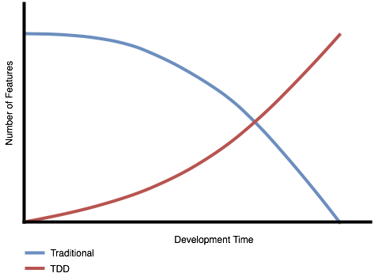
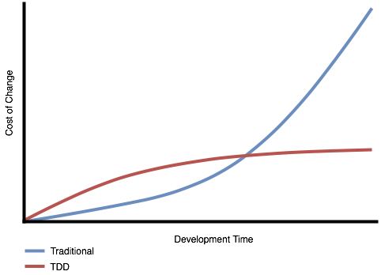
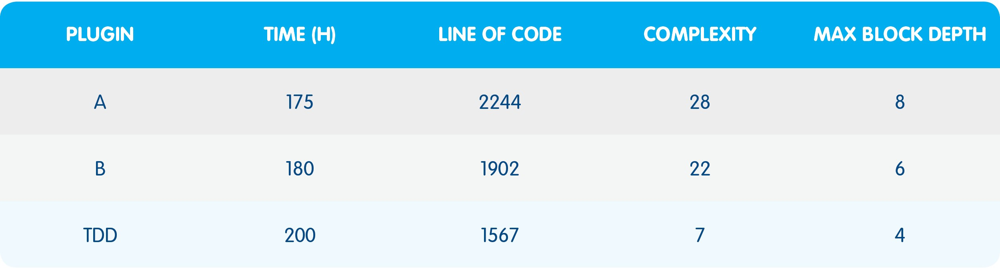

# References

- [TDD: why I decided that debugging wasn't worth my time.](https://www.imagicle.com/it/blog/o/tdd-why-i-decided-that-debugging-wasnt-worth-my-time/)
- [The real reason why you don't like TDD](https://medium.com/@joantolos/the-real-reason-why-you-dont-like-tdd-a65b26d2805e)
- [TDD ROI: Is Test-Driven Development Worth the Money?](https://medium.com/crowdbotics/tdd-roi-is-test-driven-development-worth-the-money-d535c8d5a5f)
- [The Outrageous Cost of Skipping TDD & Code Reviews](https://medium.com/javascript-scene/the-outrageous-cost-of-skipping-tdd-code-reviews-57887064c412)
- [How TDD Reduces Costs - Case Study](https://www.e-point.com/blog/how-tdd-reduces-costs-case-study)

# 들어가며

개발을 업으로 삼은지 10년이 지났고 개발을 처음 공부한지는 벌써 20년 가까이 되었다. 긴 시간동안 다양한 개발자들을 만나 함께 작업을 하며 여러가지를 배우고 나도 여러가지를 주려고 노력을 많이했다. 특히 난 TDD의 중요성을 많이 강조했고 그건 대학교를 다닐때도 마찬가지였다. 사회에서도 TDD에 대해 강의를 많이했고 이때([DroidKnights](https://www.youtube.com/watch?v=qwhIVi88pt4))에서도 여전히 난 TDD를 전파하려 애썼다.

위 링크와 같은 강의들로 내가 몇사람이나 TDD로 이끌었는지 잘 모르겠지만 큰 성공을 거두지 못한건 맞는것 같다. 내 주위에 있는 친한 개발자들도 거의 TDD를 하지 않는게 현실이니까. 예전에 쓰다가 지웠던, `TDD에 부정적인 개발자들` 에서는 왜 사람들이 그렇게 TDD를 싫어하는지에 대해 내 나름의 추측을 담고 싶었다. 다만, TDD에 부정적인 개발자들 치고 TDD를 **체화한** 사람은 없었다. 아쉬운 부분이다.

이 글은 TDD를 도입하고자 하는데 고민이 많은 개인과 단체를 위한 글이다. 여러 시리즈가 될 수도 있지만 첫 글에서는 비용에 대해 말해보고자 한다. 아래쪽 두 그래프가 내가 하고 싶은 말의 전부다. TDD를 할 때, 기능을 추가하는 속도가 증가하고 그 비용이 낮아진다. 아마 믿기지 않을 텐데, 그 내용에 대해선 아래에서 후술하겠다.





# 체화

이 글을 통해 몇명이 TDD 세계로의 여행을 떠날 수 있을지 모르겠다. 다만 내가 하고 싶은말은 그 열매는 매우 달다는 것이다. TDD를 **체화**할 경우 얻을 수 있는건 정말 많다. 다만 쉽지 않다. 나는 TDD를 수영이나, 자전거 같은 스포츠와 비교한다. 수영을 배우고 싶다고 상상해보자. 책을 볼건가? 그보단 아마 수영장에 찾아가서 강의를 끊을거다. 선생님이 옆에서 숨쉬는 법, 발차는법, 팔돌리는 법을 가르칠거다. 근데 그게 엄청난 지식이 필요한 일일까? 너무 어려워서 외우기 위해 시험도 봐야하는 그런 지식일까? 아니다 몸에 익혀야한다. 이를 **체화**라고 하고 TDD는 그런 개발방법이다. 당장 TDD를 구글에 쳐보면 몇단계를 알려줄거다. 그게 TDD의 전부다. 다만 선생님이 알려준 숨쉬는 방법이 쉬워보여도, 당장 혼자해보면 잘 모르겠는것 처럼 TDD도 마찬가지다. 혼자 접형을 할 수 있을때까지 혹은 그 너머까지 부던히 노력해야만 한다. 이 과정은 절대 쉽지 않다. 그리고 이걸 넘은 사람은 많이 보지 못했다. 혹시 TDD를 배워보고 싶다면 이규원님의 [이 강의](https://fastcampus.co.kr/dev_red_ygw)를 들으면 될 것 같다.

TDD를 체화하고 나면 무엇을 얻을 수 있을까? 두가지 정도 적자면 다음과 같다

1. 빠른 퇴근
2. 좋은 냄새의 코드

# 비용

위에서 말한 `1. 빠른 퇴근` 이 바로 비용이다. 비용 부분을 먼저 알아보자. 다음과 같은 코드가 있을 때, 나는 여러분에게 이런 질문을 할 것 같다. 만약, `result.success` 가 boolean이 아닌 여러 값을 가질 수 있다면 `기존 로직에 어떤 영향을 줄까? 그리고 그것을 어떻게 검증할까?` 그 방법에 대해 설명해 봐라.

```javascript
function payment(userName: string, planName: string) {
    const result = this.paymentService.payment(userName, planName)

    if (!result.success) {
        throw {msg: '결제 실패'}
    }

    this.userPlan.grantItem1(userName)
}
```

위 코드는 결제를 성공했을 때, 단순이 item1 번을 승인해주는 역할을 한다. 하지만 우리가 기능 개선이 필요해 위 질문처럼 result가 500, 1000, 2000 같은 true/false 가 아닌 값들이 반환이 된다면 출시된 제품과 영향이 없을지 어떻게 알 수 있을까. TDD를 하지 않는 상황이면 이렇게 한다.

1. 비즈니스 코드를 추가한다.
2. 개발자가 코드를 테스트한다. (화면에서 한땀한땀 눌러본다.)
3. QA가 열심히 제품을 쭉 테스트한다.
4. 수정한다.
5. 출시한다.

하지만 TDD를 하면 이렇게 바뀐다.

1. 테스트 코드를 추가한다.
2. 비즈니스 코드를 추가한다.
3. 테스트 코드를 실행한다.
4. QA가 열심히 제품을 쭉 테스트한다.
5. 수정한다.
6. 출시한다.

TDD를 하면 개발자가 해야할일이 한단계 더 늘어난다. 하지만 이때, 개발자는 엄청나게 빠른 속도로 피드백을 얻을 수 있다. 이미 변경전 비즈니스 로직에 맞춰진 테스트는, 새로운 비즈니스 로직이 추가되지마자 실패하게 된다. 이 부분이 변경해야하는 지점이며 새로운 Feature(기능)이다. 개발자 앞에 그려진 red-line은 개발자에게 빨리 수정하라고 소리친다. 개발자는 보통은 쉽게 수정할 수 있고 이 과정에서 출시된 로직과 추가된 Feature 로직에 대해 한번에 검증이 끝난다. 그리고 QA는 이를 쉽게 확인할 수 있다.

가장 큰 차이는 개발자가 웹페이지(혹은 앱화면)에서 하나씩 누르며 테스트하는지 아니면 자동으로 로직을 테스트하는지에 대한 차이다. 이 부분이 비용을 줄이게 만들고 여러분이 일찍 퇴근할 수 있게 만든다.


비슷한 그래프를 [여기](https://www.imagicle.com/it/blog/o/tdd-why-i-decided-that-debugging-wasnt-worth-my-time/)에서도 볼 수 있다. TDD를 하는게 어떤 순간엔 전통적인 방법보다 비용이 더 든다. 하지만 서비스가 커질 수록 그리고 오래될 수록 TDD는 빛을 발한다. 서비스가 프로토타입이고 지속성이 없다면 당연히 TDD를 하지 않아도 좋다. 하지만 보통은 내가 작성하는 코드는 내 회사와 함께 오랫동안 지속된다. 1년 혹은 몇년간은 함께 하게 된다. 그때, TDD가 함께 하게 된다면 내가 그 회사를 떠나도 새로운 로직을 추가하고 평가하는데 1초의 시간만 있으면 된다.

아래와 같은 글로 마무리 하고자 한다. 요약해보면 `code-test-debug` 방법을 쓴 팀은 전체 시간의 56%를 디버깅하는데 썼고, TDD를 한 팀은 8%만 썼다는 내용이다.

개발시간은 TDD가 더 많이 걸렸으나, 전체 라인수, 복잡도, 블록의 중첩도 또한 훨씬 적게 사용되었다고 아래 표는 말한다.



> The results were quite impressive: the teams working with code-test-debug approach spent 56% of time debugging, while the group which adopted Test Driven Development practice spent less than 8% of its time in debug activities, and this happened especially during the refactoring phase, in order to fix unexpected failing tests (pointing out the necessity to add new tests for these scenarios).

# 마무리

이 글을 쓰며 어차피 나는 `기존방법보다 TDD가 낫다. TDD를 하지 않는건 바보같은 일이다.` 라는걸 주장하고 싶었을 뿐이고 거기에 맞는 문서들만 찾은 것일지도 모른다. 내가 이 글을 쓰게된 진짜 이유는 [tdd cost](https://www.google.com/search?q=tdd+cost) 라는 검색어를 구글에 쳐보면서 시작되었다. 모든 글을 확인해보지 않았지만 TDD가 프로젝트 비용을 절감한다는 내용이다. 사실 TDD에 대한 연구는 꽤 오래되었고 많은 자료가 있다. 그렇기에 `답정너` 같이 원래 하고 다녔던 말을 다시 했을 뿐이다. 이 글을 읽는 사람은 고구마를 먹는 것 처럼 답답했을지 모르겠지만, 그래도 TDD에 대해 약간이나마 흥미가 생겼다면 다행이다.

다시 말하지만 배우고 싶다면 [이 강의](https://fastcampus.co.kr/dev_red_ygw)를 살펴보자. (이규원씨와는 지나가며 여러 세미나에서 본적은 있지만 개인적인 친분은 없다. 광고는 아니라는 거다 ㅋ)
