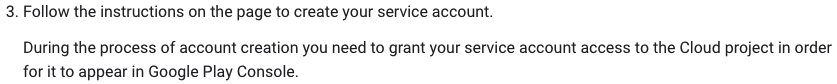
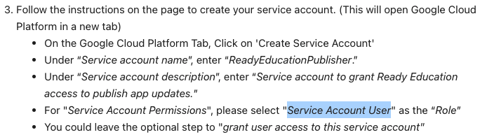
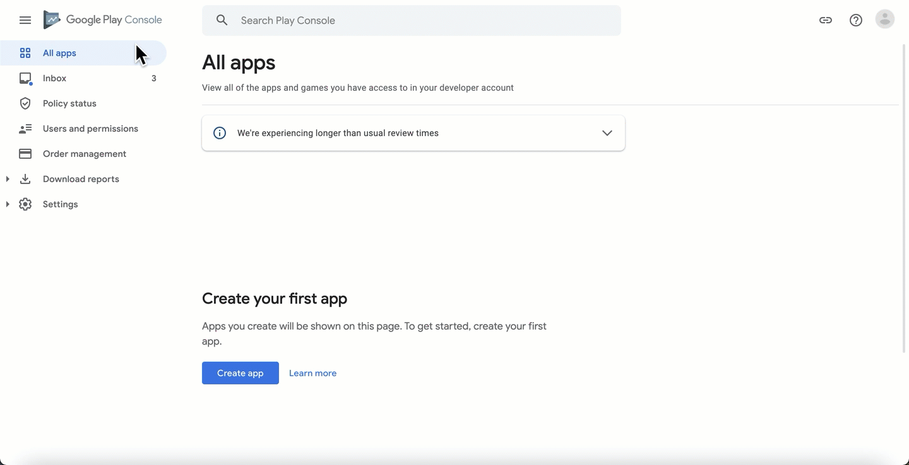
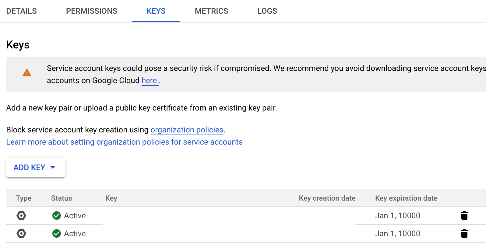
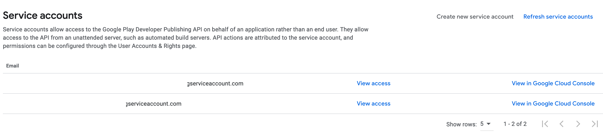
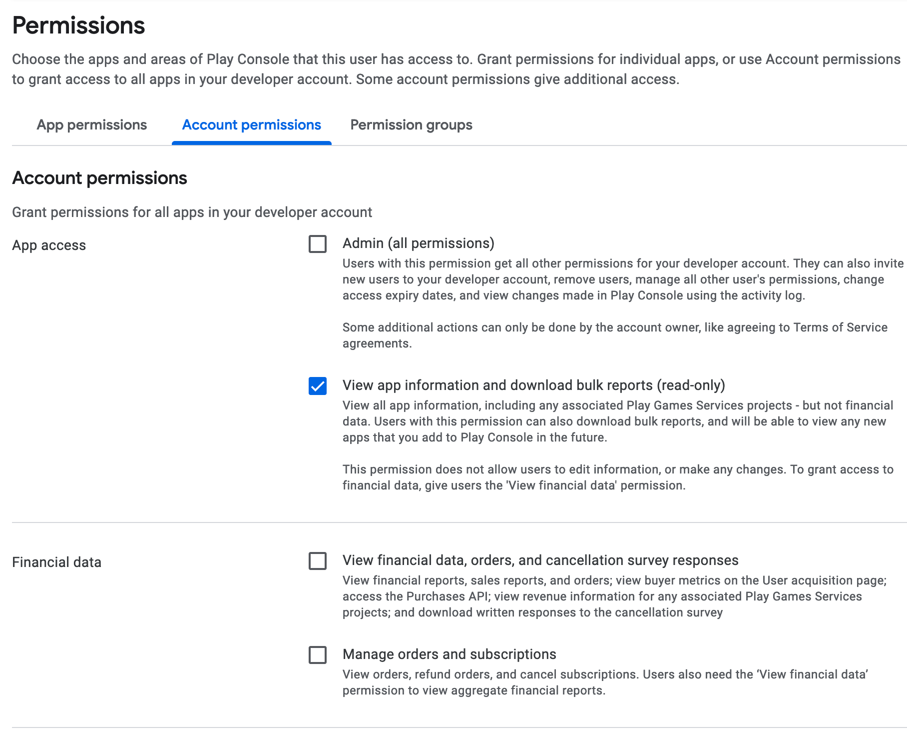

## References

- [READY Education (여기가 아래 공식 문서보다 나음)](https://support.readyeducation.com/hc/en-us/articles/360047693573-Google-Play-Service-Account-Setup)
- [권한 문제 해결 안될 때(The current user has insufficient permissions to perform the requested operation.)](https://stackoverflow.com/questions/43536904/google-play-developer-api-the-current-user-has-insufficient-permissions-to-pe)
- [구글 공식 문서 (별로임 - 이거대로 하면 거의 무조건 문제 생김)](https://developers.google.com/android-publisher/getting_started)

## 들어가며

이 글을 남기는 이유는 Backend에서 InAppPurchase(이하 IAP)를 구현할 때, 겪게되는 문제를 미연에 방지하고자 한다. 이 글을 남기는 시점에 나는 이 문제를 거의 5시간 정도 붙들고 있다가 겨우 해결했는데, Google Play Console과 Google Cloud Platform 의 연동 문제가 발목을 잡았다. 이 문제에 대해 먼저 한번 살펴보고 세팅하는 방법을 단계별로 적어놓으려 한다.

## Google Play Console 과 Google Cloud Platform 의 연동 문제

### 문제 1. Google Play Console에 GCP에서 만든 ServiceAccount가 나타나지 않음.

[구글 공식 문서](https://developers.google.com/android-publisher/getting_started)를 따라 세팅하다 보면 아래와 같은 내용이 있다. 3번의 두번째 줄의 설명이 참 애매한데, 액세스 권한을 Cloud project에 줘야한다는 거다. 근데 어떤 권한인지 말이 없다. 아래 내용을 놓치기 참 쉬운데, 저걸 설정하지 않으면 절대! Google Play Console에서 SerivceAccount를 볼수가 없다. 좀 중요 표시를 해주면 좋은데 아무런 표시가 없어 놓치기 쉬운 부분이다.

권한 설정 부분은 오히려 [첫번째 References](https://support.readyeducation.com/hc/en-us/articles/360047693573-Google-Play-Service-Account-Setup) 보는게 낫다. 아래와 같이 적혀있다.

ServiceAccount를 만들고 Service Account User role을 부여하라는 말이다. 저걸 부여하면 Google Play Console에 ServiceAccount가 나타난다.

### 문제 2. The current user has insufficient permissions to perform the requested operation.

이 문제가 원인을 찾기가 상당히 어려웠다. 일단 이 [링크](https://stackoverflow.com/questions/43536904/google-play-developer-api-the-current-user-has-insufficient-permissions-to-pe)에 보면 나 뿐만 아니라 다른 사람도 많이 겪는 문제라는 것을 알 수 있다. 이건 다음과 같은 상황에 발생한다.

- 아이템을 생성하고 ServiceAccount를 생성한 경우
- ServiceAccount 생성 시간이 24시간 미만인 경우 (이건 [여기](https://stackoverflow.com/a/56390408) 있는 내용이지만 잘 모르겠다.)

이게 진짜 머리아프다. 이거때문에 몇시간을 소비했다. 이 문제를 해결하기 위해 [첫번째에](https://stackoverflow.com/a/60691844) 있는걸 적용했더니 해결되었다. 해결 방법은 다음과 같다.

- 아이템의 정보를 수정 후 저장한다.
- 아이템을 다시 만든다.

이 문제 1, 2가 설정하는데 큰 허들이고 이것만 잘 해결하면 큰 어려움이 없이 연동이 될 것이다.

## Google Play Console과 Google Cloud Platform 연동하기

이 과정은 다음과 같이 진행된다. 이미 Google Play Store에 가입을 했다고 가정한다. [첫번째 Reference](https://support.readyeducation.com/hc/en-us/articles/360047693573-Google-Play-Service-Account-Setup)가 잘 되어 있으므로 참고하고 나도 그걸 기반으로 아래 내용을 작성한다.

### 1. Google Play Console의 API Access 메뉴 이동

### 2. GCP 프로젝트 연동하기

(위 gif 참조) Link Project 를 누른 후 새로 만들자. (이상하게 기존 프로젝트는 검색이 되질 않음)

### 3. Service Account 만들기

반드시 아래에 있는 Service Account User 부여. Google Pub/Sub 을 한번에 하고 싶다면 파란색 Role 도 설정. 위에서 잠깐 언급 했지만 Service Account User Role을 부여하지 않으면 Google Play Console에서 Service Account가 보이질 않음.

### 4. key file 얻기

만들어진 계정 안에 들어가서 ADD KEY 후 json 파일 다운로드

### 5. Google Play Console에 ServiceAccount 연동하기

ServiceAccount에 Role이 제대로 부여됐다면 Refresh service accounts를 누르면 아래와 같이 내가 만든 계정이 노출됨.

### 6. ServiceAccount에 Google Play Console 권한 부여

View access 을 누른 후 Account permissions에 적절한 권한 부여. (잘 모르겠으면 그냥 Admin 하자.)

---

여기까지 마친 후 위에서 받은 json 파일을 사용해서 우리의 Backend를 사용해 Android 앱에서 주는 결제 정보를 decode 할 수 있을 것이다. 만약 안된다면 첫 부분을 다시 살펴보고 해결하자. 나는 1,2번 문제 밖에 겪지 못했지만 GCP와 연동이 쉽지 않은것으로 보아 GCP ↔ Google Play Console 연동간에 버그가 있는것 같고 그래서 다양한 문제를 겪을 수 있을 것 같다. 어렵겠지만 다들 힘내자.

끝
