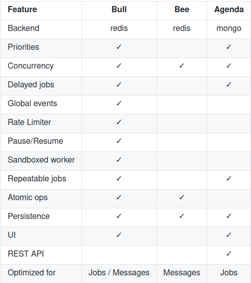
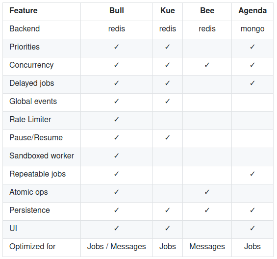

## 들어가며

Java의 [Shedlock](https://github.com/lukas-krecan/ShedLock) 처럼 추가적인 Infra없이, distributed 환경에서 한번만 job을 실행하고 싶어 후보군을 찾고 있다. Shedlock은 여러 DB(RDB, NOSQL, REDIS)를 지원하므로 대부분의 백엔드 프로젝트에서 사용할 수 있으나 nodejs 는 Shedlock의 alternative가 보이지 않아 잠시 찾아보았다.

## 후보

### Bree (Star 10.3k, Fork 1.1k)

cron(\* \* \* \* \* \*), dates (2020-01-01 00:00:00), ms ('2 days'), later(?)등 여러 포멧을 지원.

되게 좋아보임. 하지만 공식적으로 distributed 환경은 지원하지 않음. 다음과 같은 문장이 있음.

> We recommend you to query a persistent database in your jobs, to prevent specific operations from running more than once. Bree does not force you to use an additional database layer of Redis or MongoDB to manage job state. In doing so, you should manage boolean job states yourself using queries.

한번만 실행하기 위해 스스로 job states 를 관리하라는 뜻임

### Agenda (Star 7.4k, Fork 693)

Mongo를 persistence layer로 사용하는 scheduler. RESTful API도 지원하고 여러가지 특징들을 갖고 있다.

### Node Scheduler (Star 7.3k, Fork 506)

적당히 쓸만해 보이는 Scheduler. cron-like, not-cron-like 를 지원.

### Bull (Star 10.3k, Fork 1.1k)

The fastest, most reliable, Redis-based queue for Node. Carefully written for rock solid stability and atomicity.

첫 설명에 보면 queue라고 써져있는데, scheduler도 지원하고 별 기능이 되게 많다. 꽤 좋아보임.

## 결론

동시성을 해결하는걸 스스로 한다고 하면 추가 Infra가 필요없는 Bree가 좋아보이고 Redis를 쓴다면 Bull이 괜찮아보인다.

[하지만 Bree 설명글에 아래와 같은 글이 있는데, bull에는 Redis를 사용하므로 core 이슈가 있는데 그걸 해결하기 전에는 사용하지 않는게 좋다라는 말이 있다. 잘 선택해서 사용해야겠다.](https://github.com/breejs/bree#foreword)

> I was relying heavily on bull; having created @ladjs/bull – but due to core issues (and being Redis-backed) it was not the best tool for the job. Bull might have been okay if the core issues were fixed, however since it uses Redis it should not be used for a job queue.
