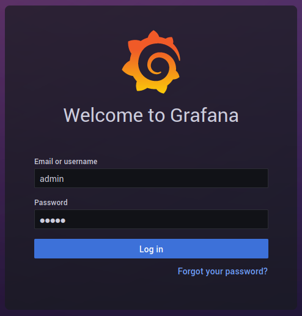
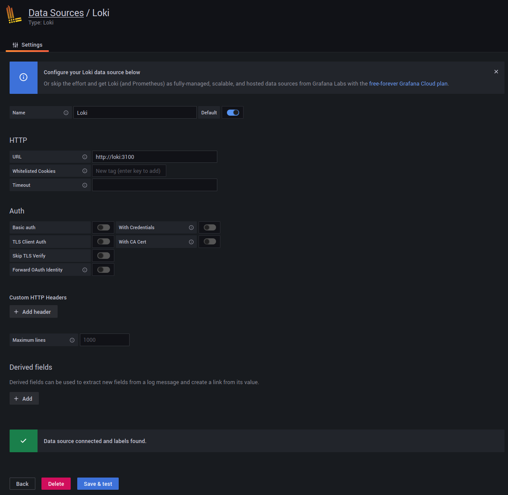
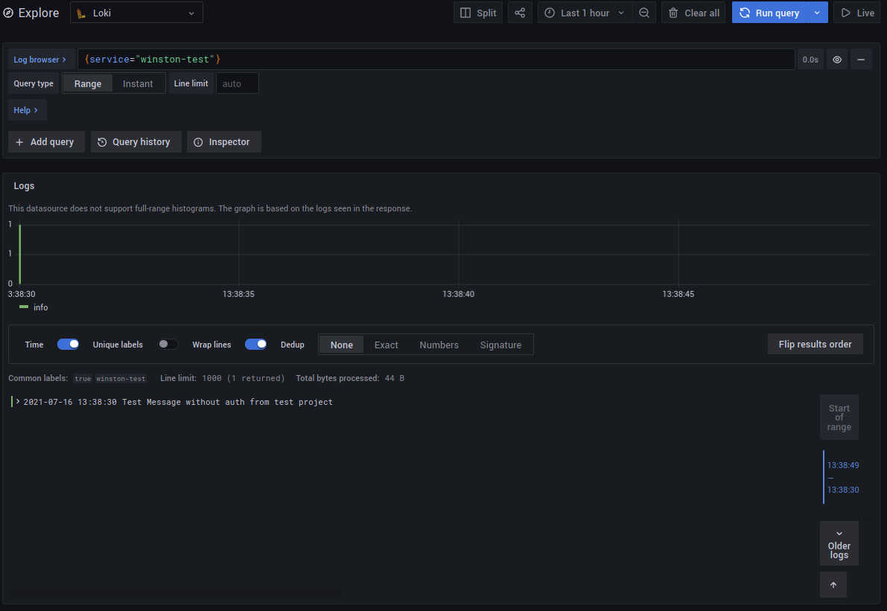

## 참고

- [winston-loki](https://github.com/JaniAnttonen/winston-loki)
- [grafana/loki](https://github.com/grafana/loki/tree/main/production#run-locally-using-docker)

## 개요

서비스 개발에서 로그를 남기는 것에 대한 중요성은 아무리 말해도 부족하지 않다. 이전에도 모니터링 하는 방법에 대해 글을 남긴 적 있는데, 모니터링과 로깅을 얼마나 잘 남기는가에 따라 서비스 운영에 엄청나 도움을 준다. 이번글을 grafana로 로그를 보기 위해 loki에 로그를 남기는 과정을 한번 보려고 한다.

## 작업 요약

1. grafana - loki instance 실행
2. test project로 loki에 log 기록
3. grafana 에서 로그 확인

## 작업 상세

### 1. grafana - loki instance 실행

1.1 grafana를 미리 사용하고 있으면 상관 없지만, 사용안하고 있을 때, docker-compose 를 사용해서 grafana를 빠르게 띄우고 테스트를 해볼 수 있다. 이 [링크](https://github.com/grafana/loki/tree/main/production#run-locally-using-docker)에서 자세한 사용방법을 볼 수 있고 아래 명령을 실행하면된다.

```bash
git clone git@github.com:grafana/loki.git

cd loki/production

docker-compose pull

docker-compose up
```

1.2 grafana 로그인

web-browser에서 http://localhost:3000 입력 후 id: admin, pass: admin



1.3 loki Data Source 추가

http://localhost:3000/datasources/new 아래와 같이 url에 http://loki:3100 입력



Data Source까지 추가하면 grafana 설정은 끝났음

### 2. test project로 loki에 log 기록

```javascript
const { createLogger } = require('winston')
const LokiTransport = require('winston-loki')
const options = {
    level: 'debug',
    transports: [
        new LokiTransport({
            host: ' http://127.0.0.1:3100',
            labels: { service: `winston-test` }
        })
    ]
}

const logger = createLogger(options)

function main () {
    logger.info({ message: 'Test Message without auth from test project', labels: { messageLabel: true } })
}

main()
```

### 3. grafana 에서 로그 확인


