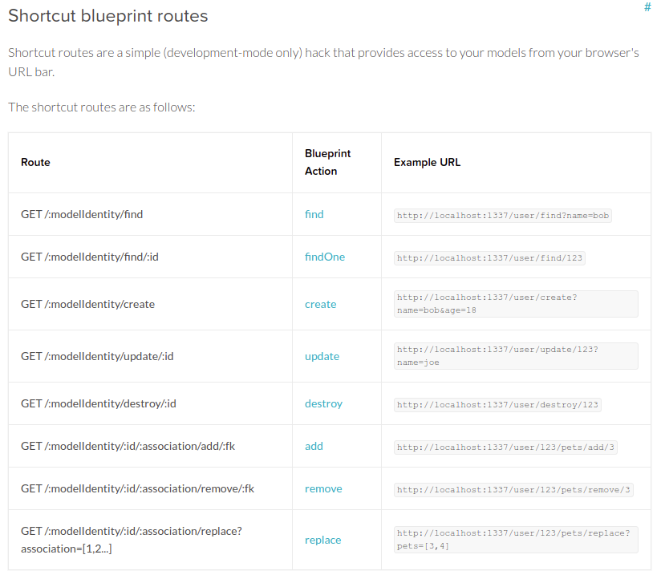

## 요약

1. npm install -g sails
2. sails create new project
3. sails generate model something
4. edit config.blueprints.js (blue print enable 시키기)
5. edit config.policies.js (모든 요청을 인증없이 받기)

---

## References

- [https://sailsjs.com/documentation/concepts/blueprints](https://sailsjs.com/documentation/concepts/blueprints)
- [완성된 프로젝트 Github repo](https://github.com/moltak/practice-sails-auto-crud)

---

이전에 설치해본 Admin Forest 를 사용할 때, 가장 신기했던 기능은 DB의 DDL을 분석해서 자동으로 CRUD 기능들을 만들어 주는 기능이었다. 생각해보면 이미 모든 정보가 다 DB에 있으니 CRUD를 자동 생성해주는건 크게 어려운 일이 아니라는 생각이 들었다.

그걸 해결해주는게 sails 의 [blueprint](https://sailsjs.com/documentation/concepts/blueprints) 기능이다. 만약 sails generate 명령(`sails generate model student name:string`) 으로 model 을 만들었다면 blueprint API가 아래 보이는 blueprint routes 를 expose 해주고 이를 이용해 GET,POST,PUT,DELETE 등의 명령을 클라이언트가 호출할 수 있게 된다.



하지만 READ 명령만 실행을 해봤는데, Blueprint API를 통해 CREATE 할 때 403 Forbidden 에러가 발생하고 이를 해결하는 정책 변경방법을 아직 못 찾았기 때문이다. 이어지는 아래 글들을 통해 지금까지 알게된 방법들을 적어놨다.

## 설정방법

### config/blueprints.js

속성들 true 로 변경하기

### config/policies.js

'\*': 'is-logged-in' -> '\*': true 로 변경

## 실행 결과

### GET

```bash
$> http GET :1337/user --print HhBb
GET /user HTTP/1.1
Accept: */*
Accept-Encoding: gzip, deflate
Connection: keep-alive
Host: localhost:1337
User-Agent: HTTPie/1.0.3


HTTP/1.1 200 OK
Connection: keep-alive
Content-Length: 2
Content-Type: application/json; charset=utf-8
Date: Sat, 16 May 2020 06:25:34 GMT
ETag: W/"2-l9Fw4VUO7kr8CvBlt4zaMCqXZ0w"
X-Powered-By: Sails <sailsjs.com>
set-cookie: sails.sid=s%3A9O5v-mQvY8_6ui_gt28eAxEU8bMrEAX5.yk4xNEpbbEgK8yog719LeGxpc6GGDynk%2FAXeGrgWIBQ; Path=/; HttpOnly

[]
```

### POST

POST 는 Forbidden으로 계속 실패하는데, 어떻게 권한을 만들어줘야하는지 모르겠음...

```bash
$> http POST :1337/Student name=test3 --json --print HBhb
POST /Student HTTP/1.1
Accept: application/json, */*
Accept-Encoding: gzip, deflate
Connection: keep-alive
Content-Length: 17
Content-Type: application/json
Host: localhost:1337
User-Agent: HTTPie/1.0.3

{
    "name": "test3"
}

HTTP/1.1 403 Forbidden
Connection: keep-alive
Content-Length: 9
Content-Type: text/plain; charset=utf-8
Date: Sat, 16 May 2020 06:27:45 GMT
ETag: W/"9-PatfYBLj4Um1qTm5zrukoLhNyPU"
X-Powered-By: Sails <sailsjs.com>
set-cookie: sails.sid=s%3A9lmrTrjtnTjYjBkuHxzHxvdLVdI8p2EL.nG0cT9mpadEVjFVe%2BE7Plgl8tAUOkFGulhTfLzy%2BI4o; Path=/; HttpOnly

Forbidden
```
