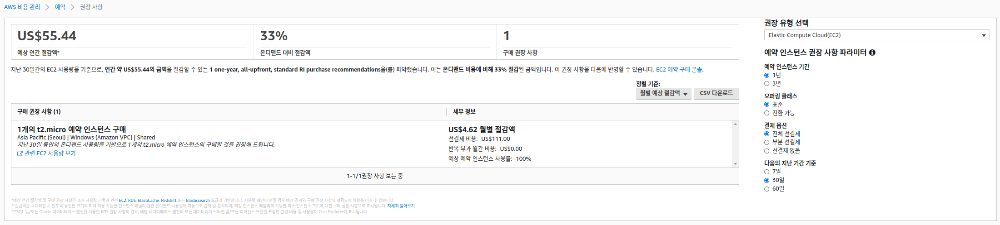
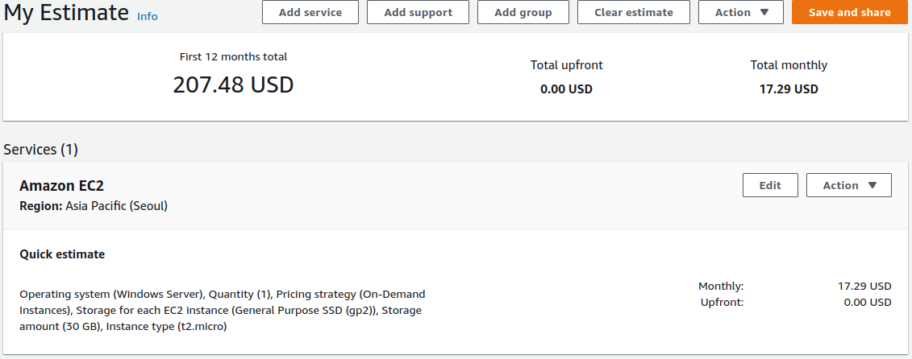
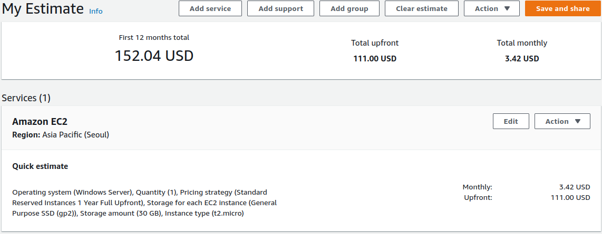
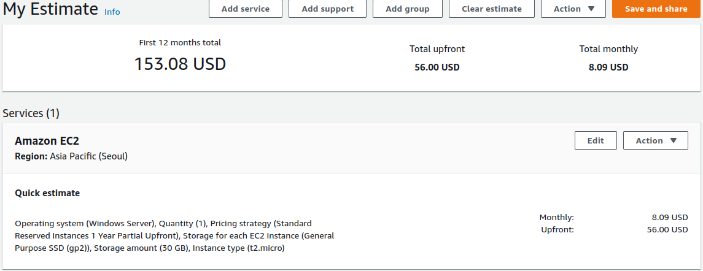
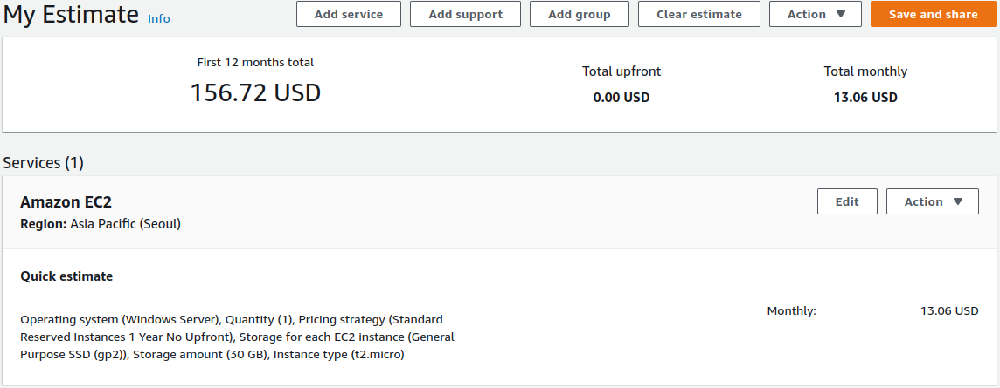
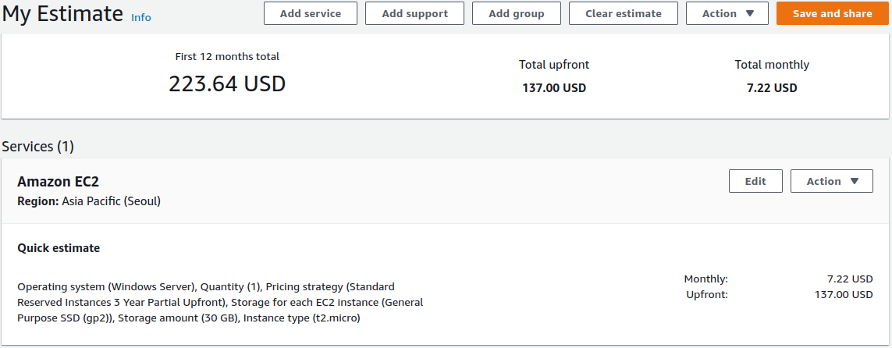
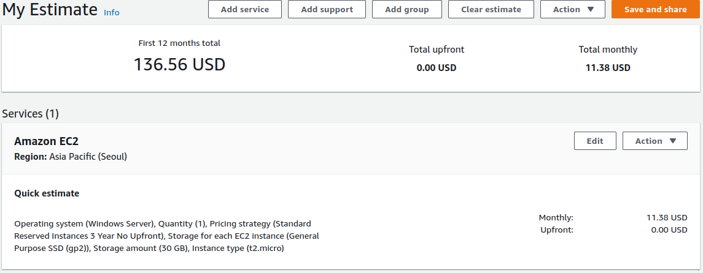

[https://calculator.aws/](https://calculator.aws/) 여기서 견적을 내볼 수 있음. 나는 Windows Server 를 365일 사용중인데 한달에 2만원 정도 나가는것 같아 조금 부담이 있다. 싸게 사용하려면 여러가지 방식이 있지만 Reserved instance를 자세히 보고 있다. 아래쪽에 가격들을 캡쳐해놨는데 뭘 하던간에 가격차이가 그리 크지 않다 -_-;

1년 기준 On Demand → RI 로 바꾸면 대략 한달에 최소 $51를 아낄 수 있는데 이는 On Demand 대비 20% 정도 절감되는 효과가 있다. 생각보다 크진 않네.. 한달에 대략 $4 정도인데 Notion 값과 비슷하다. ㅋ

## 권장사항 보기

[https://console.aws.amazon.com/cost-management/home?#/recommendations](https://console.aws.amazon.com/cost-management/home?#/recommendations)

이렇게 보인다

## Reserved Instance 1 year

### On Demand

### Full Upfront

### Partial Upfront

### No Upfront

## Reserved Instance 3 year

### On Demand

17.29\*36=622.44

### Full Upfront

306.04 + (12\*3.42\*2) = 388.12

### Partial Upfront

223.64 + (12\*7.22\*2) = 396.92

### No Upfront

11.38\*36=409.68

