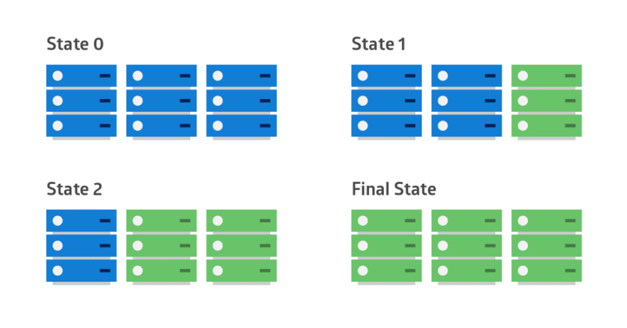
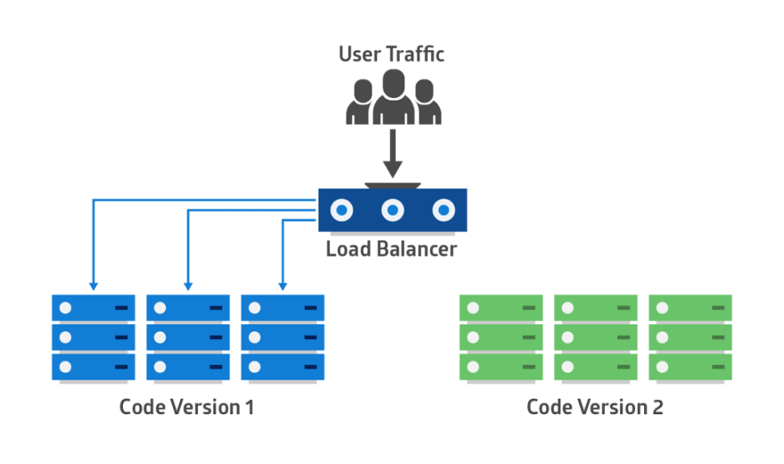
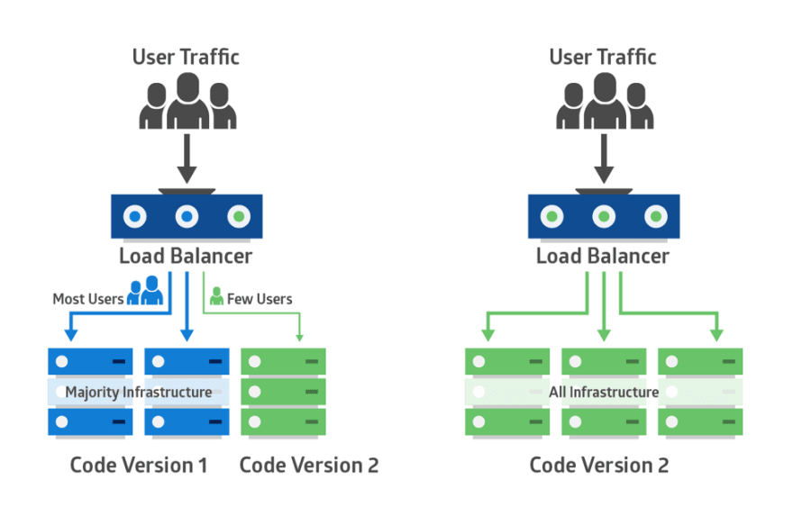

## 참고

[Canary deployments with Serverless and AWS Code Pipeline](https://carloscastellanos.dev/posts/canary-deployments-with-serverless-and-aws-code-pipeline/)

## 개요

종종 헷갈리는 용어가 또 Rolling, Blue/Green Deployment이다. 제목엔 Canary도 있는데, 이건 검색하다가 발견해서 가져와봤다.

## 요약

아래 상세를 보기 전에 생각을 먼저 해보자. 아래 이미지를 보면 파란색과 녹색이 보인다. 파란색은 Old version application이고 녹색은 New version application이다. 아래 이미지 모두 New version application이 어떻게 배포되는지 설명하는 그림인데, 그림만 보고 Rolling, Blue/Green, Canary Deployment인지 맞출 수 있나? 상세에 가면 바로 정답이 있으니 거길 일단 보지 말고 한번만 생각해보자.

## 상세

위에서 한번 고민해봤으면 이제 정답을 볼 시간이다. 고민안해봤으면 다시 올라가서 한번 고민해봐라.

일단 답은 사진 순서대로 Rolling, Blue/Green, Canary Deployment이다. 이제 각각이 뭔지 짧은 설명을 한번 보자

### Rolling

첫 그림에서 처럼, Instance Group이 있을 때, 한대씩 배포를 진행한다. 순서는 다음과 같다.

1. Instance Group에서 3번째의 Instance에게 트래픽이 가지 않도록 막는다.
2. 3번째 Instance에 New version application을 배포한다.
3. 3번째 Instance에 트래픽을 보낸다.
4. 2번째 Instance에게 트래픽이 가지 않도록 막는다.
5. 1번이 될때까지 반복

설명처럼 Instance Group에 한대씩 천천히 배포를 진행하는게 Rolling Deployment이다. 장단점이 있는데, 그냥 생각해봐도 될 것 같다.

### Blue/Green

1. Old version application이 동작하고 있는 Instance Group과 똑같은 인프라를 세팅한다.
2. New version application을 새로운 Instance Group에 배포한다.
3. Loadbalancer 에서 새로운 Instance Group에 트래픽을 모두 전달한다.
4. Old version instance Group을 해지한다.

이건 AWS에서 구현한다고 하면 매우싸고 쉽게 할 수 있다. 하지만 직접 Onpremise 환경을 구축한다고 하면 여분의 서버가 항상 있어야하므로 비싸다.

### Canary

Canary는 약간 독특한데, 이건 Rolling, Blue/Green Deployment와는 아주 다른 컨셉이다. A/B testing 을 할 때 사용하는건데, Old version, New version application을 동시에 동작시키면서 LoadBalancer를 사용해 트래픽을 분산하여 A/B 테스트를 수행한다.

새로운 Feature를 배포해야하는데, 너무 기능 변화가 많거나 엄청난 업데이트가 포함되어있다면 Canary가 좋은 대안이 된다.

## 마무리

글을 읽으며 기억나는데로 정리했는데, 누군가에게 도움이 될지 잘 모르겠다. 한명만 도움이 되더라도 기쁠것같다. Rolling, Blue/Green, Canary가 헷갈리지 않길 바란다.
