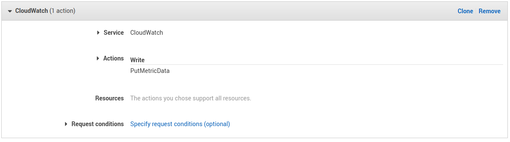
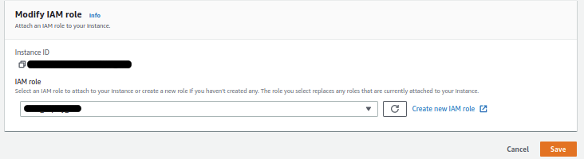
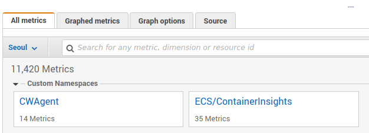
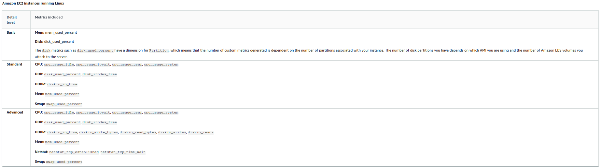

## 참고

- [Collecting metrics and logs from Amazon EC2 instances and on-premises servers with the CloudWatch agent](https://docs.aws.amazon.com/AmazonCloudWatch/latest/monitoring/Install-CloudWatch-Agent.html) (AWS 공식 페이지 - 왠만하면 이거 보면 됨)
- [Monitoring EC2 disk usage](https://marbot.io/blog/monitoring-ec2-disk-usage.html) (공식 사이트보다 보기 편함)
- [How to Setup Custom CloudWatch Metric and Alarm](https://www.zehncloud.com/how-to-setup-custom-cloudwatch-metric-and-alarm/) (그냥 한번 읽어봄..)

## 개요

이 글은 EC2의 Disk, Memory 를 Monitoring 하기 위한 글이다. CloudWatch를 사용해서 EC2의 상태들을 모니터링 하려고 보면 없는 내용들이 많으며 처음 기대완 다르게 리눅스 머신의 모든 정보가 보이지 않는것에서 혼란을 느낄 수 있다. 그걸 피하고자 이 글을 쓰고 있으며 나도 자주 까먹으므로 기억하기 위해 글을 쓴다.

## 작업 요약

1. IAM 설정
2. CloudWatch agent 설치
3. Configure CloudWatch agent
4. CloudWatch에 Metric 추가

## 작업 상세

### 1. IAM 설정

CloudWatch의 `PutMetricData` 권한을 준 Policy 생성 후 EC2에 권한 부여





### 2. CloudWatch agent 설치

아마존 리눅스는 아래와 같이 rpm으로 설치하고 다른 배포판은 [링크](https://docs.aws.amazon.com/AmazonCloudWatch/latest/monitoring/download-cloudwatch-agent-commandline.html) 참조

```bash
wget https://s3.amazonaws.com/amazoncloudwatch-agent/amazon_linux/amd64/latest/amazon-cloudwatch-agent.rpm

sudo rpm -U amazon-cloudwatch-agent.rpm
```

### 3. Configure CloudWatch agent

CloudWatch Configure 방법 두가지 있음.

#### 첫번째

```bash
sudo vim /opt/aws/amazon-cloudwatch-agent/etc/amazon-cloudwatch-agent.json

{
  "agent": {
    "metrics_collection_interval": 60,
    "run_as_user": "cwagent"
  },
  "metrics": {
    "append_dimensions": {
      "InstanceId": "${aws:InstanceId}"
    },
    "metrics_collected": {
      "disk": {
        "measurement": [
          "used_percent"
        ],
        "metrics_collection_interval": 60,
        "resources": [
          "/"
        ]
      },
      "mem": {
        "measurement": [
          "mem_used_percent"
        ],
        "metrics_collection_interval": 60
      }
    }
  }
}
```

#### 두번째

아래 명령어를 실행하고 prompt 를 따라가며 설정 가능. 자세한 내용 [여기 참고](https://docs.aws.amazon.com/AmazonCloudWatch/latest/monitoring/create-cloudwatch-agent-configuration-file-wizard.html)

아래 명령어를 사용하려면 IAM `aws_access_key_id`와 `aws_secret_access_key`가 필요함.

```bash
sudo /opt/aws/amazon-cloudwatch-agent/bin/amazon-cloudwatch-agent-config-wizard
```

#### 서비스 재실행

```bash
sudo systemctl enable amazon-cloudwatch-agent.service
sudo systemctl restart amazon-cloudwatch-agent.service
```

### 4. CloudWatch에 Metric 추가

CloudWatch Metric 목록을 보면 CWAgent 가 보이고 그 안에서 방금 추가한 여러 metric 들을 볼 수 있음.



## 번외

Basic, Standard, Advanced 에 따른 수집할 수 있는 Metric ([링크 참고](https://docs.aws.amazon.com/AmazonCloudWatch/latest/monitoring/create-cloudwatch-agent-configuration-file-wizard.html))


