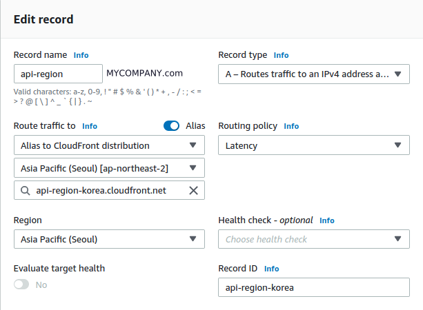
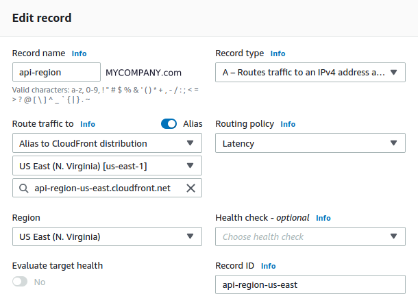

## References

- [Amazon Route53 지연 속도 기반 라우팅 활용하기](https://aws.amazon.com/ko/blogs/korea/route53-latency-based-routing/) (AWS)
- [AWS 기반 멀티 리전 SaaS 솔루션 설계하기](https://www.megazone.com/techblog_201028_architecting-multi-region-saas-solutions-on-aws/) (Megazone)

## 들어가며

서비스를 운영하다보면 두가지 이유로 Cross Region 필요하게 된다. 첫번째는 fault tolerant 이고 두번째는 지연시간 단축이다. 이번에 나는 미국에 제품을 출시함으로써 CR이 필요하게 됐다.

CR을 지원하기 위해서 DNS를 설정해주면 되는데, 우리는 Route53에서 설정하면 된다.

## 자세한 설명

Amazon Route53에는 Latency based routing 이 지원되는데, 이것을 사용하면 DNS 질의를 통해 빠른 응답이 오는 곳으로 API 요청을 보내게 된다.

1. Route53 Alias 설정
2. 이름은 약간 직관적으로 `api-region.MYCOMPANY.com` 으로 지역 만큼 생성
3. Routing Policy를 Latency로 하고 Route traffic 설정과 Region 을 설정

위 그림을 비교해보면 Record name은 같고 Route traffic to, Region 등이 다르며 Routing policy는 Latency로 되어있는 것을 알 수 있다. 위와같이 설정 한 후 아래 명령어를 통해 DNS 체크를 해보면 미국에서 테스트하면 미국으로 한국에서 테스트하면 한국으로 라우팅이 되는 것을 확인할 수 있다.





```bash
dig +short api-region.getswitch.app
```

## Troubleshooting

[SSL_ERROR_NO_CYPHER_OVERLAP](https://stackoverflow.com/questions/42844989/cloudfront-distribution-and-aws-issued-certificate-gives-ssl-error-no-cypher-ove) CloudFront 의 CNAME과 Route53의 CNAME이 달랐을 때, 발생하는 문제
