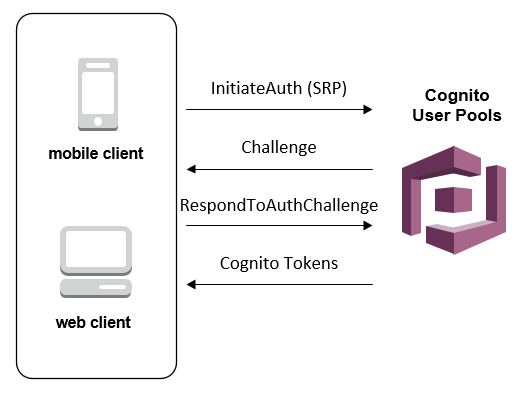
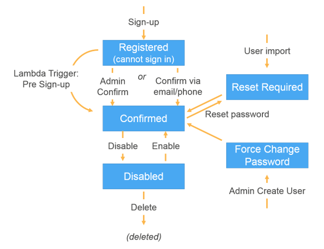

## 참고

- [User Pool Authentication Flow](https://docs.aws.amazon.com/cognito/latest/developerguide/amazon-cognito-user-pools-authentication-flow.html#amazon-cognito-user-pools-client-side-authentication-flow)
- [Overview of User Account Confirmation](https://docs.aws.amazon.com/cognito/latest/developerguide/signing-up-users-in-your-app.html)
- [AdminCreateUser](https://docs.aws.amazon.com/cognito-user-identity-pools/latest/APIReference/API_AdminCreateUser.html#API_AdminCreateUser_RequestSyntax)
- [AdminInitiateAuth](https://docs.aws.amazon.com/cognito-user-identity-pools/latest/APIReference/API_AdminInitiateAuth.html)
- [AdminRespondToAuthChallenge](https://docs.aws.amazon.com/cognito-user-identity-pools/latest/APIReference/API_AdminRespondToAuthChallenge.html)

## 개요

이 글은 혹시 나처럼 Amplify 나 Cognito Client Library 를 사용하지 않고 서버에서 모든 과정을 다 구현해야하는 경우에 유용하게 사용할 수 있는 방법이다. 사실 Cognito 는 AWS에서 버려진? (좀 2군, 3군 같은 느낌의 서비스)라서 사용하는것을 그다지 추천할 수 없다. 왜냐면 문서는 상대적으로 빈약한데 반해 기능은 꽤 많고 Trigger를 이용해 기능 확장도 가능한데, 이런 많은 것들로 도대체 뭘 하라는건지 너무 헷갈리기 때문이다(내 입장에선 그랬다 이 글을 읽는 다른 분은 다를 수 있음). 암튼 방금까지도 계속 헤메다가 좀 감이 와서 글을 남긴다.

Cognito 는 내 블로그의 다른 글과는 다르게 좀 배경 설명이 필요하므로 먼저 이 부분을 읽길 바란다.

## 배경 설명

### 요약

아래 좀 긴 설명이 이어질텐데 미리 요약하면 아래의 Cognito API를 순서대로 호출하면 된다.

> 회원가입: AdminCreateUser -> AdminInitateAuth -> AdminRespondToAuthChallenge
> 로그인: AdminInitateAuth

### 1. Overview (User Pool Authentication Flow, User Account Confirmation)

Auth (Authentication, Authorization)을 서버에서 구현하려다 보면 여러가지 기능이 필요하다. 회원가입, 로그인, SMS, Email 인증, Password Reset 등 보통 이정도 기능은 필요하다.

Cognito는 회원가입 때, SMS, Email 인증 등을 Challenge 로 묶어 관리한다. 미리 정의된 Challenge가 있고 혹은 Custom 도 가능하다. (난 Custom은 구현을 해본적이 없어서 이 글에선 포함하지 않는다.)



위 이미지를 보면 InitiateAuth 를 Cognito 에 보낸 후 Challenge를 받아 RespondToAuthChallenge 를 다시 전달하는 것을 볼 수 있다. 이전 문장에서 설명했던 것 처럼 Challenge에 대답을 잘 해야 회원가입을 완료할 수 있다. Challenge의 목록은 [1](https://docs.aws.amazon.com/cognito/latest/developerguide/amazon-cognito-user-pools-authentication-flow.html#amazon-cognito-user-pools-client-side-authentication-flow), [2](https://docs.aws.amazon.com/cognito-user-identity-pools/latest/APIReference/API_AdminInitiateAuth.html#API_AdminInitiateAuth_ResponseSyntax)에서 찾을 수 있는데, 상당히 많다. 하지만 항상 그렇듯 딱 쓸만한건 잘 눈에 띄지 않는다.

아무튼 나의 목적은 Admin이 Cognito를 제어해 회원가입 프로세스를 완성하는 것이다. 그걸 달성하기 위해 [이 쪽을](https://docs.aws.amazon.com/cognito/latest/developerguide/how-to-create-user-accounts.html) 글을 자세히 읽으면 된다. ~~근데 정말 Cognito의 글은 되게 안읽힌다~~

아래에 위에 언급한 [링크](https://docs.aws.amazon.com/cognito/latest/developerguide/how-to-create-user-accounts.html)에 있는 내용중 중요한 부분을 첨부한다.

```
Authentication Flow for Users Created by Administrators or Developers

The authentication flow for these users includes the extra step to submit
the new password and provide any missing values for required attributes.
The steps are outlined next; steps 5, 6, and 7 are specific to these users.

1. The user starts to sign in for the first time by submitting the username
   and password provided to him or her.

2. The SDK calls InitiateAuth(Username, USER_SRP_AUTH).

3. Amazon Cognito returns the PASSWORD_VERIFIER challenge with Salt & Secret block.

4. The SDK performs the SRP calculations and calls
   RespondToAuthChallenge(Username, <SRP variables>, PASSWORD_VERIFIER).

5. Amazon Cognito returns the NEW_PASSWORD_REQUIRED challenge along with
   the current and required attributes.

6. The user is prompted and enters a new password and any missing values
   for required attributes.

7. The SDK calls RespondToAuthChallenge(Username, <New password>, <User attributes>).

8. If the user requires a second factor for MFA, Amazon Cognito returns
   the SMS_MFA challenge and the code is submitted.

9. After the user has successfully changed his or her password and optionally
   provided attributed values or completed MFA, the user is signed in and
   tokens are issued.

When the user has satisfied all challenges, the Amazon Cognito service marks
the user as confirmed and issues ID, access, and refresh tokens for the user.
```

위 글을 요약한 내용이 아래 다이어그램이다. Admin이 Cognito에 직접 유저를 생성할 경우 `Force Change Password` challenge 를 "무조건" 받게 되며 그에 따라 적절하게 RespondToAuthChallenge를 해주면 된다.



여기까지가 배경 지식인데 좀 이해가 되려나.. 나는 Cognito 문서를 몇번 읽었으나 (물론 자세히 모든 부분을 읽진 않았음) 여전히 좀 어렵다. 내가 이해한 내용을 자세히 풀어 썼지만 여전히 잘 이해를 못할 것 같다. 사실상 위에 요약 부분의 행동만 정의 하면 되고 이해가 안간다면 일단 구현을 해보고 다시 이 글을 읽어보자.

### 2. API 요약

**AdminCreateUser**: 유저를 추가하는 API. 이 유저는 `FORCE_CHANGE_PASSWORD` 상태를 갖게됨.

**AdminInitateAuth**: Authentication flow 를 시작하는 API. SignIn, RefreshToken 을 수행. ([Authentication Flow는 여기에서 참고](https://docs.aws.amazon.com/cognito/latest/developerguide/amazon-cognito-user-pools-authentication-flow.html#amazon-cognito-user-pools-client-side-authentication-flow))

**AdminRespondToAuthChallenge**: AdminInitiateAuth에서 시작한 Authentication Flow 에 대한 응답을 제공. 각 Authentication Flow 마다 전달해야하는 파라미터가 달라짐.

## 작업 요약

1. Cognito User Pool 생성
2. AdminCreateUser API 호출
3. AdminInitateAuth API 호출 (강제로 로그인 해서 4번을 API를 호출하기 위함)
4. AdminRespondToAuthChallenge 호출
   - 2,3,4 번을 할 경우 유저는 로그인 가능한 상태로 Cognito User Pool 에 추가된 상태
5. AdminInitateAuth API 호출 (로그인)
   - 여기서 accessToken, idToken, refreshToken 을 받을 수 있음
6. 유저에게 5번에서 받은 토큰 반환
7. 끝

## 작업 상세

## 번외

- [Amazon Cognito isn't delivering MFA text messages to my app's users. How do I troubleshoot this?](https://aws.amazon.com/premiumsupport/knowledge-center/cognito-troubleshoot-mfa-sms-delivery/)
- [Implementing passwordless email authentication with Amazon Cognito](https://aws.amazon.com/blogs/mobile/implementing-passwordless-email-authentication-with-amazon-cognito/)
