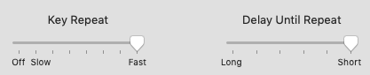

## 개요

VIM 을 잘 쓰려면 키 반복 없애야됨.

## 키 반복

맥에서 엑센트 키가 있는데 (a를 길게 누르면 a\`를 입력하게 한다던지...) 나는 쓸일이 없고 또 저것때문에 vim 키 바인딩 쓸 때 커서 이동이 너무 잘 안되서 해제하고 쓴다. 해제코드는 아래에 있고 속도를 빠르게 하기 위해 맥 설정도 바꿔주면 됨.

`defaults write -g ApplePressAndHoldEnabled -bool false`

이렇게 바꾸면 진짜 빠름.

## iterm2

Go to iTerm Preferences -> Profiles, select your profile, then the Keys tab. Click Load Preset... and choose Natural Text Editing.
