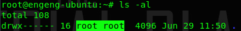

## 개요

Access Control List라는 관용어처럼 사용되는 ACL을 linux에서 설정할 수 있다. chmod, chown 명령어와 어떻게 다르냐면, chmod와 chown 명령어는 1차원적이다. 1차원이 무슨말이냐면 아래의 이미지에 보면 root root 는 각각 user와 group을 가르킨다. 이 디렉토리는 root(user)라는 소유자와 root(group)라는 그룹이 소유하고 있다는 뜻이다.



만약 root가 owner인 디렉토리에 user를 추가하려면 chown 명령어로 owner를 **변경**하는 방법밖에 없다. **변경**이라는 말이 중요한데, 우리는 **추가**를 하고 싶은거지 변경을 하고 싶은건 아니다. 물론 추가를 하기 위해 usermod 명령어를 사용해 그룹에 추가한다던지 가능한데, 약간 어색할 수 있다. 이럴때 ACL을 사용할 수 있다.

## 명령어 예제

아래 예제에서 보이듯 get과 set + facl 명령어를 통해 권한을 chmod, chown 보다 더 상세하게 추가해줄 수 있다.

### getfacl

path에 어떤 ACL이 설정되어있는지 볼 수 있다.

```bash
~ getfacl .

# file: .
# owner: engeng
# group: engeng
user::rwx
group::rwx
other::r-x
```

### setfacl

path에 ACL을 설정할 수 있다.

```bash
setfacl -mR u:engeng2:rw . # engeng2 user에게 rw ACL을 추가
setfacl -mR g:engeng2:rw . # engeng2 group에 rw ACL을 추가

옵션들
-R, –recursive : recurse into subdirectories
-d, –default : operations apply to the default ACL
-m, –modify=acl : modify the current ACL(s) of file(s)
```
