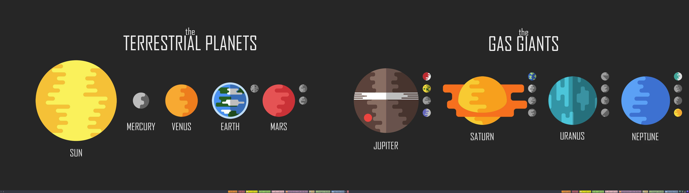

이걸 세번째나 작성하고 있을줄은 몰랐는데 -_-; 아마 네번째도 나올것 같다... 여기까지 하다보니 정말 gnome이나 kde, xfce가 얼마나 여러면에 신경을 많이 썼는지 알게됐다. 정말 WM 만드는 분들은 꼭 행복하게 사셨으면 좋겠다. 일단 이번에는 배경화면을 설정하는 내용이다. 사실 꽤나 간단하지만 gui 환경 세팅이 없으면 세팅하기 힘드니까 기록을 남긴다. 그리고 나는 듀얼 모니터를 사용하고 있다고 했는데, 그 모니터들도 리눅스 부팅 후 자동으로 xrandr이 실행되야하더라. 거기까지 함께 기록한다.

## 배경화면 설정

> 배경화면 설정에 [hsetroot](https://github.com/himdel/hsetroot) 을 사용함.

이전 글 [i3wm 1](/blog/88-i3wm-1-starterpack)을 봤다면 i3wm-starterpack 을 설치했을 건데, 그때 apt 명령어 중 hsetroot 을 이미 설치했다. 나도 hsetroot 을 이용해 배경화면을 바꿀것이다.

```bash
# autostart
exec --no-startup-id hsetroot -center wallpaper/1329201.jpg

# key binding for lock
bindsym $super+Control+l exec i3lock -t -iwallpaper/i3lock-1.png
```

일단 `.config/i3/config` 파일에 두 줄을 추가해야하는데 첫번째는 배경화면을 설정하는 곳이고 두번째라인은 lock 화면의 배경화면을 설정하는 것이다. 그렇다. 다른 os와 비슷하게 lock과 배경화면 둘다 설정해줘야한다. (하지만 우리는 커맨드로 한다 ㅋ)

## 부팅 후 모니터 자동켜기

```bash
# autostart
exec --no-startup-id xrandr --output HDMI-0 --auto --left-of DP-1
exec --no-startup-id xrandr --output DP-1 --auto --right-of HDMI-0
exec --no-startup-id hsetroot -center wallpaper/1329201.jpg
```

[i3wm - 2](/blog/90-i3wm-2-dual-monitor) 에서 설정했던 모니터 켜는 명령어와 배경화면 설정하는 명령어를 연달아 써줘야한다. 먼저 모니터를 켠 후 wallpaper 를 설정하면 배경화면이 잘 세팅된다. 아래는 현재 설정한 배경화면을 캡쳐한 화면이다. 모니터가 두대기때문에 두개의 i3status 를 확인할 수 있다.



---

여기까지 왔다면 이제 좀 화면이 예뻐보일것이다. 다만 이 상태로 컴퓨터를 사용하지 않고 가만히 놔두면 절전모드로 자동으로 들어가지지 않는다. 이를 해결하기위해 우리는 [다음 글에서 절전모드](/blog/91-i3wm-4-sleep)를 설정하는 것을 다시 볼 것이다.
