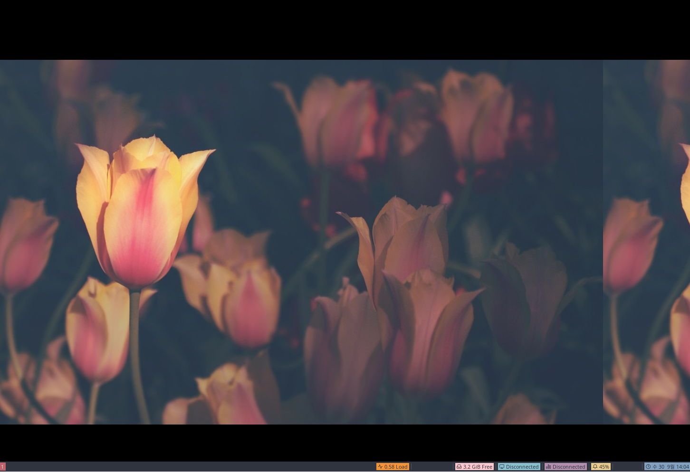
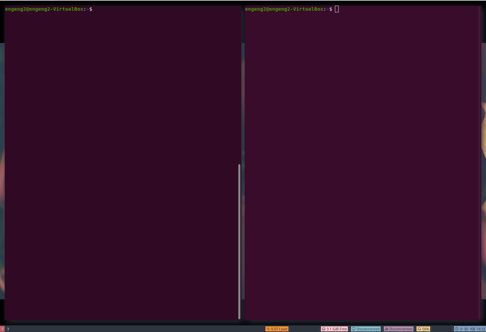

gnome 을 지난 몇년간 잘 써오고 있는데, vim에 익숙한지라 vim keybinding 을 사용할 수 있는 방법을 찾다가 i3를 발견했다. i3는 기본적으로 tiling (타일링)으로 window들을 관리하게 해주는 WindowManager 이다. 이 글에는 초기 세팅을 적어보려고 한다.

---

## References

- https://github.com/addy-dclxvi/i3-starterpack
- https://i3wm.org/docs/userguide.html#_default_keybindings
- https://github.com/Airblader/i3

## 설치 시작

```bash
# 기본 설치
sudo apt install i3 i3-wm dunst i3lock i3status suckless-tools -y

# below packages make your desktop enjoyable (근데 모르는 패키지가 많은데 -_-)
sudo apt install compton hsetroot rxvt-unicode xsel rofi fonts-noto fonts-mplus xsettingsd lxappearance scrot viewnior -y

# install i3-starterpack
git clone https://github.com/addy-dclxvi/i3-starterpack.git && cp -a i3-starterpack/. ~ && rm -rf i3-starterpack
```

**패키지 설명**

- Compton is a compositor to provide some desktop effects like shadow, transparency, fade, and transiton.
- Hsetroot is a wallpaper handler. i3 has no wallpaper handler by default.
- URxvt is a lightweight terminal emulator, part of *i3-sensible-terminal*.
- Xsel is a program to access X clipboard. We need it to make copy-paste in URxvt available. Hit Alt+C to copy, and Alt+V to paste.
- Rofi is a program launcher, similar with dmenu but with more options.
- Noto Sans and M+ are my favourite fonts used in my configuration.
- Xsettingsd is a simple settings daemon to load fontconfig and some other options. Without this, fonts would look rasterized in some applications.
- LXAppearance is used for changing GTK theme icons, fonts, and some other preferences.
- Scrot is for taking screenshoot. I use it in my configuration for Print Screen button. I set my Print Screen button to take screenshoot using scrot, then automatically open it using Viewnior image viewer.

## 설치 후

로그아웃 하고 로그인 화면 (display manager aka login screen)에서 보면 아래 그림처럼 i3를 선택할 수 있다.


i3를 선택한 후 재부팅 해보면 짜잔~ i3-starter pack이 제대로 적용됐구만? 이제 좀 써보자.. 일단 아래 단축키를 봐가면서 하나씩 해보자.



## Some Cheatsheet

**단축키**

- **Super + Shift + D** Launch dmenu
- **Super + D** Launch dmenu alternative called Rofi
- **Super + Enter** Launch i3-sensible-terminal, URxvt in this case
- **Super + Arrow** Change focused window, if You have two or more windows in the workspace
- **Super + Shift + Arrow** Send focused window to another edge of the screen, if You have two or more windows in the workspace
- **Super + H** and **Super + V** Change split direction to horizontal or vertical
- **Super + S** Change split direction, if You already have splitted windows
- **Super + Space** Float the window, hit it again to back to tiling mode
- **Super + 1-6** Switch to workspace 1-6
- **Super + Shift + 1-6** Send the focused window to workspace 1-6
- **Control + Alt + Left/Right** Switch to previous or next workspace. Only works if You have 2 workspace opened
- **Super + R** Resize mode. In resize mode, hit Arrow keys to do resizing. Hit Enter to back to normal mode
- **Super + C** or **Alt + F4** Close window
- **Super + Q** Quit i3wm
- **Super + L** Lockscreen. To unlock, type your user password then hit Enter
- **Super + Shift + R** Fully reload the configuration file. Hit this after do some modifications in the config file
- **Super + F** Make a window full screen
- More keybind look on the configuration file.

---

설치 후... 근데 이게 끝이 아니다 [Now What??](https://github.com/addy-dclxvi/i3-starterpack#now-what) 을 읽어보면 이 다음 해야하는 것들이 되게 많다. voulme 조절, app keybinds, 음악 저종, autostart 등등.. 이런걸 다 따져가면서 할 수 있으려나 ㅠㅠ 복잡시럽구만.. 일단 더 써본 후 돌아오겠다..

---

## i3-gaps

youtube에 보면 다들 창과 창 사이에 갭을 두고 쓰는데 이걸 안하면 모든 창이 다 붙어버려서 되게 답답하더라.. 그걸 하기 위해 i3-gaps 를 사용하면 된다.

```bash
sudo add-apt-repository ppa:kgilmer/speed-ricer
sudo apt install i3-gaps -y
```

이렇게 설치하면 되고 i3-gaps 는 기존에 따로 설치한 i3, i3-wm 을 대체하게 된다. i3와 i3-wm은 삭제됨. 그리고 `.config/i3/config` 을 열어 첫째줄에 다음 내용을 입력하자. 그 후 `Super + Shift + R` 로 i3 reload

```bash
#Needed for i3-gaps
#hide_edge_borders both
for_window [class="^.*"] border pixel 2
gaps inner 10
gaps outer 5
```

다음과 같이 margin 이 포함된 화면을 보게 된다.



---

여기까지는 무난?했지만 이 다음부터 겪는 문제가 되게 많다. 나처럼 vim을 좋아하고 리눅스를 좋아하는 사람만 다음 글을 계속 읽고 세팅을 해나가길 바란다.
