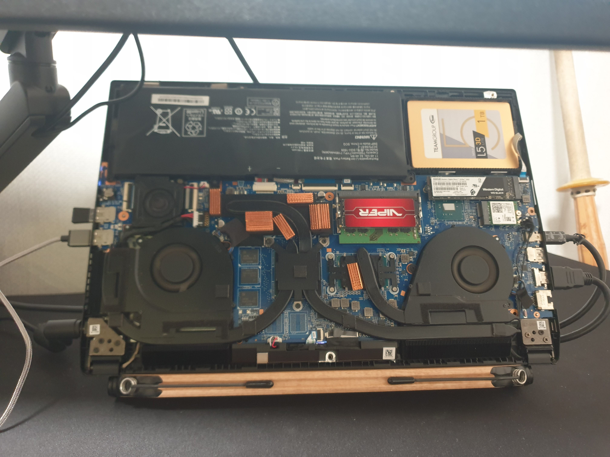

이번에는 잠깐 i3를 써보며 두번로 남기는 글이다. 나는 랩탑 + 모니터 27인치 두대 해서 총 3대의 모니터가 있고 대부분은 랩탑은 그냥 덮어놓고 사용한다.



그래서 대부분은 모니터를 듀얼로 쓰는데 i3wm 을 설치하고 크게 두가지 문제를 겪게됐다. (i3wm을 사용하자 마자 거의 바로 문제가 발생했음 -_- 아오...) 그 문제들은...

1. 랩탑의 덮개를 덮었기 때문에 바로 절전모드로 들어감. (gnome 에선 절전 모드에 안들어가게 설정할 수 있음.)
2. 두대의 외장 모니터가 출력이 되질 않음...

(정말 설정할게 많고 나중에 다시 하려면 무조건 잊어 버릴것 같은데 -_- 이렇게 하면서 까지 새로운 wm으로 옮겨가야하나 현타가 오기 시작함. 하지만 못 멈추겠음.)

아무튼간에 위 두개의 문제를 각각 살펴보자

## 외장 모니터

먼저 외장 모니터를 살펴보자. 이 문제는 간단하게 xrandr을 이용해 해결할 수 있었다. [Multiple monitors](https://i3wm.org/docs/userguide.html#multi_monitor) 섹션을 살펴보면 xrandr을 사용해서 문제를 해결하고 있었고 나도 같은 패키지를 사용해서 문제를 해결했다.

> xrandr 의 자세한 내용은 [여길](https://wiki.archlinux.org/index.php/Xrandr#Disabling_phantom_monitor) 볼 것

**1. 모니터 검색**

나는 모니터가 아예 켜지질 않아 xrandr로 모니터를 검색함. 나는 QHD 해상도를 가진 두대의 모니터를 사용하므로 각각 2560x1440까지 출력됨. DP-0은 랩탑의 모니터이므로 나중엔 DP-0도 꺼버리게 따로 해줘야함. gnome에선 자동으로 됐었는디 -0-

```bash
> xrandr

Screen 0: minimum 8 x 8, current 5120 x 1440, maximum 32767 x 32767
HDMI-0 connected primary 2560x1440+0+0 (normal left inverted right x axis y axis) 690mm x 430mm
   2560x1440     59.95*+  74.94
   1920x1200     59.88
   1920x1080     60.00    59.94    50.00    60.05    60.00    50.04
DP-0 connected (normal left inverted right x axis y axis)
   1920x1080     60.02 +
DP-1 connected 2560x1440+2560+0 (normal left inverted right x axis y axis) 597mm x 336mm
   2560x1440     59.95*+
   1920x1200     59.95
   1920x1080     60.00    60.00    59.94    50.00    50.00
```

**2. 모니터 켜기**

나의 외장 모니터는 HDMI-0, DP-1이고 이를 켜기위해 아래 명령어 사용함

```bash
> xrandr --output HDMI-0 --auto --left-of DP-1
> xrandr --output DP-1 --auto --right-of HDMI-0
```

**3. 랩탑 모니터**

이렇게 해도 랩탑 모니터가 켜져있기 때문에 아래 명령어를 사용해서 랩탑 모니터를 꺼버림

```bash
> xrandr --output DP-0 --off
```

마음 편해짐 ㅋㅋㅋ 모니터 잘 나옴. 이 글을 우연히 본 사람들은 꼭 자신의 모니터를 잘 검색해보고 사용할 것. 대부분은 한대 쓸거라서 아마 나처럼 복잡하진 않을거임...

## 절전모드

랩탑 모니터를 꺼버리고 외장 모니터를 켰지만 랩탑의 모니터를 덮어버리면... 절전모드에 바로 빠져 버린다. 이를 해결하기 위해 [이 글을](https://faq.i3wm.org/question/5629/how-to-prevent-sleep-on-laptop-lid-close/index.html) 참조함

요약하면 /etc/systemd/logind.conf 를 수정하면됨.

```bash
# 여기만 변경함
HandleLidSwitch=ignore
```

## 결론

하루만에 좀 삽질해서 새로운 WindowManager를 설치해봤는데 아직도 여러문제가 있음. 방금 대문자 w를 쓰는데 Shift+w 가 작동을 안한다는걸 알게됨.. 뭐지.. 이럴땐 당황하지말고 `~/.config/i3/config`을 살펴보면 됨. 아마 해결책이 거기 있겠지... (없음 안되는데 -_-) (있었고 바로 해결함)

암튼 나름 재밌었고 이걸 이용해서 vim keybinding 으로 완전히 작업하는 환경을 만들려는 나의 노력이 조금은 빛을 보길 바라고 있음 ㅋㅋ

## PS

하나 빼먹을 뻔 했는데. 혹시 나처럼 랩탑과 외장 모니터를 사용할 사람을 위해.. 우린 위에서 랩탑 모니터를 꺼버리게 했는데, 외장 모니터의 케이블을 분리하면 자동으로 내장 모니터로 바꿔줘야하잖아? 그 스크립트는 아래 코드고 이를 `autorandr`과 함께 사용하면 됨. 근데 아직 `autorandr` 을 어떻게 쓰는지 모름.. -_-

```bash
#!/bin/bash
intern=DP-0
extern=HDMI-0

if xrandr | grep "$extern disconnected"; then
    xrandr --output "$extern" --off --output "$intern" --auto
else
    xrandr --output "$intern" --off --output "$extern" --auto
fi
```

나는 랩탑에서 외장 모니터를 뽑을일이 거의 없기때문에 일단 다음에 하겠음. 다들 i3를 잘 사용해보자고!
