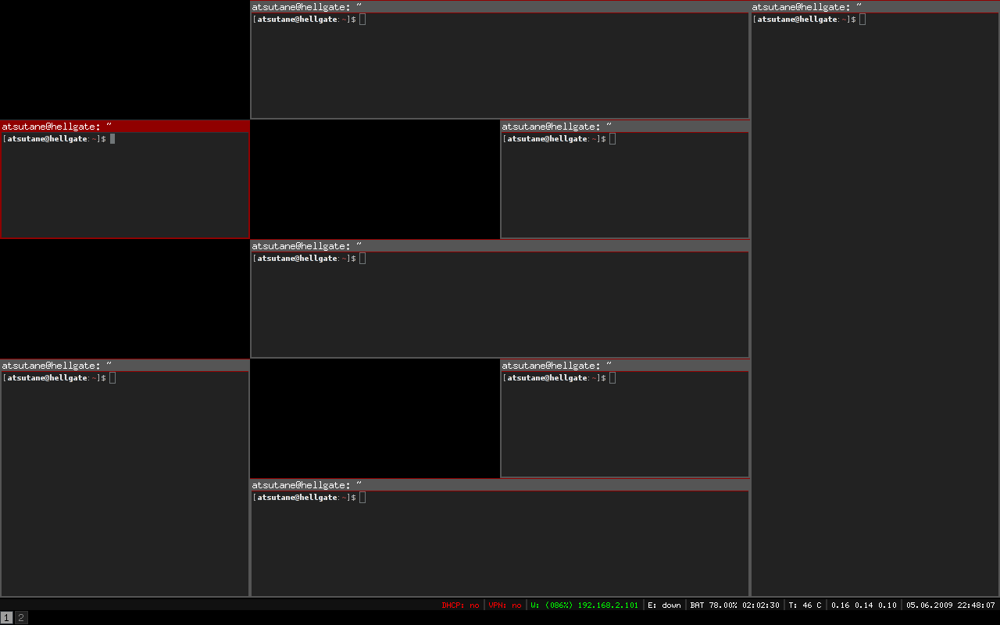
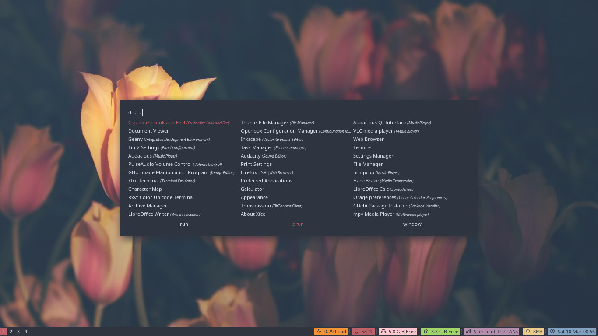

## References

- [readITzine 2호](https://best-bag-0db.notion.site/zine-2-d75d938591e34c69a9242d9841fa9a81)
- [i3-starterpack](https://github.com/addy-dclxvi/i3-starterpack)

## 본문

개발자들은 다양한 환경에서 작업을 한다. 대표적으로 맥과 윈도우, 그리고 극소수(PC사용자 중 2.4%)가 리눅스를 사용한다. 나는 소수에 포함된다. 이 글에선 내가 리눅스에서 가장 좋아하는 Window Manager(이하 WM)인 i3wm에 대해 소개한다.

리눅스는 X윈도우(X11)을 통해 화면을 출력한다. X윈도우는 Display Manager, Session Manager, Window Manager로 구성되는데, 이중 i3wm은 WM의 한 종류이다. WM은 Window(이하 창)의 모양과 위치를 담당하며 창을 열거나 닫는 역할을 한다. i3wm도 WM이므로 창의 모양과 위치를 담당하는데, 창을 조금은 특이한 방법으로 관리한다.

윈도우와 맥만을 사용해 봤다면 창이 어디에서 떠있을 수 있다는 것을 경험적으로 알고 있을 것이다. 크롬을 켜고 그 위에 사파리를 띄운다든지 혹은 지뢰 찾기를 한다든지 창은 항상 다른 창위에 떠 있을 수 있고 그게 맥과 윈도우의 일반적인 사용 방법이다. 게임이나 영상과 같이 Full Screen을 사용하지 않는다면 항상 하나의 창을 다른 창이 덮고 있을 수 있다. i3wm도 다른 창 위에 창을 둘 수 있지만, 기본 배치 방법은 타일링(tiling) 이다.

위 이미지를 보면 알 수 있는데, 창들이 타일(tile) 모양으로 배치가 되어있다. i3wm은 위 그림처럼 창을 타일로 배치하고 창이 다른 창을 가리지 않게 하는 데 중점을 둔다. 창을 하나 띄우고 새 창을 띄우기 전, 그걸 아래/오른쪽에 둘지 선택할 수 있다. 창은 그 설정에 맞춰 자동으로 화면을 절반으로 나뉘며 새 창이 띄워진다. 그리고 vim key binding을 적용하여 창과 창 사이를 아주 빠르게 이동할 수 있다. 또한, i3wm에 익숙해지면 알트-탭으로 다른 창을 선택하는 게 아니라 아예 Desktop Screen을 점프하며 작업을 하게 된다. 맥을 쓰면 보통 Desktop Screen을 1~3개 정도 사용할 텐데 (더 많이 쓸 수도 있지만 그럼 1번에서 끝으로 갈 때 상당히 힘들다) i3wm에선 보통 1~10까지의 Desktop Screen을 사용한다. Desktop Screen을 번호로 지정해놓고 빠르게 건너뛸 수 있기 때문에 다른 어떤 환경보다 작업창 전환 속도가 빠르다.

난 창이 어떤 Desktop Screen에서 실행돼야 하는지 미리 정의해놓는다. 예를 들어 1번에 Intellij 2번에 크롬과 파이어폭스 3번에 Music App 4번에 슬랙등 채팅 프로그램. 이렇게 정의하고 듀얼 모니터를 써서 왼쪽에 1,3,5,7 스크린을 오른쪽 모니터에 2,4,6,8 스크린을 지정해 왼쪽엔 항상 작업 창을 띄우고 오른쪽엔 그 외에 부가적으로 필요한 걸 실행해놓는다. 위에선 듀얼 모니터로 설명했지만 i3wm은 싱글 모니터에서도 매우 효과적으로 사용할 수 있는 프로그램이다.

지금까지 장점만 말했지만, 당연히 단점도 있다. 일단은 설정하기가 상당히 힘들다는 것이다. i3wm은 간단한 설정 파일을 통해 나에게 꼭 맞는 맞춤 환경을 제공해주지만, 그 설정을 하나하나 찾아서 한다는 게 즐겁지만은 않다. 아주 낯선 작업 환경에 적응해야 한다는 것도 절대 쉽지 않은 일이다. 하지만 자신에게 꼭 맞는 환경을 찾아 공부하고 시도해보는 것을 좋아하는 사람이라면 i3wm을 굉장히 좋아하게 될 것이라고 확신한다.

조금 더 깊게 들어가고 싶은 독자를 위해 Github Repository 하나를 추천한다. i3wm starterpack으로 구글링해보면 Github 링크가 하나 나온다. 해당 Github Repository에선 i3wm의 기본 설정법 뿐만 아니라, 모니터, 작업바, Task Swicher, 단축키, 배경화면 설정 방법들에 대해 설명해놓았다. (위의 이미지가 starterpack 페이지를 따라가 보면 얻을 수 있는 화면이다) 처음 i3wm을 설치하면 배경화면도 없는 깜깜한 화면을 얻게 되는데, 그 막막함을 해결해주는 아주 좋은 팁이 많이 모여있다. Github 페이지에 재미있는 내용도 많은데 다음과 같은 내용이다. (번역해서 첨부)

> starterpack 개발자
> - 저는 프로가 아닙니다. 저는 1년 전에 Linux를 배우기 시작했습니다. 그리고 저는 IT 전문가가 아닙니다. 따라서 이 가이드에는 약간의 오류가 있을 수 있습니다. 저를 모욕하기 보다는 정정해주셨으면 좋겠습니다.
> - 쉽게 포기하지 마세요. 100회 오류, 100회 되돌리기, 100회 재시도 3년 연속으로 리미터를 깰 수 있습니다.

위에 언급된 말처럼 i3wm이 쉽지만은 않지만, 전문가가 아니더라도 충분히 잘 사용할 수 있는 WM이다. 하지만 리눅스를 더 잘 쓰고 싶고 이리저리 갖고 노는 것을 좋아하는 사람이라면 아주 재밌게 써볼 수 있을 것이다.

지금까지의 글만 갖고는 감이 잘 오지 않을 것이다. 다만 내가 이 글로 전달하고 싶었던 내용은 리눅스는 윈도우, 맥과는 다르게 창을 관리할 수 있는 여러 가지 방법이 있다는 것과 그중 하나인 i3wm이 있다는 것을 알려주고 싶었다. 만약 독자 중 한 명이라도 i3wm을 시도해보고 싶었다는 생각이 들었다면 성공적인 글이라 생각된다. 혹시 설치하는 방법에 대해 자세히 알고 싶다면 [내 글(i3wm 1 - 기본 및 starterpack 설치)](/blog/88-i3wm-1-starterpack)을 참고해보는 것도 괜찮겠다.
