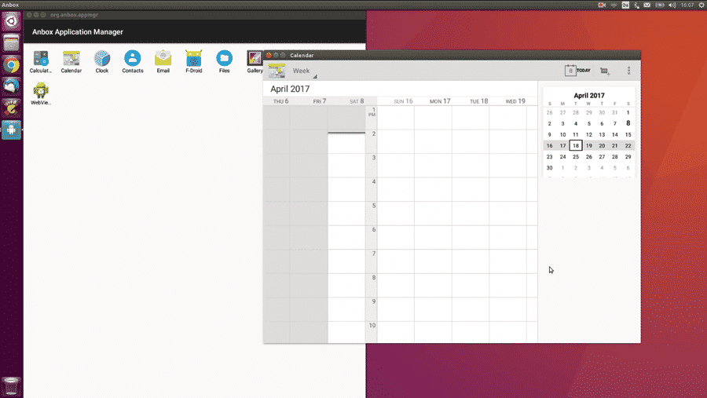
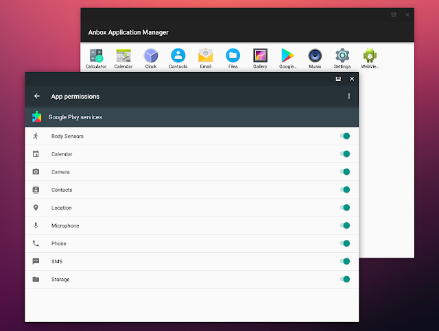

## References

- [Anbox Github](https://github.com/anbox/anbox)
- [Playstore 설치](https://www.linuxuprising.com/2018/07/anbox-how-to-install-google-play-store.html)

## 들어가며

Linux에서 Android를 실행할 필요가 생겼는데, 후보군이 여럿 있지만 [링크](https://linuxhint.com/android_apps_games_linux/) 나는 anbox를 사용하기로 했다. 그 이유는 Anbox는 container안에서 Linux namespaces(user, pid, uts, net, mount, pic)를 이용해 Android를 직접 실행하기 때문이다. 이 말은 퍼포먼스가 좋다는 말. 자세한건 [Anbox Github](https://github.com/anbox/anbox)를 참고하면 됨. Ubuntu 20.10 groovy gorila를 사용중인데 Anbox 문서에선 20.04 기준으로 설명하고 있으므로 다시 정리함. (사실 Github page 보고 잘 따라하면 문제없이 되긴 함)

## 설치하기

### Install necessary kernel modules

19.04 이후의 Ubuntu에서는 kernel module을 설치하지 않아도됨. 아래 명령어 실행하기

```bash
sudo modprobe ashmem_linux
```

하지만 `modprobe: ERROR: could not insert 'ashmem_linux': Operation not permitted` 이런 에러를 만든다면 `SecureBoot`이 켜져있으므로 아래명령어로 확인해보고 SecureBoot을 끄거나 하라고 한다.

```bash
sudo mokutil --sb-state

SecureBoot enabled # 이렇게 출력되면 SecureBoot 끄거나 ashmem_linux를 sign 하란다.
```

### kernel module load 되어있는지 확인

```bash
ls -1 /dev/{ashmem,binder}

# 여긴 정상 출력
/dev/ashmem
/dev/binder

# 내껀 비정상 출력. 근데 anbox 실행가능..
ls: cannot access '/dev/binder': No such file or directory
/dev/ashmem
```

### Anbox Install

```bash
sudo snap install --devmode --beta anbox

snap info anbox # 설치 확인
```

### Uninstall Anbox

```bash
snap remove anbox
```

## 사용하기

Anbox 실행하면 아래 이미지 처럼 실행됨



### 앱 설치

Android SDK를 설치하면 adb도 설치되는데 이걸 이용해서 앱을 설치할 수 있음.

```bash
adb install APK_PATH
```

### Playstore 설치

이제 Playstore를 설치해볼건데 [여기](https://www.linuxuprising.com/2018/07/anbox-how-to-install-google-play-store.html)에 있는 스크립트를 사용할거다. 이게 되게 좋은게 요런 문구가 있음. ㅋ ARM을 지원하는 앱도 설치해서 사용할 수 있음.

> The script to install Google Play Store and enable ARM (libhoudini) support

```bash
wget https://raw.githubusercontent.com/geeks-r-us/anbox-playstore-installer/master/install-playstore.sh

chmod +x install-playstore.sh

./install-playstore.sh
```

anbox 실행

```bash
anbox.appmgr
```

`Settings > Apps > Google Play Services > Permissions` 여기에서 Playstore, Playservice의 모든 권한을 열어주고



anbox-bridge restart

```bash
sudo /snap/anbox/current/bin/anbox-bridge.sh start

sudo /snap/anbox/current/bin/anbox-bridge.sh restart
```

그러면 짠!


## 후기

playstore 사용 가능. 앱 설치 가능. 하지만 chrome 등 앱들이 실행이 안된다. 내 목표는 Ridibooks를 실행하는 거였는데, 그냥 wine으로 했다. anbox 알아보고 이것저것 해보는데 한시간 사용했지만 wine으로 2분만에 Ridibook를 실행했다. 약간 허탈.. anbox는 계속 업데이트 될테니 나중에 또 살펴봐야겠다.
