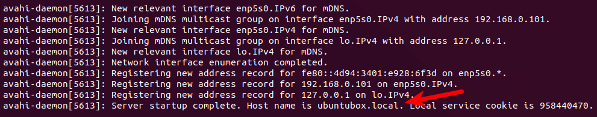

## References

- [유선설정하기](https://linuxhint.com/ubuntu_20-04_network_configuration/)
- [무선설정하기](https://www.linuxbabe.com/ubuntu/connect-to-wi-fi-from-terminal-on-ubuntu-18-04-19-04-with-wpa-supplicant)
- [빠르게 부팅하기 (부팅시 네트워크 연결 기다리는 데몬 해제하기)](https://askubuntu.com/questions/972215/a-start-job-is-running-for-wait-for-network-to-be-configured-ubuntu-server-17-1)
- [Keep Ubuntu Server running on a laptop with the lid closed?](https://askubuntu.com/questions/141866/keep-ubuntu-server-running-on-a-laptop-with-the-lid-closed)

---

## 시작

내 노트북을 서버용으로 사용하려고 ubuntu 20.04 server를 설치했다. 근데 이 상태로 wifi를 연결하는 방법을 도무지 모르겠더라. 일단 nmtui, iwconfig, wpa_supplicant를 다 사용못하기 때문이다. (왜냐면 이런 패키지들이 모두 설치가 안되있거든...)

그래서 wire → wireless 로 하는 방법으로 진행했다.

## 1. 유선 설정하기

1. ip 확인하기
   - `ip a`
   - 아마 아래 그림과는 다르게 아무런 ip가 나타나지 않을 것이다.
   - 유선 장치 이름을 저장해놓자. 아래 그림에선 `ens33` 같아 보인다. (내 우분투에선 enp34s0, wlp37s0 으로 나타난다)


2. /etc/netplan에 netplan용 파일 만들기
   - `sudo vim /etc/netplan/01-network-manager-all.yaml`

```yaml
network:
    ethernets:
        eth0:
            dhcp4: true
            optional: true
    version: 2
```

3. netplan try
   - `sudo netplan --debug try`
   - error가 안나오면 다음 단계로. 에러가 나오면 에러메세지를 잘 읽어서 문제를 해결하자. 나 같은 경우 indent가 틀려서 문제가 종종 발생했음

4. netplan apply
   - `sudo netplan --debug apply`
   - try가 잘 됐으면 이 부분은 별 문제 없을 것이다.

5. ip a 명령어로 ip address 확인
   - `ip a`

## 2. 무선 설정하기

1. 유선이 연결 됐다면 wpa_supplicant를 이용해 wireless에도 연결하자
   - `ip a` 명령어로 wifi 장치 찾기 - `wlp37s0` 이런 비슷한 포멧으로 생겼음

2. `sudo vim /etc/netplan/01-network-manager-all.yaml`

```yaml
network:
    ethernets:
        eth0:
            dhcp4: true
            optional: true
    version: 2
    wifis:
        wlp37s0:
            optional: true
            access-points:
                "SSID-NAME-HERE":
                    password: "PASSWORD-HERE"
            dhcp4: true
```

3. install wpasupplicant

```bash
# 설치
sudo apt install wpasupplicant

# 설치 후 conf 파일 생성하기
wpa_passphrase your-ESSID your-wifi-passphrase | sudo tee /etc/wpa_supplicant.conf
```

4. wifi 연결하기

```bash
sudo wpa_supplicant -c /etc/wpa_supplicant.conf -i wlp4s0

# 아래와 같은 메세지들이 출력된다면 성공
Successfully initialized wpa_supplicant
wlp4s0: SME: Trying to authenticate with c5:4a:21:53:ac:eb (SSID='LinuxBabe.Com Network' freq=2437 MHz)
wlp4s0: Trying to associate with c5:4a:21:53:ac:eb (SSID='LinuxBabe.Com Network' freq=2437 MHz)
wlp4s0: Associated with c5:4a:21:53:ac:eb
wlp4s0: CTRL-EVENT-SUBNET-STATUS-UPDATE status=0
wlp4s0: WPA: Key negotiation completed with c5:4a:21:53:ac:eb [PTK=CCMP GTK=CCMP]
wlp4s0: CTRL-EVENT-CONNECTED - Connection to c5:4a:21:53:ac:eb completed [id=0 id_str=]
```

5. ip 확인하기
   - `ip a`

6. 부팅할 때, 자동으로 wifi에 연결하기

```bash
# service 파일 복사
sudo cp /lib/systemd/system/wpa_supplicant.service /etc/systemd/system/wpa_supplicant.service

# 수정
sudo vim /etc/systemd/system/wpa_supplicant.service

# 이 라인을 찾아서
ExecStart=/sbin/wpa_supplicant -u -s -O /run/wpa_supplicant
# 이렇게 변경(아까 만든 wpa_supplicant 주소와 장치 이름을 묶어주기)
ExecStart=/sbin/wpa_supplicant -u -s -c /etc/wpa_supplicant.conf -i wlp4s0
# 그 아래줄에 이거 추가
Restart=always

# 이런 라인이 있다면 주석 처리하기 (Alias 앞에 # 추가)
Alias=dbus-fi.w1.wpa_supplicant1.service

# daemon 등록
sudo systemctl enable wpa_supplicant.service
```

## 결론

netplan과 wpa_supplicant를 이용해 wireless, wired 설정을 할 수 있었지만 둘의 관계가 뭔지 잘 모르겠다. [netplan](https://netplan.io/)은 `network configuration abstraction renderer`라는데 이게 도대체 뭔말인지 싶다. 그냥 네트워크를 좀 더 쉽게 설정할 수 있는거라고 이해하면 되려나? [Wifi on Ubuntu 18 server](https://gist.github.com/austinjp/9b968c75c3e54004be7cd7a134881d85)도 있는데 이것도 wpasupplicant를 사용해서 wifi 설정을 하고 있다.

## Bonus

### 1. 빠르게 부팅하기

ubuntu daemon 중 `systemd-networkd-wait-online.service`가 있는데 이는 네트워크에 접속될때까지 shell을 띄워주지 않게 기다리는 기능을 한다. 그다지 쓸모가 없으므로 아래 명령어로 정지시키자.

```bash
systemctl disable systemd-networkd-wait-online.service
systemctl mask systemd-networkd-wait-online.service
```

### 2. ip address 대신 호스트 이름 사용하기

avahi-daemon는 mDNS를 이용해 ip address를 hostname으로 사용하게 해준다. 예를들어 서버가 192.168.0.100 이라면 이것을 ubuntu-server.local 로 변경해준다.

```bash
# 호스트 네임 설정
sudo hostnamectl set-hostname ubuntu-server

# 설치
sudo apt install avahi-daemon

# 실행 및 auto start
sudo systemctl start avahi-daemon
sudo systemctl enable avahi-daemon

# firewall 설정
sudo ufw allow 5353/udp

# 확인
sudo systemctl status avahi-daemon
```



### 3. 랩탑에서 화면이 닫혀도 sleep 모드에 들어가지 않게 하기

서버 노트북은 화면이 닫혀 있어도 슬립모드로 들어가선 안된다. `logind.conf`를 편집해 화면이 닫혀도 sleep 모드가 되지 않도록 설정할 수 있다.

```bash
sudo vim /etc/systemd/logind.conf

# 아래 두 부분을 주석을 없애고 내용도 변경
HandleLidSwitch=ignore
LidSwitchIgnoreInhibited=no

# 데몬 재시작
sudo systemctl restart systemd-logind
```
